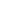

[**< Home**](../README.md)

# *DeltaScript* – Standard Library

<!-- TODO - link to a Delta Time release -->

| Version | Published | Author | Implementation |
| :-----: | :-------: | :----: | :------------: |
| 0.1.0 | January 16, 2025 | Jordan Bunke | [Link]() |

The **standard library** describes the built-in functions that are included in the *DeltaScript* [base language](./glossary.md#base-language). Functions in the standard library are either global, or member functions of a built-in type or a collection type.

## Contents

### Built-in types

* [`color`](./color-sl.md)
* [`image`](./image-sl.md)
* [`string`](./string-sl.md)

> **Note:**
> 
> *DeltaScript* has built-in types that are not listed here. The types listed here are the only built-in types with member functions and/or [properties](./glossary.md#property) in the base language[a](#fn-a).

### [Collection types](./collections-sl.md)

* [Array – `T[]`](./collections-sl.md#array)
* [List – `T<>`](./collections-sl.md#list)
* [Set – `T{}`](./collections-sl.md#set)
* [Map/dictionary – `{K:V}`](./collections-sl.md#mapdictionary)

### [Global functions](./functions-sl.md)

* [`abs`](./functions-sl.md#abs)
* [`clamp`](./functions-sl.md#clamp)
* [`flip_coin`](./functions-sl.md#flip_coin)
* [`max`](./functions-sl.md#max)
* [`min`](./functions-sl.md#min)
* [`new_image_of`](./functions-sl.md#new_image_of)
* [`print`](./functions-sl.md#print)
* [`prob`](./functions-sl.md#prob)
* [`prompt`](./functions-sl.md#prompt)
* [`rand`](./functions-sl.md#rand)
* [`read`](./functions-sl.md#read)
* [`read_image`](./functions-sl.md#read_image)
* [`rgb`](./functions-sl.md#rgb)
* [`rgba`](./functions-sl.md#rgba)

---

## Footnotes

a - [Extensions](./ls-8-ext.md#82--extensions) of the language may provide additional functionality in the form of properties or member functions to these types, as well as to other built-in types of the base language.
