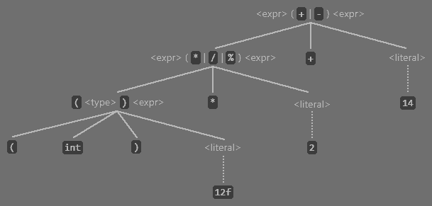

# *DeltaScript* – Language Specification

| Version | Published | Author | Implementation |
| :-----: | :-------: | :----: | :------------: |
| 0.1.0 | January 16, 2025 | Jordan Bunke | [Link](https://github.com/jbunke/deltascript/releases/tag/v0.1.0) |

*DeltaScript* is a lightweight scripting language skeleton that is designed to be easily extended for the specification and implementation of [domain-specific languages](https://en.wikipedia.org/wiki/Domain-specific_language).

The language is in active development. As it is already in production as the scripting language used by [*Stipple Effect*](https://github.com/stipple-effect/stipple-effect), it became necessary to publish a specification for the language.

*DeltaScript* is technically **platform-agnostic**. It can be implemented as a compiled language, or an interpreted language that targets any other programming language. However, the official implementation (latest version linked above) is an **interpreter that targets Java**.

This specification aims to provide an exhaustive description of how the language is designed, including its **syntax**, **semantics**, **execution**, and **extension possibilities**. Parts of this document employ advanced mathematical concepts, alongside formal mathematical notation and language. However, thorough explanations and external resources linked from within should ensure that the content remains accessible to non-experts. A strong mathematics and/or computer science background is helpful, but not required.

## Contents

### [Introduction](#introduction-1)
* [Motivation](#motivation)
* [About the specification](#about-the-specification)
  * [Notation and conventions](#notation-and-conventions)
  * [Language status and compatibility](#language-status-and-compatibility)
  * [Overview of the specification](#overview-of-the-specification)

### [1 – Syntax and grammar](#chapter-1--syntax-and-grammar)
* [**1.1**](#11--notation-and-terminology) – Notation and terminology
  * [**1.1.1**](#111--extended-backusnaur-form) – Extended Backus–Naur Form
  * [**1.1.2**](#112--terminology) – Terminology
  * [**1.1.3**](#113--notation) – Notation
* [**1.2**](#12--grammars) – Grammars
  * [**1.2.1**](#121--lexical-grammar) – Lexical grammar
  * [**1.2.2**](#122--syntax-grammar) – Syntax grammar
* [**1.3**](#13--notes-on-syntax) – Notes on syntax
  * [**1.3.1**](#131--comments) – Comments
  * [**1.3.2**](#132--whitespace) – Whitespace
  * [**1.3.3**](#133--keywords) – Keywords
  * [**1.3.4**](#134--shorthands) – Shorthands

### [2 – Types](#chapter-2--types)
* [**2.1**](#21--type-system) – Type system
  * [**2.1.1**](#211--type-safety) – Type safety
  * [**2.1.2**](#212--type-inference) – Type inference
  * [**2.1.3**](#213--extensibility) – Extensibility
* [**2.2**](#22--simple-types) – Simple types
  * [**2.2.1**](#221--built-in-types) – Built-in types
  * [**2.2.2**](#222--primitive-vs-composite-types) – Primitive vs. composite types
* [**2.3**](#23--collection-types) – Collection types
  * [**2.3.1**](#231--arrays) – Arrays
  * [**2.3.2**](#232--lists) – Lists
  * [**2.3.3**](#233--sets) – Sets
  * [**2.3.4**](#234--mapsdictionaries) – Maps/dictionaries
* [**2.4**](#24--functional-types) – Functional types
  * [**2.4.1**](#241--parsing-complex-types) – Parsing complex types
* [**2.5**](#25--type-conversion) – Type conversion
  * [**2.5.1**](#251--implicit-type-conversion) – Implicit type conversion
  * [**2.5.2**](#252--explicit-type-conversion-casting) – Explicit type conversion (casting)

### [3 – Variables and declarations](#chapter-3--variables-and-declarations)
* [**3.1**](#31--variables) – Variables
* [**3.2**](#32--declarations) – Declarations
  * [**3.2.1**](#321--variable-names) – Variable names
  * [**3.2.2**](#322--initialization) – Initialization
  * [**3.2.3**](#323--immutability) – Immutability
* [**3.3**](#33--function-parameters) – Function parameters
* [**3.4**](#34--variable-scope) – Variable scope

### [4 – Expressions](#chapter-4--expressions)
* [**4.1**](#41--precedence) – Precedence
* [**4.2**](#42--nested-expressions) – Nested expressions
* [**4.3**](#43--literals) – Literals
  * [**4.3.1**](#431--bool-literals) – `bool` literals
  * [**4.3.2**](#432--char-literals) – `char` literals
  * [**4.3.3**](#433--color-literals) – `color` literals
  * [**4.3.4**](#434--int-literals) – `int` literals
  * [**4.3.5**](#435--float-literals) – `float` literals
  * [**4.3.6**](#436--string-literals) – `string` literals
  * [**4.3.7**](#437--escape-sequences) – Escape sequences
* [**4.4**](#44--variables-as-expressions) – Variables as expressions
* [**4.5**](#45--operators) – Operators
  * [**4.5.1**](#451--unary-operators) – Unary operators
  * [**4.5.2**](#452--binary-operators) – Binary operators
  * [**4.5.3**](#453--ternary-operator) – Ternary operator
  * [**4.5.4**](#454--compound-assignment-operators) – Compound assignment operators
* [**4.6**](#46--cast-expressions) – Cast expressions
* [**4.7**](#47--function-calls) – Function calls
  * [**4.7.1**](#471--global-function-calls) – Global function calls
  * [**4.7.2**](#472--helper-function-calls) – Helper function calls
  * [**4.7.3**](#473--scoped-function-calls) – Scoped function calls
* [**4.8**](#48--helper-function-references) – Helper function references
* [**4.9**](#49--anonymous-functions) – Anonymous functions
* [**4.10**](#410--array-and-list-elements) – Array and list elements
* [**4.11**](#411--explicit-collections) – Explicit collections
* [**4.12**](#412--collection-initializers) – Collection initializers

### [5 – Statements](#chapter-5--statements)
* [**5.1**](#51--imperative-programming) – Imperative programming
* [**5.2**](#52--statements) – Statements
* [**5.3**](#53--declarations) – Declarations
* [**5.4**](#54--assignments) – Assignments
* [**5.5**](#55--void-function-calls) – Void function calls
* [**5.6**](#56--conditional-statements) – Conditional statements
  * [**5.6.1**](#561--if-statements) – `if` statements
  * [**5.6.2**](#562--when-statements) – `when` statements
* [**5.7**](#57--loops) – Loops
  * [**5.7.1**](#571--while-loops) – `while` loops
  * [**5.7.2**](#572--dowhile-loops) – `do`...`while` loops
  * [**5.7.3**](#573--for-loops) – `for` loops
  * [**5.7.4**](#574--iterator-loops) – Iterator loops
* [**5.8**](#58--return-statements) – `return` statements
  * [**5.8.1**](#581--value-return) – Value `return`
  * [**5.8.2**](#582--void-return) – Void `return`

### [6 – Functions](#chapter-6--functions)
* [**6.1**](#61--functions) – Functions
* [**6.2**](#62--type-signatures) – Type signatures
  * [**6.2.1**](#621--value-returning-functions) – Value-returning functions
  * [**6.2.2**](#622--void-functions) – Void functions
* [**6.3**](#63--types-of-functions) – Types of functions
  * [**6.3.1**](#631--header-functions) – Header functions
  * [**6.3.2**](#632--helper-functions) – Helper functions
  * [**6.3.3**](#633--anonymous-functions) – Anonymous functions
  * [**6.3.4**](#634--global-functions) – Global functions
  * [**6.3.5**](#635--member-functions) – Member functions
  * [**6.3.6**](#636--extension-functions) – Extension functions
* [**6.4**](#64--function-objects) – Function objects
  * [**6.4.1**](#641--call) – `call()`
* [**6.5**](#65--function-semantics) – Function semantics
  * [**6.5.1**](#651--parameters-and-arguments) – Parameters and arguments
  * [**6.5.2**](#652--return-path-completeness) – Return path completeness

### [7 – Execution](#chapter-7--execution)
* [**7.1**](#71--general) – General
* [**7.2**](#72--parsing) – Parsing
* [**7.3**](#73--semantic-analysis) – Semantic analysis
* [**7.4**](#74--runtime-execution) – Runtime execution
* [**7.5**](#75--errors) – Errors
  * [**7.5.1**](#751--syntax-errors) – Syntax errors
  * [**7.5.2**](#752--semantic-errors) – Semantic errors
  * [**7.5.3**](#753--runtime-errors) – Runtime errors

### [8 – Extensions](#chapter-8--extensions)
* [**8.1**](#81--extensions-philosophy) – Extensions philosophy
* [**8.2**](#82--extensions) – Extensions
* [**8.3**](#83--types-in-extensions) – Types in extensions
  * [**8.3.1**](#831--new-types) – New types
  * [**8.3.2**](#832--extending-built-in-types) – Extending built-in types
* [**8.4**](#84--namespaces) – Namespaces

### [Standard Library](#deltascript--standard-library)
* Built-in types
  * [`color`](#color)
  * [`image`](#image)
  * [`string`](#string)
* [Collection types](#collection-types)
  * [Array – `T[]`](#array)
  * [List – `T<>`](#list)
  * [Set – `T{}`](#set)
  * [Map/dictionary – `{K:V}`](#mapdictionary)
* [Global functions](#global-functions)

### [Glossary](#glossary-1)

# Introduction

## Contents

* [Motivation](#motivation)
* [About the specification](#about-the-specification)
  * [Notation and conventions](#notation-and-conventions)
  * [Language status and compatibility](#language-status-and-compatibility)
  * [Overview of the specification](#overview-of-the-specification)

## Motivation

*DeltaScript* was first developed as a domain-specific scripting language for [*Stipple Effect*](https://github.com/stipple-effect/stipple-effect), a pixel art editor that makes extensive use of scripting for automation and for transforming project contents.

Eventually, the *Stipple Effect* codebase was extensively refactored. The core of the scripting language implementation was ripped out and reimplemented in the underlying library that served as an external dependency for *Stipple Effect*, and the language features deemed specific to the context of *Stipple Effect* were implemented in its codebase as an extension to the [base language](./glossary.md#base-language). The idea was that, this way, the base language would be reuseable for multiple projects, with application-specific behaviours and features implemented as extensions.

There are other programs in a similar niche as *Stipple Effect* that support scripting, like [*Aseprite*](https://www.aseprite.org), which lets users write scripts with [Lua](https://www.lua.org). I opted to design and implement my own scripting language for a few reasons, chief among which was **how I wanted the code to look**. Lua's keyword noise, lack of punctuation, and general boilerplate were all non-starters for me. I wanted scripts written in my language to clearly reflect their behaviour at a glance without any additional fluff.

Moreover, *DeltaScript* is **not a general-purpose programming language**. It is intended for writing scripts in particular application contexts. Thus, it is designed to be quite [high-level](https://en.wikipedia.org/wiki/High-level_programming_language) and narrow in its scope.

These are real examples of scripts in the [*Stipple Effect* extension dialect](https://stipple-effect.github.io/api) of *DeltaScript*:

1.  Add a black background layer to every project that is open in the program
    ```js
    () {
        for (p in $SE.get_projects()) {
            // Create a new background layer
            p.set_layer_index(0);
            p.add_layer();
            p.move_layer_down();

            // Link the cels of the layer and rename it
            layer l = p.get_layer();
            l.link_cels();
            l.set_name("Background");
            
            // Prepare a canvas of the same dimensions as the project
            //   and fill it with the color black (hex code #000000)
            int w = p.get_width();
            int h = p.get_height();
            image filled = new_image_of(w, h);
            filled.fill(#000000, 0, 0, w, h);

            // Set the contents of the layer to the black image
            // Cel index 0 will always exist;
            //   chosen arbitrarily as layer has linked cels
            l.set_cel(0, filled);
        }
    }
    ```
    This script makes use of the `project` and `layer` types, both of which are not present in the base language. The namespace `$SE` is also defined as part of the extension.

2.  Take an image and return the right half of the image
    ```js
    (image input -> image) {
        // an image must have a width of at least 1 pixel
        int new_w = max(1, input.width / 2);
        return input.section(input.width - new_w, 0, new_w, input.height);
    }
    ```
    This script exclusively utilizes language features from the base language.

## About the specification

### Notation and conventions

This language specification makes use of several conventions that are worth mentioning.

**Link icons:**

Some links in the specification are followed by small, blue superscript icons.

The question mark icon (  ) indicates that the link leads to the **[glossary](#glossary-1) entry** for the highlighted term. These are terms that are used repeatedly throughout the specification that warrant a definition. The glossary link will usually appear when such a term is used for the first time in a given section.

The arrow leaving a box icon (  ) indicates that a link is an **external link**. That is, it links to a webpage beyond the *DeltaScript* documentation. Oftentimes such links will be to Wikipedia articles that expand on a term or concept referenced in the specification.

**Section links:**

At various points throughout the specification are superscripted links with section numbers. Such links begin with the section sign ( § ) and link to that section of the specification.

**Code snippets:**

Code snippets are multi-line segments of the specification that appear in monospaced font. Unless otherwise specified, code inside a code snippet is written in *DeltaScript*. Unless a particular language extension is referenced, the code can be assumed to be written in the [base language](./glossary.md#base-language).

```js
() {
    print("This is a code snippet.");
}
```

> **Note:**
> 
> The specification is written in a lightweight markup language called [Markdown](https://en.wikipedia.org/wiki/Markdown), which allows for a programming language to be specified alongside a code snippet so that the code can be syntax highlighted. As *DeltaScript* is not yet a widely adopted language, code snippets are highlighted using a JavaScript syntax highlighter instead. This does a mostly satisfactory job of tokenizing *DeltaScript* code, but sometimes leads to mistakes.

**Text styling:**

These are the general guidelines that inform how text is styled in this specification:
* **Bold** - key terms and important information
* *Italics* - the names of non-ubiquitous technologies
* `Monospaced` - *DeltaScript* code

### Language status and compatibility

*DeltaScript* is still in active development and has not been released. While it is my aim that future changes to the language do not break programs written in earlier language versions, I cannot guarantee it.

Throughtout the specification and standard library, language features or standard library functions may be listed as:

* **Deprecated** - still a part of the language, but **discouraged and flagged for future removal**
* **Experimental** - likely to change or be removed in a future language version
* **Planned** - likely to be implemented in an impending language version

### Overview of the specification

This specification aims to provide an exhaustive description of how the language is designed, including its **syntax**, **semantics**, **execution**, and **extension possibilities**. After reading the specification, someone looking to write a compiler or interpreter for *DeltaScript* should be able to do so without requiring additional information about the language. It is intentionally vague about many low-level language implementation details, which are delegated to the discretion of the implementers.

The specification has been sequenced in a way that concepts from earlier chapters inform the broader concepts discussed in later chapters. Concepts are itemized and encapsulated as much as possible, allowing the reader to easily jump ahead or refer back to individual sections.

# Chapter 1 – Syntax and grammar

## Contents

* [**1.1**](#11--notation-and-terminology) – Notation and terminology
  * [**1.1.1**](#111--extended-backusnaur-form) – Extended Backus–Naur Form
  * [**1.1.2**](#112--terminology) – Terminology
  * [**1.1.3**](#113--notation) – Notation
* [**1.2**](#12--grammars) – Grammars
  * [**1.2.1**](#121--lexical-grammar) – Lexical grammar
  * [**1.2.2**](#122--syntax-grammar) – Syntax grammar
* [**1.3**](#13--notes-on-syntax) – Notes on syntax
  * [**1.3.1**](#131--comments) – Comments
  * [**1.3.2**](#132--whitespace) – Whitespace
  * [**1.3.3**](#133--keywords) – Keywords
  * [**1.3.4**](#134--shorthands) – Shorthands

---

This chapter describes the syntax of *DeltaScript* using **formal grammars**.

**Syntax** can be understood to mean the rules that govern the language's structure. A *DeltaScript* program that is syntactically correct abides by the rules described in the language's grammars.

## 1.1 – Notation and terminology

### 1.1.1 – Extended Backus–Naur Form

Grammars in this document are written in an adapted version of [Extended Backus-Naur Form](https://en.wikipedia.org/wiki/Extended_Backus%E2%80%93Naur_form) (EBNF). You may want to read up on [context-free grammars](https://en.wikipedia.org/wiki/Context-free_grammar) if you do not have much experience with them.

### 1.1.2 – Terminology

The following terms are important in order to understand the grammars.

**Production rule:**

> A **production rule**, or simply a **rule**, defines a replacement from a label, known as a **rule name** (non-terminal symbol), to one or more **productions**.
> 
> In the grammars, rules are distinguished from terminals by being enclosed in &lt;angle brackets&gt;.

**Production:**

> A **production** refers to a complete replacement of a production rule by other rules (non-terminal symbols) and/or terminals. A production rule may define more than one production.
> 
> **Example:**
>> **_&lt;when_body&gt;_:** `{` &lt;when_case&gt;\+ &lt;otherwise_case&gt;? `}`
>> 
>> **_&lt;when_case&gt;_:**
>> * `is` &lt;elements&gt; `->` &lt;body&gt;
>> * `matches` &lt;expr&gt; `->` &lt;body&gt;
>> * `passes` &lt;expr&gt; `->` &lt;body&gt;
> 
> The rule &lt;when_body&gt; defines a single production, whereas the rule &lt;when_case&gt; defines three.

**Terminal:**

> A **terminal** is a symbol that represents a concrete value or token in the language and cannot be replaced further by any production rule.
> 
> In the grammars, terminals are written in `this monospace font`.

**Rule name:**

> A **rule name** refers to the label at the beginning of a production rule's definition. It may also be referred to as the left-hand side (LHS) of a production rule.
> 
> In the grammars, rule names are ***bolded and italicized***.

**Rule occurrence:**

> A **rule occurrence**, or simply an **occurrence**, refers to a situation when a rule appears as part of a production of another rule.
> 
> **Example:**
>> **_&lt;IDENTIFIER&gt;_:** &lt;LEADOFF&gt; &lt;FOLLOWING&gt;\*
> 
> This production rule features an occurrence of &lt;LEADOFF&gt; and of &lt;FOLLOWING&gt;.

**Production unit:**

> A **production unit** is a catchall term that can refer to:
> * a rule occurrence
> * a terminal
> * multiple production units (including any attached symbols present) enclosed in parentheses

### 1.1.3 – Notation

The following symbols and conventions are used in productions in the grammars.

**? (optional):**

> A question mark following a production unit means that the unit is **optional**; it may be **excluded** or **included once**.

**\+ (one or more):**

> A plus symbol following a production unit means that the unit is **repeatable**; it may occur **once** or **multiple times in a row**.

**\* (zero or more):**

> An asterisk (\*) following a production unit means that the unit is **optional and repeatable**; it may be **omitted**, or occur **once**, or **multiple times in a row**.

**| (choice):**

> Two or more production units separated by a pipe / vertical bar ( | ) represent a **choice**; any one of the units can be supplied as a valid match.
> 
> The choice symbol can also be used for entire productions.
>
> **Example:**
>> **_&lt;LEADOFF&gt;_:** `_` | `A..Z` | `a..z`
> 
> The rule &lt;LEADOFF&gt; has three productions.
> 
> Complex rules with several productions, or with productions with several units, may use bullets instead of vertical bars to show their productions on individual lines.

**`a..z` (range):**<sup>[a](#fn-a)</sup>

> A terminal consisting of two characters separated by `..` represents a **range**. This means that any character in that range of characters (including the bounding characters) is a valid match for the range.
> 
> This notation is only used when the range specified by the bounding characters is universally intuitive:
> * `a..z` - the 26 lowercase letters of the Latin alphabet
> * `A..Z` - the 26 uppercase letters of the Latin alphabet
> * `0..9` - the 10 numerical digits of the base 10 numbering system

**\~ (complement):**<sup>[a](#fn-a)</sup>

> A tilde (~) preceding a production unit represents the [**complement**](https://en.wikipedia.org/wiki/Complement_(set_theory)) of the unit. Complement means **everything that is not part of the production unit**. The [universe](https://en.wikipedia.org/wiki/Universe_(mathematics)), which means all possible things being considered, can be understood to be all of the characters encoded under [UTF-8](https://en.wikipedia.org/wiki/UTF-8).

**`\n`, `\r` (line terminators):**<sup>[a](#fn-a)</sup>

> The newline (`\n`) and carriage return (`\r`) characters are used to denote the end of a line. In the context of the lexical grammar, they are treated as line terminators and are used to handle line breaks in the source code. They are represented in the grammar as their escape character counterparts; however, in the source code, **these characters are not visible**.

**◯ (anything):**<sup>[a](#fn-a)</sup>

> A large circle (◯) represents **any character**. It is used in the lexical grammar to denote that any character, except for those explicitly excluded, can be matched.

## 1.2 – Grammars

The syntax of *DeltaScript* is formally expressed by a lexical grammar and a syntax grammar.

The lexical grammar is responsible for the tokenization of *DeltaScript* code; that is, for the correct identification of **tokens**: the basic building blocks of the program.

Conversely, the syntax grammar is responsible for parsing those tokens and understanding how they fit into the larger, more complex structures of the language, such as loops<sup>[§5.7](#57--loops)</sup> or functions<sup>[§6.1](#61--functions)</sup>.

Lexical production rule names are ***&lt;CAPITALIZED&gt;***, whereas syntactical production rule names are written in ***&lt;snake_case&gt;***.

### 1.2.1 – Lexical grammar

The lexical grammar contains the production rules that pertain to the tokenization of *DeltaScript* code. This includes correctly identifying:
* Keywords<sup>[§1.3.3](#133--keywords)</sup>
* Punctuation (types of brackets, semicolons, etc.)
* [Identifiers](./glossary.md#identifier)
* [Literals](https://en.wikipedia.org/wiki/Literal_(computer_programming))

The grammar shown here is an abridged version of the lexical grammar used for the official language implementation. For the sake of brevity and clarity, keywords and punctuation have been directly included as terminals in the syntax grammar<sup>[b](#fn-b)</sup>.

---

**<i id="lg-whitespace">&lt;WHITESPACE&gt;</i>:** ( ` ` | `\t` | `\n` )\+

> ` ` (space), `\t` (tab) and `\n` (newline) are all types of **whitespace**. Tab and newline are represented in the grammar as their escape character counterparts for the sake of clarity.
> 
> This rule is matched by the grammar, but its tokens are ignored.

**<i id="lg-linecomment">&lt;LINECOMMENT&gt;</i>:** `//` ( ~( `\r` `\n` ) )\*

> `\n` (newline) and `\r` (carriage return) are escape characters that represent line terminators. They are represented in the grammar as their escape character counterparts; however, in the source code, **these characters are not visible**.
> 
> This rule is matched by the grammar, but its tokens are ignored.

**<i id="lg-multilinecomment">&lt;MULTILINECOMMENT&gt;</i>:** `/*` ◯\* `*/`

> This rule is matched by the grammar, but its tokens are ignored.

**<i id="lg-final">&lt;FINAL&gt;</i>:** `final` | `~`

> `~` is a shorthand<sup>[§1.3.3](#133--shorthands)</sup> for `final`. They have the same meaning and can be used interchangeably.

**<i id="lg-identifier">&lt;IDENTIFIER&gt;</i>:** [&lt;LEADOFF&gt;](#lg-leadoff) [&lt;FOLLOWING&gt;](#lg-following)\*

> This rule describes a valid identifier. Identifiers are used as the names of variables, helper functions, and function parameters, plus additional use cases.

**<i id="lg-leadoff">&lt;LEADOFF&gt;</i>:** `_` | `A..Z` | `a..z`

> The initial character in an identifier. The initial character cannot be a digit.

**<i id="lg-following">&lt;FOLLOWING&gt;</i>:** `_` | `A..Z` | `a..z` | [&lt;DIGIT&gt;](#lg-digit)

> Any character following the initial character in an identifier.

**<i id="lg-subident">&lt;SUBIDENT&gt;</i>:** `.` [&lt;IDENTIFIER&gt;](#lg-identifier)

**<i id="lg-digit">&lt;DIGIT&gt;</i>:** `0..9`

**<i id="lg-hexdigit">&lt;HEX_DIGIT&gt;</i>:** [&lt;DIGIT&gt;](#lg-digit) | `a..f` | `A..F`

> A [hexadecimal](https://en.wikipedia.org/wiki/Hexadecimal) digit. Lowercase and uppercase letters can be used interchangeably.

**<i id="lg-floatlit">&lt;FLOAT_LIT&gt;</i>:**
* [&lt;DIGIT&gt;](#lg-digit)\+ `.` [&lt;DIGIT&gt;](#lg-digit)\+
* [&lt;DIGIT&gt;](#lg-digit)\+ `f`

> Floating-point number literals have two forms: decimal point notation (e.g. `2.0`) and "f" notation (`2f`).
> 
> **Note:**
> 
> Unlike some other programming languages, where `1.5f` is a valid floating-point number literal, "f" notation in *DeltaScript* is exclusively used to specify that an integer quantity should be treated as a floating-point number. Literals with a fractional component must be expressed in decimal point notation without a trailing `f`.

**<i id="lg-declit">&lt;DEC_LIT&gt;</i>:** [&lt;DIGIT&gt;](#lg-digit)\+

**<i id="lg-hexlit">&lt;HEX_LIT&gt;</i>:** `0x` [&lt;HEX_DIGIT&gt;](#lg-hexdigit)\+

> Hexadecimal integer literals are prefixed with `0x`.

**<i id="lg-channel">&lt;CHANNEL&gt;</i>:** [&lt;HEX_DIGIT&gt;](#lg-hexdigit) [&lt;HEX_DIGIT&gt;](#lg-hexdigit)

> An 8-bit color channel component of a [hex triplet](https://en.wikipedia.org/wiki/Web_colors#Hex_triplet) color literal.
> 
> **Note:**
> 
> A channel component is always two hexadecimal digits long, even if its value is representable in a single digit.

**<i id="lg-colorhexlit">&lt;COLOR_HEX_LIT&gt;</i>:** `#` [&lt;CHANNEL&gt;](#lg-channel) [&lt;CHANNEL&gt;](#lg-channel) [&lt;CHANNEL&gt;](#lg-channel) [&lt;CHANNEL&gt;](#lg-channel)?

> A hex triplet color literal representing a 32-bit RGBA color.
> 
> **Note:**
> 
> The optional fourth color channel represents the alpha/[opacity](./glossary.md#opacity) channel. If it is omitted, the color is assigned an opacity of `255` / `0xff` (fully opaque).

**<i id="lg-escapechar">&lt;ESCAPE_CHAR&gt;</i>:** `\` ( `0` | `b` | `t` | `n` | `f` | `r` | `"` | `'` | `\` )

> The [escape characters](https://en.wikipedia.org/wiki/Escape_character) supported in *DeltaScript*.

**<i id="lg-restrictedcharset">&lt;RESTRICTED_CHARSET&gt;</i>:** ~( `\` | `'` | `"` )

**<i id="lg-character">&lt;CHARACTER&gt;</i>:** [&lt;RESTRICTED_CHARSET&gt;](#lg-restrictedcharset) | [&lt;ESCAPE_CHAR&gt;](#lg-escapechar)

**<i id="lg-charlit">&lt;CHAR_LIT&gt;</i>:** `'` [&lt;CHARACTER&gt;](#lg-character) `'`

**<i id="lg-stringlit">&lt;STRING_LIT&gt;</i>:** `"` ( [&lt;CHARACTER&gt;](#lg-character) | `'` ) `"`

### 1.2.2 – Syntax grammar

The syntax grammar is responsible for arranging the tokens produced by lexical grammar into a hierarchy that reflects the grammatical structure of the programming language.

---

**<i id="sg-headrule">&lt;head_rule&gt;</i>:** [&lt;signature&gt;](#sg-signature) [&lt;func_body&gt;](#sg-funcbody) [&lt;helper&gt;](#sg-helper)\*

> The outermost rule. The contents of an entire script file must match *head_rule* in order for the script to be syntactically correct.

**<i id="sg-helper">&lt;helper&gt;</i>:** [&lt;ident&gt;](#sg-ident) [&lt;signature&gt;](#sg-signature) [&lt;func_body&gt;](#sg-funcbody)

> The matching rule for a helper function<sup>[§6.3.2](#632--helper-functions)</sup>.

**<i id="sg-funcbody">&lt;func_body&gt;</i>:**
* [&lt;body&gt;](#sg-body)
* `->` [&lt;expr&gt;](#sg-expr)

> The function body is everything associated with the function besides its signature and its name (in the case of a helper function; header functions<sup>[§6.3.1](#631--header-functions)</sup> have no name).
> 
> The second production is a [shorthand](#133--shorthands) for a function body that consists of a single value `return` statement<sup>[§5.8.1](#581--value-return)</sup>.

**<i id="sg-signature">&lt;signature&gt;</i>:**
* `(` [&lt;param_list&gt;](#sg-paramlist)? `)`
* `(` [&lt;param_list&gt;](#sg-paramlist)? `->` [&lt;type&gt;](#sg-type) `)`

**<i id="sg-paramlist">&lt;param_list&gt;</i>:** [&lt;declaration&gt;](#sg-declaration) ( `,` [&lt;declaration&gt;](#sg-declaration) )\*

**<i id="sg-declaration">&lt;declaration&gt;</i>:** [&lt;FINAL&gt;](#lg-final)? [&lt;type&gt;](#sg-type) [&lt;ident&gt;](#sg-ident)

**<i id="sg-type">&lt;type&gt;</i>:**
* `bool`
* `char`
* `color`
* `float`
* `image`
* `int`
* `string`
* [&lt;type&gt;](#sg-type) `[]`
* [&lt;type&gt;](#sg-type) `<>`
* [&lt;type&gt;](#sg-type) `{}`
* `{` [&lt;type&gt;](#sg-type) `:` [&lt;type&gt;](#sg-type) `}`
* `(` [&lt;func_type&gt;](#sg-functype) `)`
* [&lt;ident&gt;](#sg-ident)

> The last production represents extension types<sup>[§8.3.1](#831--new-types)</sup>.

**<i id="sg-functype">&lt;func_type&gt;</i>:** [&lt;param_types&gt;](#sg-paramtypes)? `->` [&lt;type&gt;](#sg-type)

**<i id="sg-paramtypes">&lt;param_types&gt;</i>:** [&lt;type&gt;](#sg-type) ( `,` [&lt;type&gt;](#sg-type) )\*

**<i id="sg-body">&lt;body&gt;</i>:**
* [&lt;stat&gt;](#sg-stat)
* `{` [&lt;stat&gt;](#sg-stat)\* `}`

**<i id="sg-stat">&lt;stat&gt;</i>:**
* [&lt;loop_stat&gt;](#sg-loopstat)
* [&lt;if_stat&gt;](#sg-ifstat)
* [&lt;when_stat&gt;](#sg-whenstat)
* [&lt;var_def&gt;](#sg-vardef) `;`
* [&lt;assignment&gt;](#sg-assignment) `;`
* [&lt;return_stat&gt;](#sg-returnstat)
* [&lt;expr&gt;](#sg-expr) [&lt;sub_ident&gt;](#sg-subident) [&lt;args&gt;](#sg-args) `;`
* [&lt;ident&gt;](#sg-ident) [&lt;args&gt;](#sg-args) `;`
* [&lt;namespace_ident&gt;](#sg-namespaceident) [&lt;args&gt;](#sg-args) `;`

**<i id="sg-returnstat">&lt;return_stat&gt;</i>:** `return` [&lt;expr&gt;](#sg-expr)? `;`

**<i id="sg-loopstat">&lt;loop_stat&gt;</i>:**
* [&lt;while_def&gt;](#sg-whiledef) [&lt;body&gt;](#sg-body)
* [&lt;iteration_def&gt;](#sg-iterationdef) [&lt;body&gt;](#sg-body)
* [&lt;for_def&gt;](#sg-fordef) [&lt;body&gt;](#sg-body)
* `do` [&lt;body&gt;](#sg-body) [&lt;while_def&gt;](#sg-whiledef) `;`

**<i id="sg-iterationdef">&lt;iteration_def&gt;</i>:** `for` `(` [&lt;iterator_declaration&gt;](#sg-iteratordeclaration) `in` [&lt;expr&gt;](#sg-expr) `)`

> Represents an iterator loop<sup>[§5.7.4](#574--iterator-loops)</sup>.

**<i id="sg-iteratordeclaration">&lt;iterator_declaration&gt;</i>:** [&lt;declaration&gt;](#sg-declaration) | [&lt;ident&gt;](#sg-ident)

**<i id="sg-whiledef">&lt;while_def&gt;</i>:** `while` `(` [&lt;expr&gt;](#sg-expr) `)`

**<i id="sg-fordef">&lt;for_def&gt;</i>:** `for` `(` [&lt;var_init&gt;](#sg-varinit) `;` [&lt;expr&gt;](#sg-expr) `;` [&lt;assignment&gt;](#sg-assignment) `)`

**<i id="sg-ifstat">&lt;if_stat&gt;</i>:** [&lt;if_def&gt;](#sg-ifdef) ( `else` [&lt;if_def&gt;](#sg-ifdef) )\* ( `else` [&lt;body&gt;](#sg-body) )?

**<i id="sg-ifdef">&lt;if_def&gt;</i>:** `if` `(` [&lt;expr&gt;](#sg-expr) `)` [&lt;body&gt;](#sg-body)

**<i id="sg-whenstat">&lt;when_stat&gt;</i>:** `when` `(` [&lt;expr&gt;](#sg-expr) `)` [&lt;when_body&gt;](#sg-whenbody)

> Represents a `when` statement<sup>[§5.6.2](#562--when-statements)</sup>, which is similar to a [switch](https://en.wikipedia.org/wiki/Switch_statement) statement in some other programming languages.

**<i id="sg-whenbody">&lt;when_body&gt;</i>:** `{` [&lt;when_case&gt;](#sg-whencase)\+ [&lt;otherwise_case&gt;](#sg-otherwisecase)? `}`

**<i id="sg-whencase">&lt;when_case&gt;</i>:**
* `is` [&lt;elements&gt;](#sg-elements) `->` [&lt;body&gt;](#sg-body)
* `matches` [&lt;expr&gt;](#sg-expr) `->` [&lt;body&gt;](#sg-body)
* `passes` [&lt;expr&gt;](#sg-expr) `->` [&lt;body&gt;](#sg-body)

**<i id="sg-otherwisecase">&lt;otherwise_case&gt;</i>:** `otherwise` `->` [&lt;body&gt;](#sg-body)

**<i id="sg-expr">&lt;expr&gt;</i>:**
* [&lt;literal&gt;](#sg-literal)
* [&lt;assignable&gt;](#sg-assignable)
* [&lt;lambda_params&gt;](#sg-lambdaparams) [&lt;lambda_body&gt;](#sg-lambdabody)
* [&lt;ident&gt;](#sg-ident) [&lt;args&gt;](#sg-args)
* [&lt;namespace_ident&gt;](#sg-namespaceident) [&lt;args&gt;](#sg-args)
* [&lt;namespace_ident&gt;](#sg-namespaceident)
* `::` [&lt;ident&gt;](#sg-ident)
* [&lt;expr&gt;](#sg-expr) [&lt;sub_ident&gt;](#sg-subident) [&lt;args&gt;](#sg-args)
* [&lt;expr&gt;](#sg-expr) [&lt;sub_ident&gt;](#sg-subident)
* ( `-` | `!` | `#|` ) [&lt;expr&gt;](#sg-expr)
* `(` [&lt;type&gt;](#sg-type) `)` [&lt;expr&gt;](#sg-expr)
* [&lt;expr&gt;](#sg-expr) `^` [&lt;expr&gt;](#sg-expr)
* [&lt;expr&gt;](#sg-expr) ( `*` | `/` | `%` ) [&lt;expr&gt;](#sg-expr)
* [&lt;expr&gt;](#sg-expr) ( `+` | `-` ) [&lt;expr&gt;](#sg-expr)
* [&lt;expr&gt;](#sg-expr) ( `==` | `!=` | `>` | `<` | `>=` | `<=` ) [&lt;expr&gt;](#sg-expr)
* [&lt;expr&gt;](#sg-expr) ( `||` | `&&` ) [&lt;expr&gt;](#sg-expr)
* [&lt;expr&gt;](#sg-expr) `?` [&lt;expr&gt;](#sg-expr) `:` [&lt;expr&gt;](#sg-expr)
* `{` [&lt;kv_pairs&gt;](#sg-kvpairs) `}`
* `[` [&lt;elements&gt;](#sg-elements)? `]`
* `<` [&lt;elements&gt;](#sg-elements)? `>`
* `{` [&lt;elements&gt;](#sg-elements)? `}`
* `new` [&lt;type&gt;](#sg-type) `[` [&lt;expr&gt;](#sg-expr) `]`
* `new` `{` [&lt;type&gt;](#sg-type) `:` [&lt;type&gt;](#sg-type) `}`
* `(` [&lt;expr&gt;](#sg-expr) `)`

**<i id="sg-lambdaparams">&lt;lambda_params&gt;</i>:**
* `(` `)`
* [&lt;ident&gt;](#sg-ident)
* `(` [&lt;ident&gt;](#sg-ident) ( `,` [&lt;ident&gt;](#sg-ident) )\+ `)`

**<i id="sg-lambdabody">&lt;lambda_body&gt;</i>:** `->` ( [&lt;body&gt;](#sg-body) | [&lt;expr&gt;](#sg-expr) )

**<i id="sg-kvpairs">&lt;kv_pairs&gt;</i>:** [&lt;kv_pair&gt;](#sg-kvpair) ( `,` [&lt;kv_pair&gt;](#sg-kvpair) )\*

**<i id="sg-kvpair">&lt;kv_pair&gt;</i>:** [&lt;expr&gt;](#sg-expr) `:` [&lt;expr&gt;](#sg-expr)

**<i id="sg-args">&lt;args&gt;</i>:** `(` [&lt;elements&gt;](#sg-elements)? `)`

**<i id="sg-elements">&lt;elements&gt;</i>:** [&lt;expr&gt;](#sg-expr) ( `,` [&lt;expr&gt;](#sg-expr) )\*

**<i id="sg-assignment">&lt;assignment&gt;</i>:**
* [&lt;assignable&gt;](#sg-assignable) `=` [&lt;expr&gt;](#sg-expr)
* [&lt;assignable&gt;](#sg-assignable) `++`
* [&lt;assignable&gt;](#sg-assignable) `--`
* [&lt;assignable&gt;](#sg-assignable) `+=` [&lt;expr&gt;](#sg-expr)
* [&lt;assignable&gt;](#sg-assignable) `-=` [&lt;expr&gt;](#sg-expr)
* [&lt;assignable&gt;](#sg-assignable) `*=` [&lt;expr&gt;](#sg-expr)
* [&lt;assignable&gt;](#sg-assignable) `/=` [&lt;expr&gt;](#sg-expr)
* [&lt;assignable&gt;](#sg-assignable) `%=` [&lt;expr&gt;](#sg-expr)
* [&lt;assignable&gt;](#sg-assignable) `&=` [&lt;expr&gt;](#sg-expr)
* [&lt;assignable&gt;](#sg-assignable) `|=` [&lt;expr&gt;](#sg-expr)

**<i id="sg-varinit">&lt;var_init&gt;</i>:** [&lt;declaration&gt;](#sg-declaration) `=` [&lt;expr&gt;](#sg-expr)

**<i id="sg-vardef">&lt;var_def&gt;</i>:** [&lt;declaration&gt;](#sg-declaration) | [&lt;var_init&gt;](#sg-varinit)

**<i id="sg-assignable">&lt;assignable&gt;</i>:**
* [&lt;ident&gt;](#sg-ident)
* [&lt;ident&gt;](#sg-ident) `<` [&lt;expr&gt;](#sg-expr) `>`
* [&lt;ident&gt;](#sg-ident) `[` [&lt;expr&gt;](#sg-expr) `]`

> In addition to variables, indices of lists and arrays are also assignable.

**<i id="sg-ident">&lt;ident&gt;</i>:** [&lt;IDENTIFIER&gt;](#lg-identifier)

**<i id="sg-subident">&lt;sub_ident&gt;</i>:** [&lt;SUBIDENT&gt;](#lg-subident)

**<i id="sg-namespaceident">&lt;namespace_ident&gt;</i>:** `$` [&lt;ident&gt;](#sg-ident) [&lt;sub_ident&gt;](#sg-subident)

> Represents an identifier of a constant or function in an extension namespace<sup>[§8.4](#84--namespaces)</sup>.

**<i id="sg-literal">&lt;literal&gt;</i>:**
* [&lt;STRING_LIT&gt;](#lg-stringlit)
* [&lt;CHAR_LIT&gt;](#lg-charlit)
* [&lt;COLOR_HEX_LIT&gt;](#lg-colorhexlit)
* [&lt;int_literal&gt;](#sg-intliteral)
* [&lt;FLOAT_LIT&gt;](#lg-floatlit)
* [&lt;bool_literal&gt;](#sg-boolliteral)

**<i id="sg-intliteral">&lt;int_literal&gt;</i>:** [&lt;HEX_LIT&gt;](#lg-hexlit) | [&lt;DEC_LIT&gt;](#lg-declit)

**<i id="sg-boolliteral">&lt;bool_literal&gt;</i>:** `true` | `false`

## 1.3 – Notes on syntax

### 1.3.1 – Comments

**Comments** are optional sections of source files that are ignored by interpreters or compilers implementing *DeltaScript*. Comments are intended to serve as human-readable annotations that make code easier to understand or provide additional context, such as authorship of a program, for example.

Comments in *DeltaScript* are identical to comments in most programming languages with [C-like syntax](./glossary.md#c-like-syntax):

* **line comments** are initiated with `//` and run to the end of the line
* **multi-line comments** are opened with `/*` and closed with `*/`, capturing everything in between

```js
// This is a line comment.
() {
  int x = 5; // This is also a line comment.

  /*
    This is a multi-line comment.

    You can write entire paragraphs this way.
  */
  print(x);
  
  /* Although it only occupies one line, this is also a multi-line comment. */
  print(x * 2);

  print(/* You can put comments amongst code! */ "Hello world");
}
```

### 1.3.2 – Whitespace

Unlike programming languages like [Python](https://en.wikipedia.org/wiki/Python_(programming_language)), where indentation is used to specify the scope of code, whitespace (spaces, tabs, newlines) in *DeltaScript* has no bearing on the behaviour of a program.

> **Note:**
> 
> There are two notable exceptions to this:
> 
> 1. Whitespace within a multi-character token (like a keyword) will lead to syntax errors.
> 
> ```js
> // This program can be compiled / interpreted.
> () {
>   if (flip_coin())
>     print("Heads");
>   else
>     print("Tails");
> }
> ```
> 
> ```js
> // This program has a syntax error and cannot be compiled / interpreted.
> () {
>   if (flip_coin())
>     print("Heads");
>   el se
>     print("Tails");
> }
> ```
> 
> 2. Whitespace inside a string literal<sup>[§4.3.6](#436--string-literals)</sup> **DOES** affect the behaviour of the program. `"Helloworld"` and `"Hello world"` are **NOT** [semantically equivalent](./glossary.md#semantic-equivalence).

### 1.3.3 – Keywords

*DeltaScript* utilizes the following keywords. **These are not to be used as [identifiers](./glossary.md#identifier).**

* `bool`
* `char`
* `color`
* `do`
* `else`
* `false`
* `final`
* `float`
* `for`
* `if`
* `image`
* `in`
* `int`
* `is`
* `matches`
* `new`
* `otherwise`
* `passes`
* `return`
* `string`
* `true`
* `when`
* `while`

> **Planned:**
> 
> These keywords are associated with planned language features. To avoid having programs written in the current language version break in the future, the use of these keywords as identifiers is also discouraged.
> * `break`
> * `next`
> * `stop`

### 1.3.4 – Shorthands

*DeltaScript* supports a few types of shorthands. A **shorthand** is a way of expressing something [semantically equivalent](./glossary.md#semantic-equivalence) using less code than it would otherwise take.

<br>

**Immutability:**

Like in [Java](https://en.wikipedia.org/wiki/Java_(programming_language)), *DeltaScript* uses the keyword `final` to declare a variable as immutable<sup>[§3.2.3](#323--immutability)</sup>. The tilde `~` is a shorthand that can be used instead.

> The following lines of code are semantically equivalent:
> 
> 1.  ```js
>     final string name = "John Doe";
>     ```
> 2.  ```js
>     ~ string name = "John Doe";
>     ```

<br>

**Single expression function bodies:**

Sometimes, a function body consists of a single `return` statement<sup>[§5.8](#58--return-statements)</sup>:

```js
red_channel(color c -> int) {
  return c.red;
}
```

Using the shorthand syntax, this can be expressed the following way:

```js
red_channel(color c -> int) -> c.red
```

Generally, for a function of the form:

```js
function_name(params? -> return_type) {
  return expression;
}
```

It can be equivalently expressed as:

```js
function_name(params? -> return_type) -> expression
```

> **Note:**
> 
> `params` is optional.

<br>

**Property abbreviations:**

Certain types define properties<sup>[§2.2.2](#222--primitive-vs-composite-types)</sup>. Some of these properties can be accessed by an abbreviation.

These are all of the property abbreviations available in the [base language](./glossary.md#base-language), though extensions<sup>[§8.2](#82--extensions)</sup> may define additional ones:

| Type | Property | Abbreviation |
| :--: | :------: | :----------: |
| `color` | [`red`](./color-sl.md#red) | `r` |
| `color` | [`green`](./color-sl.md#green) | `g` |
| `color` | [`blue`](./color-sl.md#blue) | `b` |
| `color` | [`alpha`](./color-sl.md#alpha) | `a` |
| `image` | [`width`](./image-sl.md#width) | `w` |
| `image` | [`height`](./image-sl.md#height) | `h` |

The following scripts are semantically equivalent:

1.  ```js
    () {
      image blank = new_image_of(300, 200);
      print(blank.width); // Prints "300"
    }
    ```
2.  ```js
    () {
      image blank = new_image_of(300, 200);
      print(blank.w); // Prints "300"
    }
    ```


---

## Footnotes

* <sup id="fn-a">a</sup> – This symbol/convention is only used in the lexical grammar.
* <sup id="fn-b">b</sup> – The exception is the keyword `final`, which is included in the abridged lexical grammar. This is because `final` has a shorthand equivalent ( `~` ), and thus cannot be trivially represented as a terminal in the syntax grammar.


# Chapter 2 – Types

## Contents

* [**2.1**](#21--type-system) – Type system
  * [**2.1.1**](#211--type-safety) – Type safety
  * [**2.1.2**](#212--type-inference) – Type inference
  * [**2.1.3**](#213--extensibility) – Extensibility
* [**2.2**](#22--simple-types) – Simple types
  * [**2.2.1**](#221--built-in-types) – Built-in types
  * [**2.2.2**](#222--primitive-vs-composite-types) – Primitive vs. composite types
* [**2.3**](#23--collection-types) – Collection types
  * [**2.3.1**](#231--arrays) – Arrays
  * [**2.3.2**](#232--lists) – Lists
  * [**2.3.3**](#233--sets) – Sets
  * [**2.3.4**](#234--mapsdictionaries) – Maps/dictionaries
* [**2.4**](#24--functional-types) – Functional types
  * [**2.4.1**](#241--parsing-complex-types) – Parsing complex types
* [**2.5**](#25--type-conversion) – Type conversion
  * [**2.5.1**](#251--implicit-type-conversion) – Implicit type conversion
  * [**2.5.2**](#252--explicit-type-conversion-casting) – Explicit type conversion (casting)

---

This chapter describes how *DeltaScript* handles types and their values.

## 2.1 – Type system

A **type** is a classification that specifies the kind of value a variable can hold and the operations that can be performed on it. In programming languages, types are used to enforce constraints on the values that can be represented by expressions<sup>[§4](#chapter-4--expressions)</sup>, ensuring that operations on these expressions and their values are semantically correct.

A sequence of characters written in the code to refer to a type is known as a **type identifier**. For example, the type identifier for an integer is `int`, while the type identifier for a set of characters is `char{}`.

Types in *DeltaScript* can be broadly categorized into three main groups: **simple types**<sup>[§2.2](#22--simple-types)</sup>, **collection types**<sup>[§2.3](#23--collection-types)</sup>, and **functional types**<sup>[§2.4](#24--functional-types)</sup>.

### 2.1.1 – Type safety

*DeltaScript* is type-safe and statically typed, meaning that type checking<sup>[§7.3](#73--semantic-analysis)</sup> is performed at compile-time<sup>[a](#fn-a)</sup> rather than at runtime. This ensures that type errors are caught early in the development process, leading to more reliable and maintainable code.

### 2.1.2 – Type inference

While *DeltaScript* requires explicit type declarations in many cases, it also supports type inference in certain contexts. This allows the language to deduce the type of a variable or expression based on the context in which it is used, reducing the need for redundant type annotations.

An example of this is in iterator loops<sup>[§5.7.4](#574--iterator-loops)</sup>. The iterator variable can be declared without a type, as its type can be inferred from the collection.

> **Example 1:**
> 
> ```js
> () {
>     string aretharized = "";
>     
>     for (letter in "RESPECT")
>         aretharized += letter + ".";
> 
>     print(aretharized);
> }
> ```
> 
> The iterator variable `letter` is inferred to be of type `char`, because the collection is a `string`.

> **Example 2:**
> 
> ```js
> () {
>     color[] cs = [ #ff0000, #28283c, rgba(169, 75, 0x80, 0x3b) ];
> 
>     for (c in cs)
>         print("Value: " + value(c));
> }
> 
> value(color c -> int) -> max([ c.red, c.green, c.blue ])
> ```
> 
> This script calculates the [value](https://en.wikipedia.org/wiki/HSL_and_HSV#HSV_to_RGB) of each color in the array `cs` on an integer scale from 0 to 255. The iterator variable `c` is inferred to be of type `color`, because the collection is an array of colors `color[]`.

### 2.1.3 – Extensibility

The type system in *DeltaScript* is designed to be extensible, allowing for the addition of new types<sup>[§8.3.1](#831--new-types)</sup> and the extension of built-in types<sup>[§8.3.2](#832--extending-built-in-types)</sup> through language extensions. This makes *DeltaScript* highly adaptable to various application domains and use cases.

## 2.2 – Simple types

Simple types are types whose identifiers consist of a single word and no punctuation. These types are **simple** in contrast to collection types and functional types, which are considered complex. Simple types comprise [built-in](./glossary.md#built-in) types like `bool` and `int`, as well as new types defined by extensions to *DeltaScript*<sup>[§8.3.1](#831--new-types)</sup>.

### 2.2.1 – Built-in types

The following simple types are built into the [base language](./glossary.md#base-language):
* `bool` - one of two possible [truth values](https://en.wikipedia.org/wiki/Truth_value): true or false
* `char` - a [UTF-8](https://en.wikipedia.org/wiki/UTF-8) character
* `color` - a 32-bit [RGBA color](https://en.wikipedia.org/wiki/RGBA_color_model)
* `float` - [a 64-bit (double precision) floating-point number](https://en.wikipedia.org/wiki/Double-precision_floating-point_format)
* `image` - a [bitmap](https://en.wikipedia.org/wiki/Bitmap); a [matrix](https://en.wikipedia.org/wiki/Matrix_(mathematics)) of pixels represented as colors
* `int` - a 32-bit signed [integer](https://en.wikipedia.org/wiki/Integer_(computer_science))
* `string` - [a sequence of zero or more characters](https://en.wikipedia.org/wiki/String_(computer_science))

### 2.2.2 – Primitive vs. composite types

Simple types can be further subdivided into **primitive types** and **composite types**.

**Primitive types** (`bool`, `char`, `float`, and `int`) represent primitive data values; they cannot be broken down into smaller units.

**Composite types** (`image`, `string`) represent [**objects**](./glossary.md#object), which are composed of multiple primitive data values. Objects have mutable states, meaning their internal data can change without altering the object's identity. For example, an object of the type `image` can have one of its pixels change color without becoming a different `image` object. Extension types are also usually composite.

Many composite types also define member functions<sup>[§6.3.5](#635--member-functions)</sup> and [properties](./glossary.md#properties). The member functions and properties of the built-in composite types are detailed in *DeltaScript*'s [standard library](#deltascript--standard-library).

`color` does not fall neatly into either category. Fundamentally, `color` represents a 32-bit integer. However, the type defines additional behaviours in the form of properties that give it the characteristics of a composite type.

## 2.3 – Collection types

Collection types represent collections of elements. They allow for the storage and manipulation of multiple values in a structured manner.

A collection's elements must all be of the same type<sup>[b](#fn-b)</sup>. A collection's elements mustn't be of a simple type; functions and collections themselves can also be grouped into collections.

The basic collection types in *DeltaScript* are **arrays**, **lists**, and **sets**. Each of these collection types contains elements of a single type, and is constrained by different rules determining how its elements can be accessed, arranged, added, or removed.

**Maps**, also known as **dictionaries**, are a special type of collection that represent associations between **keys** and **values**.

The member functions of collection types are detailed in the [standard library](./collections-sl.md).

### 2.3.1 – Arrays

An **array** is an ordered collection of fixed [length](./glossary.md#length).

**Ordered** means that elements in an array are arranged in a certain order, and that individual elements can be accessed via their **index** - their position in the array. *DeltaScript* uses [zero-based numbering](https://en.wikipedia.org/wiki/Zero-based_numbering), which means that the initial<sup>[c](#fn-c)</sup> element in an ordered collection has an index of 0.

> **Example:**
> 
> ```js
> () {
>     int[] squares = [ 1, 4, 9, 16, 25, 36, 49, 64, 81, 100 ];
> 
>     print(squares[0]); // prints "1"
>     print(squares[1]); // prints "4"
>     print(squares[9]); // prints "100"
> }
> ```

**Fixed length** means that an array can neither grow, nor shrink. It will always have the same number of allocated elements, even if some indices do not contain elements. <!-- TODO - How does the language currently handle attempting to access indices of collections of elements of a composite type that are empty? -->

Arrays are represented by **square brackets** `[]`. An array of elements of an arbitrary type `T` would be declared with the type identifier `T[]`.

### 2.3.2 – Lists

Like an array<sup>[§2.3.1](#231--arrays)</sup>, a **list** is an ordered collection. However, unlike an array, the [size](./glossary.md#size) of a list is dynamic. This means that it can grow and shrink: elements can be added and removed.

Lists are represented by **angle brackets** `[]`. A list of elements of an arbitrary type `T` would be declared with the type identifier `T<>`.

### 2.3.3 – Sets

Like a list, a **set** is a collection of dynamic size. However, unlike a list, a set is **unordered**. Elements in a set have no order, and thus cannot be retrieved from an index.

Unlike arrays and lists, each element in a [set](https://en.wikipedia.org/wiki/Set_(mathematics)) is unique; a set cannot contain two elements of the same value or object.

Sets are represented by **curly brackets / braces** `{}`. A set of elements of an arbitrary type `T` would be declared with the type identifier `T{}`.

### 2.3.4 – Maps/dictionaries

A **map**, or **dictionary**, is a collection of associations, or **mappings**, between **keys** and **values**. Like lists and sets, the size of a **map** is dynamic. They are also unordered. A value can be retrieved from the map by providing the corresponding key.

Maps are represented by **curly brackets / braces** and a **colon** separating their key and value types. A map of keys of an arbitrary type `K` and values of an arbitrary type `V` would be declared with the type identifier `{K:V}`.

## 2.4 – Functional types

Functional types represent value-returning functions<sup>[§6.2.1](#621--value-returning-functions)</sup>, including both named helper functions and anonymous functions. They enable the definition and invocation of reusable code blocks.

Functional type identifiers consist of **optional comma-separated parameter types**, followed by an **arrow**, followed by a **return type**, all **enclosed in parentheses**. A functional type with the arbitrary parameter types `P1`, `P2`, etc. and the arbitrary return type `R` would be declared with the type identifier `(P1, P2, ... -> R)`.

**Examples:**

* `(int -> string)` - a function that accepts an integer as a parameter and returns a string
* `(float, float -> bool)` - a function that accepts two floating-point numbers as parameters and returns a boolean
* `(-> int)` - a function with no parameters that returns an integer
* `((float -> int), float[] -> int[])` - a function that accepts a floating-point number to integer function and an array of floating-point numbers as parameters and returns an array of integers

> **Planned:**
> 
> Future language versions may support functional types for void functions<sup>[§6.2.2](#622--void-functions)</sup>.

### 2.4.1 – Parsing complex types

It is important for *DeltaScript* programmers to be able to parse complex type identifiers<sup>[§2.1](#21--type-system)</sup> in order to correctly conceptualize what they represent.

In these examples, the "outermost" type is bolded:

* `int[]` - **an array** of integers
* `char{}[]` - **an array** of sets of characters
* `char[]{}` - **a set** of arrays of characters
* `{string:int}<>` - **a list** of maps mapping strings to integers
* `{bool[]:bool}` - **a map** mapping arrays of booleans to booleans
* `(float, float -> int)[]` - **an array** of functions that accept two floating-point numbers as parameters and return integers
* `(int, int, bool -> int[])` - **a function** that accepts an integer, an integer, and a boolean as parameters and returns an array of integers

## 2.5 – Type conversion

**Type conversion** is when a value of a certain type is converted to a correspondent value of another type, either implicitly or explicitly.

*DeltaScript* supports both implicit and explicit type conversion. Implicit type conversion occurs automatically when it is safe to do so, while explicit type conversion (casting) requires the programmer to specify the desired type. Type conversion is not universal; only certain types can be converted to certain other types.

These are all the type conversions that are possible in *DeltaScript*:

| From |  To  | Value conversion |
| :--- | :--- | :--------------- |
| `bool` | `string` | `true` values converted to `"true"`, `false` values to `"false"` |
| `char` | `int` | Converts a character to its [Unicode](https://en.wikipedia.org/wiki/List_of_Unicode_characters) decimal (base-10) value |
| `char` | `string` | Converts a character to the equivalent one-character string |
| `float` | `int` | Truncates a `float` to its integer component |
| `float` | `string` | Represents a `float` as a string in decimal point notation |
| `int` | `char` | Derives a character from its Unicode decimal value |
| `int` | `float` | Trivial |
| `int` | `string` | Trivial |

### 2.5.1 – Implicit type conversion

**Implicit type conversion** usually occurs when operands of different types are operated on by a (binary) operator<sup>[§4.5.2](#452--binary-operators)</sup>.

> **Example:**
> 
> ```js
> () {
>     print(27.25 + 12); // prints "39.25"
> }
> ```
> 
> The operand `27.25` is a `float`, and the operand `12` is an `int`. Before this addition operation is performed, `12` is converted to the equivalent `float` (`12f` / `12.0`). That way, the operation is an addition of `float` rather than an addition of `int`. An addition of `float` preserves the fractional component of `27.25` (`0.25`), which would have been truncated had `27.25` been converted into an integer (`27`) instead.

**Any value of any type** can be implicitly converted to a `string` value.

### 2.5.2 – Explicit type conversion (casting)

**Explicit type conversion**, or **casting**, is when a programmer specifies in the source code that the value of an expression should be converted to another type. This is achieved with a cast expression<sup>[§4.6](#46--cast-expressions)</sup>, where the desired type is enclosed in parentheses before the expression whose value is to be converted.

> **Example:**
> 
> ```js
> () {
>     print((int) 27.25 + 12); // prints "39"
> }
> ```
> 
> The precedence of the expression `(int) 27.25 + 12` looks like this: `((int) 27.25) + 12`. The cast operation is performed first; the `float` `27.25` is truncated to an `int` with a value of `27`. Now, as both operands of the addition operation (`27` and `12`) are `int`, the operation is an addition of `int`.

---

## Footnotes

* <sup id="fn-a">a</sup> - The term "compile-time" is used here, however, depending on the language implementation, *DeltaScript* code may be either compiled or interpreted. Either way, type checking is performed prior to runtime – the execution of the script.
* <sup id="fn-b">b</sup> - This applies to arrays, lists, and sets. Maps/dictionaries have two element types: one for keys and one for values. All keys in a map must be of the same type, and all values must be of the same type. However, keys and values mustn't be of the same type.
* <sup id="fn-c">c</sup> - Because the ordinal number "first" doesn't correspond with the index 0, some people refer to the initial element of an ordered collection in a zero-based language as the "zeroth" element. However, this specification uses "first" to mean initial, i.e. at index 0.


# Chapter 3 – Variables and declarations

## Contents

* [**3.1**](#31--variables) – Variables
* [**3.2**](#32--declarations) – Declarations
  * [**3.2.1**](#321--variable-names) – Variable names
  * [**3.2.2**](#322--initialization) – Initialization
  * [**3.2.3**](#323--immutability) – Immutability
* [**3.3**](#33--function-parameters) – Function parameters
* [**3.4**](#34--variable-scope) – Variable scope

## 3.1 – Variables

In *DeltaScript*, a **variable** is a storage location associated with a particular name, in a particular scope<sup>[§3.4](#34--variable-scope)</sup> of the program. Variables are either **declared** in the body of a function, or are **parameters** of the function itself.

A variable stores a value of a particular type<sup>[§2](#chapter-2--types)</sup>, which is stated in the variable's declaration<sup>[§3.2](#32--declarations)</sup>.

A variable may or may not be assigned a value when it is declared. The assignment of a value to a variable upon its declaration is known as initialization<sup>[§3.2.2](#322--initialization)</sup>.

## 3.2 – Declarations

A **variable declaration** is a type of statement<sup>[§5.2](#52--statements)</sup> in *DeltaScript* that appoints a particular name as a storage location for values of a particular type.

Referring back to the syntax grammar<sup>[§1.2.2](#122--syntax-grammar)</sup>, variable declarations are matched by the following production rules:

> **_&lt;var_def&gt;_:** &lt;declaration&gt; | &lt;var_init&gt;
> 
> **_&lt;var_init&gt;_:** &lt;declaration&gt; `=` &lt;expr&gt;
> 
> **_&lt;declaration&gt;_:** &lt;FINAL&gt;? &lt;type&gt; &lt;ident&gt;

From left to right, a declaration consists of an optional immutability<sup>[§3.2.3](#323--immutability)</sup> modifier, a type identifier, and a variable name. A declaration statement may also be an initialization statement, in which case the variable name will be followed by the assignment operator `=` and an expression<sup>[§4](#chapter-4--expressions)</sup> representing the variable's initial value.

After its initialization, a variable's name can be used as an expression to retrieve its associated value. A **mutable** variables can also be assigned<sup>[§5.4](#54--assignments)</sup> a new value.

### 3.2.1 – Variable names

Variable names in *DeltaScript* must be valid [identifiers](./glossary.md#identifier). An identifier must match the following rule<sup>[a](#fn-a)</sup> from the lexical grammar<sup>[§1.2.1](#121--lexical-grammar)</sup>:

> **_&lt;IDENTIFIER&gt;_:** &lt;LEADOFF&gt; &lt;FOLLOWING&gt;\*
> 
> **_&lt;LEADOFF&gt;_:** `_` | `A..Z` | `a..z`
> 
> **_&lt;FOLLOWING&gt;_:** &lt;LEADOFF&gt; | `0..9`

Simply put, variable names must **contain only alphanumeric characters or underscores**, **contain no spaces**, and **cannot begin with a number**.

*DeltaScript* uses the **special identifier** `_` (a single underscore) to represent the **scope variable**. Certain control structures make use of a control expression. Inside the scope<sup>[§3.4](#34--variable-scope)</sup> of such a structure, the special identifier `_` acts as a stand-in for the control expression. Presently, `when` statements<sup>[§5.6.2](#562--when-statements)</sup> are the only such structure in *DeltaScript*.

### 3.2.2 – Initialization

An **initialization statement** is a single statement that declares a variable and assigns it an initial value. Variables that were declared without an initialization are called **uninitialized**.

> **Example:**
> 
> ```js
> () {
>   int a;
>   int b = 10;
>   int c = rand(0, 11);
> }
> ```
> 
> * `a` is declared, but not initialized. During program execution<sup>[§7.4](#74--runtime-execution)</sup>, after its declaration and before any assignment of `a`, `a` is considered uninitialized.
> * `b` is declared and initialized with a value of 10.
> * `c` is declared and initialized with a value of a random number between 0 and 11<sup>[b](#fn-b)</sup>.

Provided they were not declared as immutable, uninitialized variables can be initialized after their declaration with an assignment<sup>[§5.4](#54--assignments)</sup>.

Attempting to access the value of an uninitialized variable by using the variable name as an expression will lead to a runtime error<sup>[§7.5.3](#753--runtime-errors)</sup>.

> **Example:**
> 
> ```js
> () {
>   int a;
>   int b = a + 5; // runtime error - script stops executing here
>   print(b);
> }
> ```
> 
> `a` is uninitialized, so attempting to access the value of `a` in the initialization of `b` will result in a runtime error.

### 3.2.3 – Immutability

Variables, including function parameters, can optionally be declared as **immutable**. An **immutable** variable cannot be reassigned a new value. For variables declared in the body of a function, this means that they can only be assigned a value in an initialization statement. For function parameters, this means that they can only be assigned a value by the arguments that are passed into the function when it is called<sup>[§4.7](#47--function-calls)</sup>.

A variable is declared as immutable by [prepending](./glossary.md#prepend) the type identifier in the declaration with the keyword<sup>[§1.3.3](#133--keywords)</sup> `final`<sup>[c](#fn-c)</sup>.

Contrastingly, a variable that **can** have its value reassigned is called **mutable**.

Immutability in *DeltaScript* is **shallow**. This means that, for variables representing arrays<sup>[§2.3.1](#231--arrays)</sup> or lists<sup>[§2.3.2](#232--lists)</sup>, while the entire collection cannot be reassigned, indices of the collection can be reassigned with new elements.

> **Example:**
> 
> ```js
> () {
>   final int[] nums = [ 1, 2, 3, 4 ]; // nums is declared as immutable
> 
>   nums[0] = 5; // permitted
> 
>   for (int i = 0; i < #|nums; i++)
>     nums[i] *= 2; // permitted
> 
>   nums = [ 10, 9, 8, 7 ]; // runtime error - script stops executing here
> 
>   print(nums);
> }
> ```
> 
> `nums` is declared as immutable. Assignments with a [LHS](./glossary.md#lhs) of the form `nums[I]`, where `I` is an arbitrary expression that evaluates to a value of type `int`, are permitted. However, direct assignments to `nums` (`nums = ...`) are not.

## 3.3 – Function parameters

**Function parameters** are special types of variables. Rather than being declared with statements in the bodies of functions<sup>[§6.1](#61--functions)</sup>, they are defined in the function's signature. Function parameters receive their values from the arguments passed to the function when it is called. These parameters can be either mutable or immutable, depending on whether the `final` keyword<sup>[c](#fn-c)</sup> is used in their declaration. That is to say, mutable parameters can be assigned new values in the bodies of the functions they are defined with.

**Example:**

```js
backwards(~ string word -> string) {
  string assembled = "";

  for (letter in word)
    assembled = letter + assembled;

  return assembled;
}
```

The function `backwards(string) -> string` has a single parameter `word`, which is immutable and of type `string`.

## 3.4 – Variable scope

The **scope** of a variable is the section of a program's source code in which the name of the variable can be used to as a reference to its associated value. Scopes are associated with a language structure, whether it is a function<sup>[§6.1](#61--functions)</sup>, or a [control flow](./glossary.md#control-flow) structure like an `if` statement<sup>[§5.6.1](#561--if-statements)</sup> or a loop<sup>[§5.7](#57--loops)</sup>.

> **Note:**
> 
> This specification uses the terms **reference** and **use** of a variable to mean the invocation of a variable's name as an expression to represent its value.

Variables cannot be referenced outside of the scope in which their are declared. Nor can they be referenced in their declaration scope prior to their declaration. Attempting to do so will lead to a compile error<sup>[§7.5.2](#752--semantic-errors)</sup> that will prevent the script from being executed.

Scopes can be **nested**. A variable defined in the outermost scope of a function can still be referenced inside control flow structures within that function, as long as they follow the variable's declaration.

> **Example 1: Reference in nested scope**
> 
> ```js
> () {
>   ~ string a = "Aussie!";
>   ~ string b = "Oi!"
>   ~ int reps = 3;
> 
>   for (int i = 0; i < reps; i++) {
>     print(a);
>   }
> 
>   for (int i = 0; i < reps; i++) {
>     print(b);
>   }
> }
> ```
> 
> The outermost scope of this script is the header function body, i.e. everything between the outermost curly brackets `() {...}`. Each of the `for` loops<sup>[§5.7.3](#573--for-loops)</sup> defines a nested scope within the function body scope. The variables `a` and `b` are declared in the function body scope. The `print()` statements inside each loop are part of the scopes of the respective loops. Because the loop scopes are **nested within the function scope**, variables declared in the function scope can be referenced from within the nested scopes.

> **Example 2: Out of scope**
> 
> ```js
> () {
>   if (true) {
>     int b = 1;
>     print(b);
>   }
> 
>   int c = b + 1; // compile error - script is not executed
>   print(c);
> }
> ```
> 
> The variable `b` is defined in the body of the `if` statement, which comprises its scope. So, when `b` is referenced outside of its scope in the initialization of `c`, a compile error is triggered.

> **Example 3: Reference before declaration**
> 
> ```js
> () {
>   print(d); // compile error - script is not executed
>   int d = 1;
> }
> ```
> 
> A variable cannot be referenced before its declaration. Although the `print()` statement and the declaration of `d` are in the same scope, the fact that the use of `d` as an expression precedes its declaration will trigger a compile error.

> **Example 4: Reuse of variable name in nested scope**
> 
> ```js
> () {
>   int e = 1;
> 
>   if (true) {
>     int e = 2;
>     print(e); // prints "2"
> 
>     e = 3;
>     print(e); // prints "3"
>   }
> 
>   print(e); // prints "1"
> }
> ```
> 
> This script will result in the output
> 
> ```
> 2
> 3
> 1
> ```
> 
> This script initially declares a variable `e` in the function scope, and then declares another variable with the same name in the `if` statement's scope. The first `print()` statement, which is in the `if` statement's scope, matches the expression `e` to the **most immediate** variable matching that name. This is the variable that is the fewest outer scopes removed from the scope of the expression.
> 
> The same goes for the use of `e` in the assignment `e = 3;`. Here, the `e` in the assignment refers to the variable declared in the `if` statement's scope, not the one in the function scope. The final `print()` statement outside the `if` statement demonstrates how variable names can be reused in nested scopes without affecting variables in outer scopes, as the outer `e` still retains the value from its initial declaration.

> **Example 5: Nested scope without reuse of variable name**
> 
> ```js
> () {
>   int e = 1;
> 
>   if (true) {
>     print(e);
> 
>     e = 3;
>     print(e);
>   }
> 
>   print(e);
> }
> ```
> 
> This script will result in the output
> 
> ```
> 1
> 3
> 3
> ```
> 
> This is because the variable `e` declared in the function scope is accessible within the nested `if` statement's scope. The assignment `e = 3;` modifies the value of `e` in the function scope, which is then reflected in the subsequent `print(e);` statements both inside and outside the `if` statement's scope.

---

## Footnotes

* <sup id="fn-a">a</sup> - Production rule is collapsed for the sake of brevity and clarity
* <sup id="fn-b">b</sup> - `11` is an exclusive upper bound in `rand(0, 11)`. The function has an equal probability of returning 0, 1, 2, 3, 4, 5, 6, 7, 8, 9 or 10. For more information, you can read about the behaviour of [`rand(int min, int max_ex) -> int`](#rand) in the standard library.
* <sup id="fn-c">c</sup> - `final` or its shorthand<sup>[§1.3.4](#134--shorthands)</sup> equivalent `~`


# Chapter 4 – Expressions

## Contents

* [**4.1**](#41--precedence) – Precedence
* [**4.2**](#42--nested-expressions) – Nested expressions
* [**4.3**](#43--literals) – Literals
  * [**4.3.1**](#431--bool-literals) – `bool` literals
  * [**4.3.2**](#432--char-literals) – `char` literals
  * [**4.3.3**](#433--color-literals) – `color` literals
  * [**4.3.4**](#434--int-literals) – `int` literals
  * [**4.3.5**](#435--float-literals) – `float` literals
  * [**4.3.6**](#436--string-literals) – `string` literals
  * [**4.3.7**](#437--escape-sequences) – Escape sequences
* [**4.4**](#44--variables-as-expressions) – Variables as expressions
* [**4.5**](#45--operators) – Operators
  * [**4.5.1**](#451--unary-operators) – Unary operators
  * [**4.5.2**](#452--binary-operators) – Binary operators
  * [**4.5.3**](#453--ternary-operator) – Ternary operator
  * [**4.5.4**](#454--compound-assignment-operators) – Compound assignment operators
* [**4.6**](#46--cast-expressions) – Cast expressions
* [**4.7**](#47--function-calls) – Function calls
  * [**4.7.1**](#471--global-function-calls) – Global function calls
  * [**4.7.2**](#472--helper-function-calls) – Helper function calls
  * [**4.7.3**](#473--scoped-function-calls) – Scoped function calls
* [**4.8**](#48--helper-function-references) – Helper function references
* [**4.9**](#49--anonymous-functions) – Anonymous functions
* [**4.10**](#410--array-and-list-elements) – Array and list elements
* [**4.11**](#411--explicit-collections) – Explicit collections
* [**4.12**](#412--collection-initializers) – Collection initializers

---

This chapter details the various forms expressions in *DeltaScript* can take.

An **expression** is a section of source code that, when reached in the program's execution, **can be evaluated** to a single value of a certain type<sup>[§2](#chapter-2--types)</sup>.

Expressions can consist of single syntactic tokens, like a numeric literal (e.g. `12`) or a variable (e.g. `item`), or be composed of various smaller expressions (e.g. `max(12 - 5, rand(2, 15))`).

## 4.1 – Precedence

Expressions are matched in this order by the following production rule from the syntax grammar<sup>[§1.2.2](#122--syntax-grammar)</sup>:

> **_&lt;expr&gt;_:**
> * &lt;literal&gt;
> * &lt;assignable&gt;
> * &lt;lambda_params&gt; &lt;lambda_body&gt;
> * &lt;ident&gt; &lt;args&gt;
> * &lt;namespace_ident&gt; &lt;args&gt;
> * &lt;namespace_ident&gt;
> * `::` &lt;ident&gt;
> * &lt;expr&gt; &lt;sub_ident&gt; &lt;args&gt;
> * &lt;expr&gt; &lt;sub_ident&gt;
> * ( `-` | `!` | `#|` ) &lt;expr&gt;
> * `(` &lt;type&gt; `)` &lt;expr&gt;
> * &lt;expr&gt; `^` &lt;expr&gt;
> * &lt;expr&gt; ( `*` | `/` | `%` ) &lt;expr&gt;
> * &lt;expr&gt; ( `+` | `-` ) &lt;expr&gt;
> * &lt;expr&gt; ( `==` | `!=` | `>` | `<` | `>=` | `<=` ) &lt;expr&gt;
> * &lt;expr&gt; ( `||` | `&&` ) &lt;expr&gt;
> * &lt;expr&gt; `?` &lt;expr&gt; `:` &lt;expr&gt;
> * `{` &lt;kv_pairs&gt; `}`
> * `[` &lt;elements&gt;? `]`
> * `<` &lt;elements&gt;? `>`
> * `{` &lt;elements&gt;? `}`
> * `new` &lt;type&gt; `[` &lt;expr&gt; `]`
> * `new` `{` &lt;type&gt; `:` &lt;type&gt; `}`
> * `(` &lt;expr&gt; `)`

> **Note:**
> 
> Definitions for production rules with occurrences in &lt;expr&gt; may be provided in later sections of the chapter.

Consider the following expression:

```cpp
(int) 12f * 2 + 14
```

This is the [parse tree](https://en.wikipedia.org/wiki/Parse_tree) for the expression according to the [precedence](https://en.wikipedia.org/wiki/Order_of_operations) order of the productions of &lt;expr&gt;:



## 4.2 – Nested expressions

A **nested expression** is merely an expression enclosed in parentheses `()`. This is useful for explicitly redefining the evaluation order of a compound expression.

> **Example:**
> 
> ```js
> 4 + 5 * 6 // evaluates to 34
> ```
> 
> ```js
> (4 + 5) * 6 // evaluates to 54
> ```

## 4.3 – Literals

A **literal expression** or simply **literal** is an expression whose evaluation is trivial. Its textual representation in the source code reveals its value.

Literal expressions are matched by the follow production rule from the syntax grammar<sup>[§1.2.2](#122--syntax-grammar)</sup>:

> **_&lt;literal&gt;_:**
> * &lt;STRING_LIT&gt;
> * &lt;CHAR_LIT&gt;
> * &lt;COLOR_HEX_LIT&gt;
> * &lt;int_literal&gt;
> * &lt;FLOAT_LIT&gt;
> * &lt;bool_literal&gt;
> 
> **_&lt;int_literal&gt;_:** &lt;HEX_LIT&gt; | &lt;DEC_LIT&gt;
> 
> **_&lt;bool_literal&gt;_:** `true` | `false`

### 4.3.1 – `bool` literals

The literals for type<sup>[§2.2.1](#221--built-in-types)</sup> `bool` consist of the keywords<sup>[§1.3.3](#133--keywords)</sup> `true` and `false`, which represent the two possible [truth values](https://en.wikipedia.org/wiki/Truth_value).

### 4.3.2 – `char` literals

A **`char` literal** is consists of opening and closing single quotation marks `'`, with a single character or escape sequence<sup>[§4.3.7](#437--escape-sequences)</sup> in between. A char literal is matched by the following lexical grammar<sup>[§1.2.1](#121--lexical-grammar)</sup> production rule:

> **_&lt;CHAR_LIT&gt;_:** `'` &lt;CHARACTER&gt; `'`
> 
> **_&lt;CHARACTER&gt;_:** &lt;RESTRICTED_CHARSET&gt; | &lt;ESCAPE_CHAR&gt;
> 
> **_&lt;RESTRICTED_CHARSET&gt;_:** ~( `\` | `'` | `"` )
> 
> **_&lt;ESCAPE_CHAR&gt;_:** `\` ( `0` | `b` | `t` | `n` | `f` | `r` | `"` | `'` | `\` )

Some characters can only be represented by a `char` literal by using an escape sequence. For example, representing a tab character, which is not printed, requires the escape sequence `\t`.

**Examples:**

* `'n'` - a `char` literal representing the lowercase letter `n`
* `'\n'` - a `char` literal representing a [newline / line break character](https://en.wikipedia.org/wiki/Newline)

### 4.3.3 – `color` literals

Colors in *DeltaScript* can be represented as [hex codes](https://en.wikipedia.org/wiki/Web_colors#Hex_triplet). They consist of a hash `#` followed by three or four two-digit [hexadecimal](https://en.wikipedia.org/wiki/Hexadecimal) numbers representing channels of a [32-bit RGBA color](https://en.wikipedia.org/wiki/RGBA_color_model).

They are matched by the following production rule from the lexical grammar<sup>[§1.2.1](#121--lexical-grammar)</sup>:

> **_&lt;COLOR_HEX_LIT&gt;_:** `#` &lt;CHANNEL&gt; &lt;CHANNEL&gt; &lt;CHANNEL&gt; &lt;CHANNEL&gt;?
> 
> **_&lt;CHANNEL&gt;_:** &lt;HEX_DIGIT&gt; &lt;HEX_DIGIT&gt;
> 
> **_&lt;HEX_DIGIT&gt;_:** &lt;DIGIT&gt; | `a..f` | `A..F`
> 
> **_&lt;DIGIT&gt;_:** `0..9`

The optional fourth color channel represents the alpha/[opacity](./glossary.md#opacity) channel. If it is omitted, the color is assigned an opacity of `255` / `0xff` (fully opaque).

> **Examples:**
> 
> * `#287de2` = `rgb(40, 125, 226)`
> * `#03ffa044` = `rgba(3, 255, 160, 68)`

### 4.3.4 – `int` literals

> **Note:**
> 
> Negative numbers (e.g. `-2`) are not treated as literals by *DeltaScript*, but rather as an application of the arithmetic negation operator<sup>[§4.5.1](#arith-neg)</sup> to a positive number literal. This is also true for `float` literals (e.g. `-2.0` or `-2f`).

`int` literals take two forms: decimal (base 10) literals and hexadecimal (base 16) literals. They are matched by the following production rules.

> * From the syntax grammar<sup>[§1.2.2](#122--syntax-grammar)</sup>:
>   
>   **_&lt;int_literal&gt;_:** &lt;HEX_LIT&gt; | &lt;DEC_LIT&gt;
> * From the lexical grammar<sup>[§1.2.1](#121--lexical-grammar)</sup>:
> 
>   **_&lt;DEC_LIT&gt;_:** &lt;DIGIT&gt;\+
>   
>   **_&lt;HEX_LIT&gt;_:** `0x` &lt;HEX_DIGIT&gt;\+
> 
>   **_&lt;HEX_DIGIT&gt;_:** &lt;DIGIT&gt; | `a..f` | `A..F`
> 
>   **_&lt;DIGIT&gt;_:** `0..9`

> **Planned:**
> 
> Future language versions may support binary (base 2) integer literals of the form `0b` ( `0` | `1` )\+.

**Decimal literals** consist of some non-empty sequence of the digits `0`-`9`.

**Hexadecimal literals** are alphanumeric. They are prefixed by `0x` and consist of the digits `0`-`9` and the letters `a`-`f` (`A`-`F`). Uppercase and lowercase letters can be used interchangeably.

In a [hexadecimal number](https://en.wikipedia.org/wiki/Hexadecimal), the [radix/base](https://en.wikipedia.org/wiki/Radix) is 16, so the values one through fifteen must be represented as a single digit each. Like with the conventional base 10 numbering system, `0` is a placeholder, and the digits `1`-`9` represent their expected digit values. The letters are used to represent the values ten through fifteen, starting with `a`/`A` as ten and culminating with `f`/`F` as fifteen.

In base 10 numbers, each place represents a power of 10, whereas in hexadecimal numbers, each place represents a power of 16.

> **Examples:**
> 
> * `0x3c`
>   
>   = `(3 * 16^1) + (12 * 16^0)`
>   
>   = `(3 * 16) + 12` = `60`
> * `0x2d5`
>   
>   = `(2 * 16^2) + (13 * 16^1) + (5 * 16^0)`
>   
>   = `(2 * 256) + (13 * 16) + 5` 
>   
>   = `512 + 208 + 5` = `725`

### 4.3.5 – `float` literals

`float` literals also have two formats. They are matched by the following production rules from the lexical grammar<sup>[§1.2.1](#121--lexical-grammar)</sup>:

> **_&lt;FLOAT_LIT&gt;_:**
> * &lt;DIGIT&gt;\+ `.` &lt;DIGIT&gt;\+
> * &lt;DIGIT&gt;\+ `f`
> 
> **_&lt;DIGIT&gt;_:** `0..9`

A `float` literal in **decimal point notation** consists of a non-empty sequence of the digits `0`-`9` preceding a decimal point `.` and followed by another non-empty sequence of the digits `0`-`9`.

**`f` notation** is used to express an integer quantity as a floating-point number. A `float` literal using `f` notation consists of some non-empty sequence of the digits `0`-`9` followed by `f` (must be lowercase).

> **Note:**
> 
> Unlike some other programming languages, where `1.5f` is a valid floating-point number literal, "f" notation in *DeltaScript* is exclusively used to specify that an integer quantity should be treated as a floating-point number. Literals with a fractional component must be expressed in decimal point notation without a trailing `f`.

### 4.3.6 – `string` literals

A **`string` literal** is bounded by opening and closing double quotation marks `"`. Within the quotation marks, zero or more characters define the contents of the string represented. Formally, they are matched by the following production rule from the lexical grammar<sup>[§1.2.1](#121--lexical-grammar)</sup>:

> **_&lt;STRING_LIT&gt;_:** `"` ( &lt;CHARACTER&gt; | `'` ) `"`
> 
> **_&lt;CHARACTER&gt;_:** &lt;RESTRICTED_CHARSET&gt; | &lt;ESCAPE_CHAR&gt;
> 
> **_&lt;RESTRICTED_CHARSET&gt;_:** ~( `\` | `'` | `"` )
> 
> **_&lt;ESCAPE_CHAR&gt;_:** `\` ( `0` | `b` | `t` | `n` | `f` | `r` | `"` | `'` | `\` )

Some characters can only be represented inside a `string` literal by using escape sequences<sup>[§4.3.7](#437--escape-sequences)</sup>. For example, representing a quotation mark inside a `string` literal requires the escape sequence `\"`. This is because the mere use of `"` without the preceding `\` would be parsed as the end of the `string` literal.

### 4.3.7 – Escape sequences

**Escape sequences** are sequences of characters beginning with `\` that are used as stand-ins for a single character that could otherwise not be represented in source code, either due to the context of its use clashing with the language's syntax or the character being a non-printing character.

This is the full set of escape sequences supported by *DeltaScript*:
* `\t` - [Tab](https://en.wikipedia.org/wiki/Tab_key#Tab_characters)
* `\n` - [Newline / line break](https://en.wikipedia.org/wiki/Newline)
* `\r` - [Carriage return](https://en.wikipedia.org/wiki/Carriage_return#Computers)
* `\"` - Double quotation mark `"`
* `\'` - Apostrophe / single quotation mark `'`
* `\\` - Backslash `\`

## 4.4 – Variables as expressions

**Variables**<sup>[§3.1](#31--variables)</sup> can be invoked as expressions by simply typing their names, provided they are defined in the current scope<sup>[§3.4](#34--variable-scope)</sup> and have been declared prior to the invocation statement that contains the expression.

## 4.5 – Operators

**Operators** are syntactical tokens that accept one or more expressions of certain types as **operands**, and produce a return value of a certain type. This specification categorizes operators based on how many operands they accept:

* Unary operators<sup>[§4.5.1](#451--unary-operators)</sup> - 1 operand
* Binary operators<sup>[§4.5.2](#452--binary-operators)</sup> - 2 operands
* The ternary operator<sup>[§4.5.3](#453--ternary-operator)</sup> - 3 operands

### 4.5.1 – Unary operators

Unary operators consist of one of the **unary operators** `!`, `-`, `#|` followed by an expression of a valid type.

From the syntax grammar<sup>[§1.2.2](#122--syntax-grammar)</sup>:

> **_&lt;expr&gt;_:**
> * (... higher precedence productions)
> * ( `-` | `!` | `#|` ) &lt;expr&gt;
> * (... lower precedence productions)

<br>

[**Logical negation**](https://en.wikipedia.org/wiki/Negation) or **not** is represented by the operator `!`. It can only be applied to expressions that evaluate to values of the type `bool`<sup>[§2.2.1](#221--built-in-types)</sup>.

This is the [truth table](https://en.wikipedia.org/wiki/Truth_table) for `!` operations with an arbitrary operand `P` of type `bool`:

| Value of `P` | Value of `!P` |
| :----------: | :-----------: |
| `true` | `false` |
| `false` | `true` |

<br>

<b id="arith-neg">Arithmetic negation</b> is represented by the operator `-`. It can only be applied to expressions that evaluate to values of a numeric type: either `float`<sup>[§2.2.1](#221--built-in-types)</sup> or `int`<sup>[§2.2.1](#221--built-in-types)</sup>.

Applying `-` to an arbitrary numeric type expression `P` yields the [additive inverse](https://en.wikipedia.org/wiki/Additive_inverse) of `P`. For `P` of type `float`, `-P` can be conceptualized as `0.0 - P`, while for `P` of type `int`, `-P` can be conceptualized as `0 - P`. The return type of the operation `-P` will be the same type as the operand `P`.

<br>

The `#|` operator represents **length** or **size**. It can be applied to expressions of types `string`<sup>[§2.2.1](#221--built-in-types)</sup>, array<sup>[§2.3.1](#231--arrays)</sup> `T[]`, list<sup>[§2.3.2](#232--lists)</sup> `T<>`, set<sup>[§2.3.3](#233--sets)</sup> `T{}` and map<sup>[§2.3.4](#234--mapsdictionaries)</sup> `{K:V}`.

The [length](./glossary.md#length) of a `string` is the **number of characters in the string**.

The length of an array `T[]`<sup>[a](#fn-a)</sup> is the **number of elements allotted to the array**.

The [size](./glossary.md#size) of a list `T<>`<sup>[a](#fn-a)</sup> or set `T{}`<sup>[a](#fn-a)</sup> is the **number of elements in the collection**.

The size of a map `{K:V}`<sup>[b](#fn-b)</sup> is the **number of mappings or key-value pairs contained in the map**.

> **Example:**
> 
> ```js
> () {
>   ~ color BLACK = #000000;
>   ~ color PINK = #f5a0a0;
> 
>   color{} cs = { BLACK, PINK };
> 
>   print(#|"Test phrase"); // prints "11"
>   print(#|[ 1, 2, 3, 4, 5 ]); // prints "5"
>   print(#|{ 'a' : 1, 'j' : 10, 'z' : 26 }); // prints "3"
> 
>   print(#|cs); // prints "2"
>   cs.add(rgb(0, 0, 0));
>   print(#|cs); // prints "2" again; cs already contained the color defined by rgb(0, 0, 0)
>   cs.add(rgb(0xff, 0, 0));
>   print(#|cs); // prints "3"
>   cs.remove(BLACK);
>   cs.remove(PINK);
>   print(#|cs); // prints "1"
> }
> ```
> 
> This script will produce the following output:
> 
> ```
> 11
> 5
> 3
> 2
> 2
> 3
> 1
> ```

### 4.5.2 – Binary operators

Binary operations consist of two operand expressions separated by a **binary operator**. Binary operators can be categorized into the following categories based on their precedence in the [order of operations](https://en.wikipedia.org/wiki/Order_of_operations):

* Exponent (`^`) - highest precedence, **deprecated**
* **Multiplicative operators** (`*`, `/`, `%`)
* **Additive operators** (`+`, `-`)
* **Comparison operators** (`==`, `!=`, `>` `>=`, `<=`, `<`)
* **Logic operators** (`&&`, `||`) - lowest precedence

From the syntax grammar<sup>[§1.2.2](#122--syntax-grammar)</sup>:

> **_&lt;expr&gt;_:**
> * (... higher precedence productions)
> * &lt;expr&gt; `^` &lt;expr&gt;
> * &lt;expr&gt; ( `*` | `/` | `%` ) &lt;expr&gt;
> * &lt;expr&gt; ( `+` | `-` ) &lt;expr&gt;
> * &lt;expr&gt; ( `==` | `!=` | `>` | `<` | `>=` | `<=` ) &lt;expr&gt;
> * &lt;expr&gt; ( `||` | `&&` ) &lt;expr&gt;
> * (... lower precedence productions)

Binary operators of the same precedence are left-[associative](https://en.wikipedia.org/wiki/Operator_associativity).

> **Examples:**
> 
> These chains of operators are shown with and without explicit grouping.
> 
> | Expression | With explicit grouping |
> | :--------- | :--------------------- |
> | `4 - 5 + 6 - 7` | `((4 - 5) + 6) - 7` |
> | `10 % 2 * 6` | `(10 % 2) * 6` |
> | `4 == 5 - 2 \|\| 3 != 4 - 2` | `(4 == (5 - 2)) \|\| (3 != (4 - 2))` |

<br>

The operator `+` represents both **addition** and [**concatenation**](https://en.wikipedia.org/wiki/Concatenation).

The operator performs an **addition** operation when both of its operands are of a numeric type. If both operands are of type `int`<sup>[§2.2.1](#221--built-in-types)</sup>, `+` performs an integer addition operation and returns the result as an `int` value. If both operands are of type `float`<sup>[§2.2.1](#221--built-in-types)</sup>, `+` performs a floating-point number addition operation and returns the result as a `float` value. If one of the operands is of type `float` and the other is of type `int`, the `int` operand is implicitly converted<sup>[§2.5.1](#251--implicit-type-conversion)</sup> to its `float` value, and `+` performs a floating-point number addition operation, returning the result as a `float` value.

If either operand is of a non-numeric type, both operands are implicitly converted to `string` values (if they are not already `string` values), and `+` performs a **concatenation** operation, returning the result as a `string` value.

> **Examples:**
> 
> | Operation | Return value | Return type |
> | :-------: | :----------: | :---------: |
> | `1 + 3` | `4` | `int` |
> | `1.0 + 3` | `4.0` | `float` |
> | `1 + 3.5` | `4.5` | `float` |
> | `"stage" + "coach"` | `"stagecoach"` | `string` |
> | `"race" + 's'` | `"races"` | `string` |
> | `"It is " + true` | `"It is true"` | `string` |

<br>

**Subtraction** is represented by the operator `-`. Its behaviour follows from the behaviour of the addition `+` operator. However, note that the subtraction operator `-` does not double as a `string` operator.

Its operand and return types can be expressed as follows:

* `int - int => int`
* `float - float => float`
* `int - float => float`
* `float - int => float`

<br>

**Multiplication** is represented by the operator `*`. 

Its operand and return types can be expressed as follows:

* `int * int => int`
* `float * float => float`
* `int * float => float`
* `float * int => float`

<br>

**Division** is represented by the operator `/`, while the **[modulo](https://en.wikipedia.org/wiki/Modulo) operation** is represented by the operator `%`.

For the arbitrary numeric operands `a`, `b`, the expression `a % b` returns the [remainder](https://en.wikipedia.org/wiki/Remainder) of the division operation `a / b` (`a` is the dividend, `b` is the divisor).

The behaviour of the modulo operator varies across programming languages in its handling of negative operands. *DeltaScript* leaves this to the discretion of implementers, but recommends an adherence to the following axiom:

* `(a / b) * b + (a % b) == a`

For both the division `/` and modulo `%` operators, attempting to divide by zero (a [RHS](./glossary.md#rhs) operand with a value of `0` or `0.0`) will result in a runtime error<sup>[§7.5.3](#753--runtime-errors)</sup>.

The operand and return types of the division `/` and modulo `%` operators can be expressed as follows:

* `int OP int => int`
* `float OP float => float`
* `int OP float => float`
* `float OP int => float`

> **Note:**
> 
> This is in contrast to many other programming languages, which perform an integer or floating-point division operation based purely on the type of the divisor.

<br>

[**Exponentiation**](https://en.wikipedia.org/wiki/Exponentiation) is represented by the operator `^`.

For the arbitrary numeric operands `a`, `b`, the expression `a ^ b` performs an exponentiation operation with `a` as the **base** and `b` as the **power** or **exponent**.

> **Deprecated:**
> 
> This language feature is [deprecated](https://en.wikipedia.org/wiki/Deprecation).

<br>

**Equality** is represented by the operator `==`, while **inequality** is represented by the operator `!=`.

For any operand expressions `a`, `b`, `a == b` returns `true`<sup>[§4.3.1](#431--bool-literals)</sup> if `a` and `b` are **equal** and `false` if they are not.

The equality operator `==` can operate over operands of any type. Operands mustn't be the of the same type in order for `==` to operate on them. However, `a == b` will never return `true` if the values of `a` and `b` are of different types.

Equality is defined in the following ways for values of each of the types in the [base language](./glossary.md#base-language):

| Type | `a == b`<sup>[c](#fn-c)</sup> |
| :--- | :------------------ |
| `bool` | `a` and `b` both evaluate to the same [truth value](https://en.wikipedia.org/wiki/Truth_value), whether `true` or `false` | 
| `char` | `a` and `b` both evaluate to the same [UTF-8](https://en.wikipedia.org/wiki/UTF-8) character |
| `color` | `a` and `b` both evaluate to the same 32-bit [RGBA color](https://en.wikipedia.org/wiki/RGBA_color_model): `a.red == b.red && a.green == b.green && a.blue == b.blue && a.alpha == b.alpha` |
| `float` | `a` and `b` both evaluate to equivalent floating-point numbers: `a - b == 0.0` |
| `image` | `a` and `b` represent identical images: (1) `a.width == b.width && a.height == b.height`, (2) for every `x`,`y` in `a` and `b`: `a.pixel(x, y) == b.pixel(x, y)` |
| `int` | `a` and `b` both evaluate to equivalent integers: `a - b == 0` |
| `string` | `a` and `b` both evaluate to the same string: (1) `#\|a == #\|b`, (2) for every index `i` in `a` and `b`: `a.at(i) == b.at(i)` |
| Array `T[]` | (1) `#\|a == #\|b`, (2) for every index `i` in `a` and `b`: `a[i] == b[i]` |
| List `T<>` | (1) `#\|a == #\|b`, (2) for every index `i` in `a` and `b`: `a<i> == b<i>` |
| Set `T{}` | `a` contains every element in `b` and `b` contains every element in `a` |
| Map `{K:V}` | (1) `a.keys()` contains every element in `b.keys()` and `b.keys()` contains every element in `a.keys()`, (2) for every element `k` in `a.keys()`: `a.lookup(k) == b.lookup(k)` |
| *Functional type* | `a` and `b` point to the same helper function<sup>[§6.3.2](#632--helper-functions)</sup> or anonymous function<sup>[§6.3.3](#633--anonymous-functions)</sup> in the source code; even if the type signature and logic of two distinct functions are the same, `a != b` |

Extension types<sup>[§8.3.1](#831--new-types)</sup> should define their own definition of equality internally. The naive definition should be based on sharing the same [object reference](https://en.wikipedia.org/wiki/Object_(computer_science)).

For any operand expressions `a`, `b`, `a != b` is defined as `!(a == b)`.

<br>

There are four types of [mathematical inequality](https://en.wikipedia.org/wiki/Inequality_(mathematics)) operators:

* **Greater than** `>`
* **Greater than or equal to** `>=`
* **Less than or equal to** `<=`
* **Less than** `<`

These operators operate on operands of numeric types (`int` or `float`) are return either `true` or `false` (`bool` values).

<br>

[**Logical conjunction**](https://en.wikipedia.org/wiki/Logical_conjunction) (**and**) is represented by the operator `&&`, while [**logical disjunction**](https://en.wikipedia.org/wiki/Logical_disjunction) (**or**) is represented by the operator `||`.

Both operators require operands of type `bool`, and return a value of type `bool`.

This is the [truth table](https://en.wikipedia.org/wiki/Truth_table) for `&&` operations with arbitrary operands `a`, `b` of type `bool`:

| Value of `a` | Value of `b` | Value of `a && b` |
| :----------: | :----------: | :---------------: |
| `false` | `false` | `false` |
| `false` | `true` | `false` |
| `true` | `false` | `false` |
| `true` | `true` | `true` |

This is the truth table for `||` operations with arbitrary operands `a`, `b` of type `bool`:

| Value of `a` | Value of `b` | Value of `a \|\| b` |
| :----------: | :----------: | :---------------: |
| `false` | `false` | `false` |
| `false` | `true` | `true` |
| `true` | `false` | `true` |
| `true` | `true` | `true` |

### 4.5.3 – Ternary operator

The **ternary operator** or [**conditional operator**](https://en.wikipedia.org/wiki/Ternary_conditional_operator) returns one of two values depending on the result of a condition check. It takes the form `a ? b : c`, where `a` is an expression of type `bool`<sup>[§2.2.1](#221--built-in-types)</sup> and `b`, `c` are expressions of the same type. The return type of `a ? b : c` is the same type as `b` and `c`. If `a` evaluates to `true`, `a ? b : c` returns `b`. Otherwise (`a` evaluates to `false`), `a ? b : c` returns `c`.

> **Note:**
> 
> "Ternary" refers to any operator with three operands; however, as this is by far the most commonly used (and often only) ternary operator in many programming languages, it is widely referred to as **the** ternary operator.

### 4.5.4 – Compound assignment operators

[**Compound assignment operators**](https://en.wikipedia.org/wiki/Augmented_assignment) are a type of shorthand syntax used to simplify augmentative assignments of a variable; that is, variable assignments that incorporate the variable's current value to calculate the value being assigned.

For reference, this is the production rule for assignment statements<sup>[§5.4](#54--assignments)</sup> from the syntax grammar<sup>[§1.2.2](#122--syntax-grammar)</sup>:

> **_&lt;assignment&gt;_:**
> * &lt;assignable&gt; `=` &lt;expr&gt;
> * &lt;assignable&gt; `++`
> * &lt;assignable&gt; `--`
> * &lt;assignable&gt; `+=` &lt;expr&gt;
> * &lt;assignable&gt; `-=` &lt;expr&gt;
> * &lt;assignable&gt; `*=` &lt;expr&gt;
> * &lt;assignable&gt; `/=` &lt;expr&gt;
> * &lt;assignable&gt; `%=` &lt;expr&gt;
> * &lt;assignable&gt; `&=` &lt;expr&gt;
> * &lt;assignable&gt; `|=` &lt;expr&gt;

Most compound assignment operations take the form `v OP e`, where `v` is an assignable expression like a variable<sup>[§3.1](#31--variables)</sup> or an array element or list element<sup>[§4.10](#410--array-and-list-elements)</sup>, `OP` is the operator, and `e` is an expression of a valid type that defines the change value.

The syntax of such compound assignment statements are listed below alongside their expanded forms under the hood. Refer back to the binary operators<sup>[§4.5.2](#452--binary-operators)</sup> for the semantics of each operator.

| Operation | Compound assignment | Expansion under the hood |
| :-------- | :------------------ | :----------------------- |
| Addition / concatenation | `v += e;` | `v = v + e;` |
| Subtraction | `v -= e;` | `v = v - e;` |
| Multiplication | `v *= e;` | `v = v * e;` |
| Division | `v /= e;` | `v = v / e;` |
| Modulo | `v %= e;` | `v = v % e;` |
| Conjunction (and) | `v &= e;` | `v = v && e;` |
| Disjunction (or) | `v \|= e;` | `v = v \|\| e;` |

The **incrementation** `++` and **decrementation** `--` are special cases of compound assignments. They are postfix operators, meaning that they follow their operand `v`. `++` increments the value of `v` by `1`, while `--` decrements the value of `v` by `1`.

| Operation | Compound assignment | Expansion under the hood |
| :-------- | :------------------ | :----------------------- |
| Incrementation | `v++;` | `v = v + 1;` |
| Decrementation | `v--;` | `v = v - 1;` |

For incrementation and decrementation operations, the assignable `v` must be of type `int`<sup>[§2.2.1](#221--built-in-types)</sup>.

> **Note:**
> 
> Unlike some programming languages like C and C++, in *DeltaScript*, **compound assignments are not expressions**.

## 4.6 – Cast expressions

A **cast expression** is used to explicitly convert a value from one type to another<sup>[§2.5.2](#252--explicit-type-conversion-casting)</sup>.

Cast expressions are matched by the following production rule from the syntax grammar<sup>[§1.2.2](#122--syntax-grammar)</sup>:

> **_&lt;expr&gt;_:**
> * (... higher precedence productions)
> * `(` &lt;type&gt; `)` &lt;expr&gt;
> * (... lower precedence productions)

The type in the cast expression must be a valid type<sup>[§2](#chapter-2--types)</sup> in *DeltaScript*. The expression being cast must be of a type that can be converted to the target type<sup>[§2.5](#25--type-conversion)</sup>.

> **Example:**
> 
> ```js
> float f = (float) 10; // casts the integer 10 to a float 10.0
> ```

## 4.7 – Function calls

**Function calls** are expressions that invoke a function and return its result.

They are matched by the following production rules from the syntax grammar<sup>[§1.2.2](#122--syntax-grammar)</sup>:

> **_&lt;expr&gt;_:**
> * (... higher precedence productions)
> * &lt;ident&gt; &lt;args&gt;
> * &lt;namespace_ident&gt; &lt;args&gt;
> * &lt;namespace_ident&gt;
> * (... productions in between)
> * &lt;expr&gt; &lt;sub_ident&gt; &lt;args&gt;
> * &lt;expr&gt; &lt;sub_ident&gt;
> * (... lower precedence productions)
> 
> **_&lt;args&gt;_:** `(` &lt;elements&gt;? `)`
> 
> **_&lt;namespace\_ident&gt;_:** `$` &lt;ident&gt; &lt;sub_ident&gt;
> 
> **_&lt;sub\_ident&gt;_:**<sup>[d](#fn-d)</sup> `.` &lt;ident&gt;

### 4.7.1 – Global function calls

**Global function calls** invoke functions that are defined globally<sup>[§6.3.4](#634--global-functions)</sup> and are accessible from any scope.

They are matched by the following rule production from the syntax grammar<sup>[§1.2.2](#122--syntax-grammar)</sup>:

> &lt;ident&gt; &lt;args&gt;

The global functions available in *DeltaScript* are defined by the [standard library](#global-functions).

> **Example:**
> 
> ```js
> print("Hello, world!"); // calls the global function print
> ```

### 4.7.2 – Helper function calls

**Helper function calls** invoke helper functions<sup>[§6.3.2](#632--helper-functions)</sup>: named functions that follow the header function<sup>[§6.3.1](#631--header-functions)</sup> in the script.

They are matched by the following rule production from the syntax grammar<sup>[§1.2.2](#122--syntax-grammar)</sup>:

> &lt;ident&gt; &lt;args&gt;

> **Note:**
> 
> This is the same rule production that matches global function calls<sup>[§4.7.1](#471--global-function-calls)</sup>.

> **Example:**
> 
> ```js
> (int[][] arrays) {
>   for (arr in arrays) {
>     ~ int sum = array_sum(arr); // helper function call
>     print("The sum of the array " + arr + " is " + sum + ".");
>   }
> }
> 
> array_sum(int[] arr -> int) {
>   int sum = 0;
> 
>   for (elem in arr)
>     sum += elem;
> 
>   return sum;
> }
> ```

### 4.7.3 – Scoped function calls

Functions called on a particular [object](./glossary.md#object) or namespace<sup>[§8.4](#84--namespaces)</sup> are considered **scoped**.

Scoped function calls are matched by the following production rules from the syntax grammar<sup>[§1.2.2](#122--syntax-grammar)</sup>:

> **_&lt;expr&gt;_:**
> * (... higher precedence productions)
> * &lt;namespace_ident&gt; &lt;args&gt;
> * &lt;namespace_ident&gt;
> * (... productions in between)
> * &lt;expr&gt; &lt;sub_ident&gt; &lt;args&gt;
> * &lt;expr&gt; &lt;sub_ident&gt;
> * (... lower precedence productions)

They can be sorted into **member function calls** and **namespace function calls**. **Properties** and **constants** are similar concepts that are also described in this section.

<br>

**Member function calls** invoke member functions<sup>[§6.3.5](#635--member-functions)</sup>: functions that are defined as callable on objects of a particular type.

They are matched by the following rule production from the syntax grammar:

> &lt;expr&gt; &lt;sub_ident&gt; &lt;args&gt;

> **Example:**
> 
> ```js
> () {
>   bool check = { 1, 2, 3 }.has(1); // member function call
>   print(check);  // prints "true"
> 
>   string name = "John Doe";
>   char fourth = name.at(3); // member function call
>   print(fourth) // prints "n"
> }
> ```
> 
> * [`has(T check) -> bool`](./collections-sl.md#has-2) is a member function of type set `T{}`
> * [`at(int index) -> char`](./string-sl.md#at) is a member function of type `string`

<br>

**Properties** are similar to member functions. Like member functions, they are called on objects of a particular type. However, unlike member functions, they take no [arguments](https://en.wikipedia.org/wiki/Parameter_(computer_programming)#Parameters_and_arguments) and simply return a value without executing any instructions.

Properties are matched by the following rule production from the syntax grammar:

> &lt;expr&gt; &lt;sub_ident&gt;

> **Example:**
> 
> ```js
> () {
>   int redness = #ff0000.red; // property invocation
>   print(redness); // prints "255"
> 
>   image new_img = new_image_of(160, 90);
>   print(new_img.width); // property invocation; prints "160"
> }
> ```
> * [`red -> int`](./color-sl.md#red) is a property of type `color`
> * [`width -> int`](./image-sl.md#width) is a property of type `image`

<br>

**Namespace function calls** invoke namespace functions<sup>[§6.3.6](#636--extension-functions)</sup>: functions defines as part of a namespace<sup>[§8.4](#84--namespaces)</sup>. A namespace is an identifier used to group functions and constants in a *DeltaScript* extension<sup>[§8.2](#82--extensions)</sup>.

They are matched by the following rule production from the syntax grammar:

> &lt;namespace_ident&gt; &lt;args&gt;

> **Example:**
> 
> Taken from the [*Stipple Effect* scripting API](https://stipple-effect.github.io/api), an extension to *DeltaScript*
> 
> ```js
> (-> color) {
>   color primary = $SE.get_primary(); // namespace function call
>   color secondary = $SE.get_secondary(); // namespace function call
> 
>   return blended_color(primary, secondary);
> }
> 
> blended_color(color a, color b -> color) {
>   color blended = $Graphics.lerp_color(a, b, 0.5); // namespace function call
>   return blended;
> }
> ```
> 
> This script returns the blended color of the two current system colors in *Stipple Effect*. It invokes the following namespace functions:
> 
> * [`$SE.get_primary() -> color`](https://stipple-effect.github.io/api/global#get_primary)
> * [`$SE.get_secondary() -> color`](https://stipple-effect.github.io/api/global#get_secondary)
> * [`$Graphics.lerp_color(color a, color b, float t) -> color`](https://stipple-effect.github.io/api/graphics#lerp_color)

<br>

**Constants** are to namespaces what properties are to objects of particular types. Namespaces may define [constants](https://en.wikipedia.org/wiki/Constant_(computer_programming)).

They are matched by the following rule production from the syntax grammar:

> &lt;namespace_ident&gt;

> **Example:**
> 
> Taken from the [*Stipple Effect* scripting API](https://stipple-effect.github.io/api), an extension to *DeltaScript*
> 
> ```js
> () {
>   project p = $SE.get_project();
>   save_config psc = p.get_save_config();
>   psc.set_save_type($SE.GIF); // constant invocation
>   p.save();
> }
> ```
> 
> This script changes the save association of the active *Stipple Effect* project to export to a GIF image and then saves the project. [`$SE.GIF`](https://stipple-effect.github.io/api/global#save-type-constants) is an `int` constant defined by the [`$SE` namespace](https://stipple-effect.github.io/api/global).

## 4.8 – Helper function references

**Helper function references** are expressions that return object references to helper functions without invoking them.

They are matched by the following production rule from the syntax grammar<sup>[§1.2.2](#122--syntax-grammar)</sup>:

> **_&lt;expr&gt;_:**
> * (... higher precedence productions)
> * `::` &lt;ident&gt;
> * (... lower precedence productions)

Function objects can be invoked with the special `call()` function<sup>[§6.4.1](#641--call)</sup>, which accepts the function's arguments.

> **Example:**
> 
> ```js
> (color c -> color[]) {
>   (color -> color)[] transformations = [
>     ::iso_r,        // helper function reference
>     ::iso_g,        // helper function reference
>     ::iso_b,        // helper function reference
>     ::greyscale     // helper function reference
>   ];
>   color[] output = new color[#|transformations];
> 
>   for (int i = 0; i < #|transformations; i++)
>     output[i] = transformations[i].call(c); // call()
> 
>   return output;
> }
> 
> iso_r(color c -> color) -> rgba(c.red, 0, 0, c.alpha)
> iso_g(color c -> color) -> rgba(0, c.green, 0, c.alpha)
> iso_b(color c -> color) -> rgba(0, 0, c.blue, c.alpha)
> 
> greyscale(color c -> color) {
>   int avg = (c.red + c.green + c.blue) / 3;
>   return rgba(avg, avg, avg, c.alpha);
> }
> ```

> **Planned:**
> 
> Future language versions may support a similar syntax for referencing global functions<sup>[§6.3.4](#634--global-functions)</sup> and namespace functions<sup>[§6.3.6](#636--extension-functions)</sup>.
> 
> * `::max`
> * `$Math::tan`

## 4.9 – Anonymous functions

**Anonymous functions**, also known as **lambda expressions**, are functions defined without a name within the body of another function.

They are matched by the following production rule from the syntax grammar<sup>[§1.2.2](#122--syntax-grammar)</sup>:

> **_&lt;expr&gt;_:**
> * (... higher precedence productions)
> * &lt;lambda_params&gt; &lt;lambda_body&gt;
> * (... lower precedence productions)
> 
> **_&lt;lambda_params&gt;_:**
> * `(` `)`
> * &lt;ident&gt;
> * `(` &lt;ident&gt; ( `,` &lt;ident&gt; )\+ `)`
> 
> **_&lt;lambda_body&gt;_:** `->` ( &lt;body&gt; | &lt;expr&gt; )

Parameters of anonymous functions do not have their types explicitly declared. As anonymous functions are expressions, they are used in contexts where values or objects of a particular type are expected. As such, the types of their parameters can be inferred.

> **Example:**
> 
> ```js
> () {
>   (string, string -> string) string_function = 
>           (a, b) -> flip_coin() ? a + b : b + " " + a; // anon. function definition
> 
>   string result = string_function.call("race", "car"); // call()
>   print(result);
> }
> ```
> 
> This script has a 50% chance of printing `racecar` and a 50% chance of printing `car race`.
> 
> The anonymous function `(a, b) -> ...` is defined in the initialization<sup>[§3.2.2](#322--initialization)</sup> statement for the variable `string_function` with the functional type<sup>[§2.4](#24--functional-types)</sup> `(string, string -> string)`. This context lets the compiler or interpreter to know that the parameters `a`, `b` are of type `string`, and that the anonymous function returns a value of type `string`.
 
Like helper function references<sup>[§4.8](#48--helper-function-references)</sup>, anonymous function expressions are function objects. Thus, they can be invoked with the special `call()` function<sup>[§6.4.1](#641--call)</sup>, which accepts the function's arguments.

## 4.10 – Array and list elements

Array and list elements can be accessed as expressions by using their **indices**.

Array and list element expressions are matched by the following production rule from the syntax grammar<sup>[§1.2.2](#122--syntax-grammar)</sup>:

> **_&lt;expr&gt;_:**
> * (... higher precedence productions)
> * &lt;assignable&gt;
> * (... lower precedence productions)

**_&lt;assignable&gt;_:**
* (... higher precedence productions)
* &lt;ident&gt; `<` &lt;expr&gt; `>`
* &lt;ident&gt; `[` &lt;expr&gt; `]`

> **Planned:**
> 
> The current syntax grammar is overly restrictive, and only allows for array and list element expressions that are assignables: cases where the collection in the expression is a variable<sup>[§3.1](#31--variables)</sup>.
> 
> ```js
> () {
>   int[] arr = [ 1, 2, 3, 4 ];
>   print(arr[0]); // valid in language version 0.1.0
>   print([ 1, 2, 3, 4 ][0]); // syntax error
> 
>   int[][] arr2 = [ arr, [ 5, 6, 7, 8 ] ];
>   print(arr2[0][0]); // syntax error
> }
> ```
> 
> 
> Future language versions will change the syntax grammar rules that match array and list elements to something akin to this:
> 
>> **_&lt;expr&gt;_:**
>> * (... higher precedence productions)
>> * &lt;expr&gt; `[` &lt;expr&gt; `]`
>> * &lt;expr&gt; `<` &lt;expr&gt; `>`
>> * (... lower precedence productions)
> 
> That way, the syntax errors indicated above will be valid syntax.

**Array elements** are accessed with square brackets `[]`, and **list elements** are accessed with angle brackets `<>`.

> **Example:**
> 
> ```js
> () {
>   int[] arr = [1, 2, 3];
>   int first = arr[0]; // accesses the first element of the array
> 
>   string<> words = <>;
>   words.add("Able");
>   words.add("was");
>   words.add("I");
>   words.add("ere");
>   words.add("I");
>   words.add("saw");
>   words.add("Elba");
>   string last = words<#|words - 1>; // accesses the last element of the list
> }
> ```

> **Note:**
> 
> *DeltaScript* uses [zero-based numbering](https://en.wikipedia.org/wiki/Zero-based_numbering).

## 4.11 – Explicit collections

**Explicit collections** are expressions that define collections directly by writing out their contents (elements or key-value pairs).

They are matched by the following productions of &lt;expr&gt; from the syntax grammar<sup>[§1.2.2](#122--syntax-grammar)</sup>:

> **_&lt;expr&gt;_:**
> * (... higher precedence productions)
> * `{` &lt;kv_pairs&gt; `}`
> * `[` &lt;elements&gt;? `]`
> * `<` &lt;elements&gt;? `>`
> * `{` &lt;elements&gt;? `}`
> * (... lower precedence productions)
> 
> **_&lt;kv_pairs&gt;_:** &lt;kv_pair&gt; ( `,` &lt;kv_pair&gt; )\*
> 
> **_&lt;kv_pair&gt;_:** &lt;expr&gt; `:` &lt;expr&gt;
> 
> **_&lt;elements&gt;_:** &lt;expr&gt; ( `,` &lt;expr&gt; )\*

Each type of collection<sup>[§2.3](#23--collection-types)</sup> has a unique syntax:

* Maps<sup>[§2.3.4](#234--mapsdictionaries)</sup> are explicitly defined by outer curly braces `{}`. Key-value pairs are comma-separated `,`. The key and value in a pair are separated by a colon `:`, with the key to the left of the colon and the value to the right.
* Arrays<sup>[§2.3.1](#231--arrays)</sup> are explicitly defined by outer square brackets `[]`. Elements are comma-separated `,`.
* Lists<sup>[§2.3.2](#232--lists)</sup> are explicitly defined by outer angle brackets `<>`. Elements are comma-separated `,`.
* Sets<sup>[§2.3.3](#233--sets)</sup> are explicitly defined by outer curly braces `{}`. Elements are comma-separated `,`.

> **Example:**
> 
> ```js
> () {
>   ~ float PI_APPROX = 3.1415;
> 
>   int[] arr = [ 1, 2, 3, 4 ];
>   float{} set = { 1.0 - 0.5, PI_APPROX, 4f, 7.9 };
>   string<> list = <"This", "is", "a", "list">;
>   {char : int} map = { 'a' : 1, 'b' : 2, 'j' : (int) 'j' - (int) 'a' + 1, 'z' : 26 };
> }
> ```
> 
> * `arr` - explicit integer array
> * `set` - explicit set of floating-point numbers
> * `list` - explicit list of strings
> * `map` - explicit map of character to integer associations
> 
> Note the use of non-literal expressions like `PI_APPROX` and `(int) 'j' - (int) 'a' + 1` within the explicit collections.

## 4.12 – Collection initializers

**Collection initializers** are special ways of creating empty collections. Only arrays<sup>[§2.3.1](#231--arrays)</sup> and maps<sup>[§2.3.4](#234--mapsdictionaries)</sup> have collection initializers.

They are matched by the following productions of &lt;expr&gt; from the syntax grammar<sup>[§1.2.2](#122--syntax-grammar)</sup>:

> **_&lt;expr&gt;_:**
> * (... higher precedence productions)
> * `new` &lt;type&gt; `[` &lt;expr&gt; `]`
> * `new` `{` &lt;type&gt; `:` &lt;type&gt; `}`
> * (... lower precedence productions)

<br>

To create an empty **array** `T[]` with `n` elements, where `T` is an abstract type representing the type of elements in the array, and `n` is an expression that evaluates to a non-negative `int`:

```js
new T[n]
```

<br>

To create an empty **map** `{K:V}`, where `K` is an abstract type representing the type of keys in the map, and `V` is an abstract type representing the type of the map's values:

```js
new {K:V}
```

<br>

> **Example:**
> 
> ```js
> () {
>   final int ALLOWANCE = 10;
> 
>   string[] words = new string[5];
>   int[] nums = new int[rand(3, 7)];
>   (int -> char)[] int_to_char_fs = new (int -> char)[ALLOWANCE - 2];
> 
>   {string : char[]} str_to_letters = new {string : char[]};
>   {(-> int) : int} first_output = new {(-> int) : int};
> }
> ```
> 
> * `words` - an empty string array with 5 allocated elements
> * `nums` - an empty integer array with between 3 and 6 allocated elements
> * `int_to_char_fs` - an empty array of integer to character functions with 8 (`ALLOWANCE - 2`) allocated elements
> * `str_to_letters` - an empty map of string to character array mappings
> * `first_output` - an empty map of integer-returning function to integer mappings

---

## Footnotes

* <sup id="fn-a">a</sup> - `T` represents an arbitrary element type
* <sup id="fn-b">b</sup> - `K` represents an arbitrary type for keys of the map, while `V` represents an arbitrary type for values of the map
* <sup id="fn-c">c</sup> - `a` and `b` are both arbitrary expressions of the type indicated by the row of the table
* <sup id="fn-d">d</sup> - The rule &lt;sub_ident&gt; is adapted slightly for the sake of brevity


# Chapter 5 – Statements

## Contents

* [**5.1**](#51--imperative-programming) – Imperative programming
* [**5.2**](#52--statements) – Statements
* [**5.3**](#53--declarations) – Declarations
* [**5.4**](#54--assignments) – Assignments
* [**5.5**](#55--void-function-calls) – Void function calls
* [**5.6**](#56--conditional-statements) – Conditional statements
  * [**5.6.1**](#561--if-statements) – `if` statements
  * [**5.6.2**](#562--when-statements) – `when` statements
* [**5.7**](#57--loops) – Loops
  * [**5.7.1**](#571--while-loops) – `while` loops
  * [**5.7.2**](#572--dowhile-loops) – `do`...`while` loops
  * [**5.7.3**](#573--for-loops) – `for` loops
  * [**5.7.4**](#574--iterator-loops) – Iterator loops
* [**5.8**](#58--return-statements) – `return` statements
  * [**5.8.1**](#581--value-return) – Value `return`
  * [**5.8.2**](#582--void-return) – Void `return`

---

This chapter details the various forms statements in *DeltaScript* can take.

## 5.1 – Imperative programming

Statements are the building blocks of [imperative](https://en.wikipedia.org/wiki/Imperative_programming) programming languages like *DeltaScript*<sup>[a](#fn-a)</sup>. **Imperative programming** is a programming paradigm in which sequential instructions to change a program's state. These instructions are called statements.

## 5.2 – Statements

A **statement** is an instruction. In *DeltaScript*, statements can be conceptualized as any chunk of code that tells the program to do something. Expressions<sup>[§4](#chapter-4--expressions)</sup> are evaluated, whereas statements are **executed**.

Simple statements like assignments<sup>[§5.4](#54--assignments)</sup> or void function calls<sup>[§5.5](#55--void-function-calls)</sup> terminate with a semicolon `;` and often fit on a single line. Complex statements like control flow structures (conditionals and loops) define a nested scope<sup>[§3.4](#34--variable-scope)</sup> and may contain many statements themselves.

Statements are matched by the following production rule from the syntax grammar<sup>[§1.2.2](#122--syntax-grammar)</sup>:

> **_&lt;stat&gt;_:**
> * &lt;loop_stat&gt;
> * &lt;if_stat&gt;
> * &lt;when_stat&gt;
> * &lt;var_def&gt; `;`
> * &lt;assignment&gt; `;`
> * &lt;return_stat&gt;
> * &lt;expr&gt; &lt;sub_ident&gt; &lt;args&gt; `;`
> * &lt;ident&gt; &lt;args&gt; `;`
> * &lt;namespace_ident&gt; &lt;args&gt; `;`

## 5.3 – Declarations

**Declarations**<sup>[§3.2](#32--declarations)</sup> are statements that introduce new variables<sup>[§3.1](#31--variables)</sup>. A declaration specifies the type and name of the variable, and optionally, its initial value. A declaration that defines the initial value of its variable is called an initialization<sup>[§3.2.2](#322--initialization)</sup>.

Declaration statements are matched by the following production of &lt;stat&gt; from the syntax grammar<sup>[§1.2.2](#122--syntax-grammar)</sup>:

> **_&lt;stat&gt;_:**
> * (... higher precedence productions)
> * &lt;var_def&gt; `;`
> * (... lower precedence productions)
> 
> **_&lt;var\_def&gt;_:** &lt;declaration&gt; | &lt;var_init&gt;
> 
> **_&lt;var\_init&gt;_:** &lt;declaration&gt; `=` &lt;expr&gt;
> 
> **_&lt;declaration&gt;_:** &lt;FINAL&gt;? &lt;type&gt; &lt;ident&gt;

## 5.4 – Assignments

**Assignments** are statements that update the value of an assignable expression<sup>[§4](#chapter-4--expressions)</sup>.

An **assignable** can be:

* A variable<sup>[§4.4](#44--variables-as-expressions)</sup>
* An array element<sup>[§4.10](#410--array-and-list-elements)</sup> of a variable representing an array<sup>[§2.3.1](#231--arrays)</sup>
* A list element<sup>[§4.10](#410--array-and-list-elements)</sup> of a variable representing a list<sup>[§2.3.2](#232--lists)</sup>

Assignment statements can be split into standard assignments and compound assignments.

**Standard assignments** consist of an assignable [LHS](./glossary.md#lhs), the assignment operator `=`, and the value to be assigned to the assignable as the [RHS](./glossary.md#rhs).

**Compound assignments** are a shorthand syntax used to express assignments that reference the assignable's current value to define its updated value. They make use of one of the compound assignment operators<sup>[§4.5.4](#454--compound-assignment-operators)</sup>.

Assignments are matched by the following production of &lt;stat&gt; from the syntax grammar<sup>[§1.2.2](#122--syntax-grammar)</sup>:

> **_&lt;stat&gt;_:**
> * (... higher precedence productions)
> * &lt;assignment&gt; `;`
> * (... lower precedence productions)
> 
> **_&lt;assignment&gt;_:**
> * &lt;assignable&gt; `=` &lt;expr&gt;
> * &lt;assignable&gt; `++`
> * &lt;assignable&gt; `--`
> * &lt;assignable&gt; `+=` &lt;expr&gt;
> * &lt;assignable&gt; `-=` &lt;expr&gt;
> * &lt;assignable&gt; `*=` &lt;expr&gt;
> * &lt;assignable&gt; `/=` &lt;expr&gt;
> * &lt;assignable&gt; `%=` &lt;expr&gt;
> * &lt;assignable&gt; `&=` &lt;expr&gt;
> * &lt;assignable&gt; `|=` &lt;expr&gt;
> 
> **_&lt;assignable&gt;_:**
> * &lt;ident&gt;
> * &lt;ident&gt; `<` &lt;expr&gt; `>`
> * &lt;ident&gt; `[` &lt;expr&gt; `]`

Attempting to assign a value to a variable declared as immutable<sup>[§3.2.3](#323--immutability)</sup> (`final`, `~`) causes a semantic error<sup>[§7.5.2](#752--semantic-errors)</sup>.

> **Example:**
> 
> ```js
> () {
>   int x;
>   x = 5; // assignment of the value 5 to x
>   x = rand(0, 10); // assigns a random integer between 0 and 10 to x
> 
>   final int y = 10;
>   y = 5; // semantic error - script cannot be executed
> }
> ```

## 5.5 – Void function calls

**Void function calls** in *DeltaScript* invoke functions that do not return a value<sup>[§6.2.2](#622--void-functions)</sup>. These functions perform actions but do not produce a result that can be used in expressions.

Void function calls are matched by the following productions of &lt;stat&gt; from the syntax grammar<sup>[§1.2.2](#122--syntax-grammar)</sup>:

> **_&lt;stat&gt;_:**
> * (... higher precedence productions)
> * &lt;expr&gt; &lt;sub_ident&gt; &lt;args&gt; `;`
> * &lt;ident&gt; &lt;args&gt; `;`
> * &lt;namespace_ident&gt; &lt;args&gt; `;`
> 
> **_&lt;args&gt;_:** `(` &lt;elements&gt;? `)`
> 
> **_&lt;elements&gt;_:** &lt;expr&gt; ( `,` &lt;expr&gt; )\*

> **Example:**
> 
> ```js
> () {
>   print("Hello, World!"); // void function call
> 
>   {string:color} named_colors = new {string:color};
>   named_colors.define("red", #ff0000); // void function call
> }
> ```
> 
> This script calls two different kinds of void functions: a global function<sup>[§6.3.4](#634--global-functions)</sup> and a member function<sup>[§6.3.5](#635--member-functions)</sup> of the type map<sup>[§2.3.4](#234--mapsdictionaries)</sup> `{K:V}`.
> 
> * The global function [`print(T message);`](#print) prints a value to output, but returns nothing
> * The map function [`MAP.define(K key, V value);`](./collections-sl.md#define) adds a mapping from `key` to `value` to `MAP`, but returns nothing

## 5.6 – Conditional statements

**Conditional statements** allow the program to execute different code paths based on certain conditions. *DeltaScript*'s conditional statements are `if` and `when`.

### 5.6.1 – `if` statements

**`if` statements** execute a block of code if a specified condition is true. Optionally, subsequent `else if` branches may be used to specify alternative conditions and alternative behaviours if those conditions are met. Finally, an `if` statement may include an `else` branch for code to be executed if no prior condition from the `if` branch or any `else if` branches was met.

If the conditional expression of an `if` or `else if` branch is not of type `bool`<sup>[§2.2.1](#221--built-in-types)</sup>, a semantic error<sup>[§7.5.2](#752--semantic-errors)</sup> is triggered.

`if` statements are matched by the following production of &lt;stat&gt; from the syntax grammar<sup>[§1.2.2](#122--syntax-grammar)</sup>:

> **_&lt;stat&gt;_:**
> * (... higher precedence productions)
> * &lt;if_stat&gt;
> * (... lower precedence productions)
> 
> **_&lt;if_stat&gt;_:** &lt;if_def&gt; ( `else` &lt;if_def&gt; )\* ( `else` &lt;body&gt; )?
> 
> **_&lt;if_def&gt;_:** `if` `(` &lt;expr&gt; `)` &lt;body&gt;

> **Examples:**
> 
> 1.  A simple `if` statement
>     
>     ```js
>     (-> bool) {
>       int seed = rand(0, 11);
> 
>       if (seed == 0) {
>         print("Lucky you!");
>         return true;
>       }
> 
>       return false;
>     }
>     ```
> 
>     `Lucky you!` is only printed if `seed` evaluates to `0`.
> 
> 2.  An `if` statement with an `else if` branch and an `else` branch
> 
>     ```js
>     (int num -> bool) {
>       if (num <= 1)
>         return false;    // num is not prime if it is less than or equal to 1
>       else if (num % 2 == 0)
>         return num == 2; // if num is divisible by 2, num is prime iff num is 2
>       else {             // otherwise, num is prime if it has exactly 2 factors
>         int[] fs = factors(num);
>         return #|fs == 2;
>       }
>     }
> 
>     factors(int num -> int[]) { /* ... */ }
>     ```
> 
>     This script returns `true` [iff](./glossary.md#iff) the argument supplied to its parameter `num` is a prime number. Note that the `if` and `else if` blocks in the example consist of a single statement each and are not enclosed in curly braces `{}`.

### 5.6.2 – `when` statements

**`when` statements** in *DeltaScript* are similar to [`switch` statements](https://en.wikipedia.org/wiki/Switch_statement) in other programming languages. They allow the program to execute different blocks of code based on the value of a **control expression**.

> **Experimental:**
> 
> The `when` statement is still an experimental feature in *DeltaScript*. As such, its syntax and implementation may change. Notably, the use of the keyword `otherwise` is still under review, and may be changed in favour of the reuse of the keyword `else`.

> **Planned:**
> 
> Future language versions may introduce a `when` expression structure that is analogous to the `when` statement.

`when` statements are matched by the following production of &lt;stat&gt; from the syntax grammar<sup>[§1.2.2](#122--syntax-grammar)</sup>:

> **_&lt;stat&gt;_:**
> * (... higher precedence productions)
> * &lt;when_stat&gt;
> * (... lower precedence productions)
> 
> **_&lt;when_stat&gt;_:** `when` `(` &lt;expr&gt; `)` &lt;when_body&gt;
> 
> **_&lt;when_body&gt;_:** `{` &lt;when_case&gt;\+ &lt;otherwise_case&gt;? `}`
> 
> **_&lt;when_case&gt;_:**
> * `is` &lt;elements&gt; `->` &lt;body&gt;
> * `matches` &lt;expr&gt; `->` &lt;body&gt;
> * `passes` &lt;expr&gt; `->` &lt;body&gt;
> 
> **_&lt;otherwise_case&gt;_:** `otherwise` `->` &lt;body&gt;
> 
> **_&lt;elements&gt;_:** &lt;expr&gt; ( `,` &lt;expr&gt; )\*

Unlike traditional `switch` statements<sup>[b](#fn-b)</sup>, which consist of a series of cases that check the value of the control expression against literal expressions<sup>[§4.3](#43--literals)</sup>, the `when` statement is a powerful pattern matching structure that can be used for control expressions of any type.

A `when` statement consists of a control expression, one or more non-trivial cases, and optionally, an `otherwise` case. Cases are checked sequentially; the first case to be matched has its block of code executed. There is no fallthrough; subsequent cases to the first matched case are neither checked, nor is their code block executed. `when` statements are non-exhaustive; if no case is matched and the `when` statement does not contain an `otherwise` case, no constituent code block is executed.

> **Example:**
> 
> ```js
> (color c) {
>   ~ string pfx = "The color is ";
>   
>   when (c) {
>     matches _.alpha == 0 -> print(pfx + "transparent");
>     is #000000 -> print(pfx + "black");
>     is #ffffff -> print(pfx + "white");
>     matches _.r == _.g && _.r == _.b && opaque(_) -> 
>             print(pfx + "a shade of grey");
>     is #ff0000, #00ff00, #0000ff -> print(pfx + "an RGB primary color");
>     passes ::bright_opaque -> print("bright");
>     otherwise -> print(pfx + "not a match");
>   }
> }
> 
> bright_opaque(color c -> bool) {
>   int max = max([ c.r, c.g, c.b ]);
>   return max == 0xff && opaque(c);
> }
> 
> opaque(color c -> bool) -> c.alpha == 0xff
> ```

There are three types of non-trivial cases:

* `is` cases
* `matches` cases
* `passes` cases

These cases can be written in any order in a `when` statement.

<br>

The `is` keyword is used to specify a **case that matches a specific value**.

A value that is defined to be checked against the control expression in an `is` case is called a **match value**. An `is` case can consist of one or more comma-separated match values. Unlike traditional `switch` statements, match values in `is` cases do not have to be literals.

> **Note:**
> 
> [Under the hood](./glossary.md#under-the-hood), an `is` case consisting of multiple match values is "unfolded" into multiple `is` cases consisting of a single match value each.

<br>

The `matches` keyword is used to specify a **case that matches a pattern**.

The **pattern** of a `matches` case must be an expression of type `bool`.

`matches` cases are designed to make use of the special identifier<sup>[§3.2.1](#321--variable-names)</sup> `_`, which replaces the control expression in pattern definitions. When the `matches` case is reached, the control expression is evaluated, and every use of `_` in the pattern is replaced by the control expression's value.

> **Example:**
> 
> ```js
> when ("Test string") {
>   matches _.has('T') -> { /* do something */ }
>   matches #|_ > 5 -> { /* do something */ }
> }
> ```
> 
> When replaced by the control expression, these patterns correspond to:
> 
> ```js
> "Test string".has('T')        // true
> #|"Test string" > 5           // true, as #|"Test string" == 11
> ```

`matches` patterns can avoid the special identifier `_` and the control expression entirely, though this likely indicates a poor use of the `matches` case.

> **Example:**
> 
> ```js
> when (rand(0, 10)) {
>   matches 5 > 3 -> { /* do something */ }
> }
> ```
> 
> Despite being nonsensical, this is valid *DeltaScript* code.

<br>

The `passes` keyword is used to specify a **case that passes a test**.

A test of a `passes` case must be an expression that evaluates to a function object<sup>[§6.4](#64--function-objects)</sup>. Such an expression can be a function reference<sup>[§4.8](#48--helper-function-references)</sup> (`::`) or an anonymous function<sup>[§4.9](#49--anonymous-functions)</sup>.

For a `when` statement with a control expression of an arbitrary type `T`, a test of a `passes` case must be of a functioal type<sup>[§2.4](#24--functional-types)</sup> `(T -> bool)`. In other words, the test must be a function that accepts a single parameter of the same type as the control expression and returns a `bool` value. Such functions are called [predicates](https://en.wikipedia.org/wiki/Predicate_(mathematical_logic)).

> **Example:**
> 
> ```js
> () {
>   string[] words = [
>     "Racecar", "Pilot", "Madam", 
>     "Able was I ere I saw Elba", 
>     "Nurses run", "Highway 61", 
>     "A man, a plan, a canal - Panama"
>   ];
> 
>   (string -> bool) no_whitespace_palindrome = 
>           (s -> palindrome(no_whitespace(s)));
> 
>   for (word in words) {
>     when (word) {
>       passes ::palindrome -> print("\"" + _ + "\" is a pure palindrome!");
>       passes no_whitespace_palindrome -> 
>               print("\"" + _ + "\" is a palindrome if whitespace is ignored");
>       passes (s -> palindrome(only_letters(s))) -> 
>               print("\"" + _ + "\" is a palindrome if whitespace and punctuation are ignored");
>       otherwise -> print("\"" + _ + "\" is not a palindrome");
>     }
>   }
> }
> 
> palindrome(string s -> bool) {
>   string lc = lowercase(s);
>   return lc == reverse(lc);
> }
> 
> reverse(string s -> string) {
>   string res = "";
> 
>   for (c in s)
>     res = c + res;
> 
>   return res;
> }
> 
> lowercase(string s -> string) {
>   string res = "";
> 
>   for (c in s) {
>     int unicode = (int) c;
> 
>     if (uppercase_letter(c))
>       res += (char) ((int) 'a' + (unicode - (int) 'A'))
>     else
>       res += c;
>   }
> 
>   return res;
> }
> 
> no_whitespace(string s -> string) {
>   ~ char{} WHITESPACE = { ' ', '\t' '\n' };
>   string res = "";
> 
>   for (c in s)
>     if (!WHITESPACE.has(c))
>       res += c;
>   
>   return res;
> }
> 
> only_letters(string s -> string) {
>   string res = "";
> 
>   for (c in s)
>     if (uppercase_letter(c) || lowercase_letter(c))
>       res += c;
>   
>   return res;
> }
> 
> uppercase_letter(char c -> bool) {
>   int unicode = (int) c;
>   return unicode >= (int) 'A' && unicode <= (int) 'Z';
> }
> 
> lowercase_letter(char c -> bool) {
>   int unicode = (int) c;
>   return unicode >= (int) 'a' && unicode <= (int) 'z';
> }
> ```
> 
> This script produces the output:
> 
> ```
> "Racecar" is a pure palindrome!
> "Pilot" is not a palindrome
> "Madam" is a pure palindrome!
> "Able was I ere I saw Elba" is a pure palindrome!
> "Nurses run" is a palindrome if whitespace is ignored
> "Highway 61" is not a palindrome
> "A man, a plan, a canal - Panama" is a palindrome if whitespace and punctuation are ignored
> ```
> 
> In the `when` statement, note the use of three different types of expressions for each `passes` case test:
> 
> * `::palindrome` - A **reference** to the helper function `palindrome(string s -> bool)`
> * `no_whitespace_palindrome` - A **variable** that was initialized with an anonymous function that composed `palindrome(string s -> bool)` with `no_whitespace(string s -> string)`
> * `(s -> palindrome(only_letters(s)))` - An **anonymous function** that composed `palindrome(string s -> bool)` with `only_letters(string s -> string)`

<br>

The `otherwise` keyword is used to specify a case that executes if no other cases match. An `otherwise` case is optional; if present, it must be preceded by one or more non-trivial cases (`is`, `matches`, `passes`).

<br>

> **Note:**
> 
> `when` statements have some peculiar **semantics**. Consider the following script.
> 
> ```js
> () {
>   ~ int REPS = 100;
> 
>   for (int i = 0; i < REPS; i++) {
>     when (flip_coin()) {
>       is true, false -> print("Matched literals");
>       matches _ || !_ -> print("Matched pattern");
>       otherwise -> print("No match");
>     }
>   }
> }
> ```
> 
> This script executes a `for` loop<sup>[§5.7.3](#573--for-loops)</sup> with a `when` statement inside it 100 times. The control expression of the `when` statement is the global function [`flip_coin()`](#flip_coin), which has a 50% chance of returning `true` and a 50% chance of returning `false`. The `when` statement has two non-trivial cases and an `otherwise` case, which prints a message indicating that neither of the two non-trivial cases was matched.
> 
> The first case is an `is` case with the `bool` literals `true` and `false` as match values. Naively, one might assume that this case is always matched, as the result of `flip_coin()` can only be `true` or `false`. However, an `is` case of multiple match values actually unfolds into a series of `is` cases with a single match value each:
> 
> ```js
> is true -> print("Matched literals");
> is false -> print("Matched literals");
> ```
> 
> Critically, **the control expression is re-evaluated on every case check**. Therefore, `flip_coin()` may return `false` during the check for the unfolded case `is true -> ...`, and `flip_coin()` may then return `true` during the check for the unfolded case `is false -> ...`, thus bypassing `is true, false -> ...`.
> 
> This does not occur in the `matches` case. `_ || !_` does not unfold into multiple cases, and because the control expression is only evaluated once per case, both special identifier `_` sub-expressions will always evaluate to the same value. Thus, `_ || !_` will always be true and this case will always be matched if it is reached.

## 5.7 – Loops

**Loops** allow the program to execute a block of code multiple times. *DeltaScript* supports `while`, `do`...`while`, `for`, and iterator loops. The block of code to be executed by a loop is often called the loop's **body**.

Loops are matched by the following production of &lt;stat&gt; from the syntax grammar<sup>[§1.2.2](#122--syntax-grammar)</sup>:

> **_&lt;stat&gt;_:**
> * &lt;loop_stat&gt;
> * (... lower precedence productions)
> 
> **_&lt;loop_stat&gt;_:**
> * &lt;while_def&gt; &lt;body&gt;
> * &lt;iteration_def&gt; &lt;body&gt;
> * &lt;for_def&gt; &lt;body&gt;
> * `do` &lt;body&gt; &lt;while_def&gt; `;`
> 
> **_&lt;while_def&gt;_:** `while` `(` &lt;expr&gt; `)`
> 
> **_&lt;iteration_def&gt;_:** `for` `(` &lt;iterator_declaration&gt; `in` &lt;expr&gt; `)`
> 
> **_&lt;for_def&gt;_:** `for` `(` &lt;var_init&gt; `;` &lt;expr&gt; `;` &lt;assignment&gt; `)`
> 
> **_&lt;iterator_declaration&gt;_:** &lt;declaration&gt; | &lt;ident&gt;

### 5.7.1 – `while` loops

**`while` loops** execute a block of code as long as a specified condition is true.

If the conditional expression of an `while` loop is not of type `bool`<sup>[§2.2.1](#221--built-in-types)</sup>, a semantic error<sup>[§7.5.2](#752--semantic-errors)</sup> is triggered.

`while` loops are matched by the following production of &lt;loop_stat&gt; from the syntax grammar<sup>[§1.2.2](#122--syntax-grammar)</sup>:

> **_&lt;loop_stat&gt;_:**
> * &lt;while_def&gt; &lt;body&gt;
> * (... lower precedence productions)
> 
> **_&lt;while_def&gt;_:** `while` `(` &lt;expr&gt; `)`

A `while` loop `while (C) B` consists of a conditional expression of type `bool` `C` and a block of code `B`, where `B` can be zero or more statements<sup>[§5.2](#52--statements)</sup> enclosed in curly braces `{}`, or a single statement without enclosing punctuation.

> **Examples:**
> 
> ```js
> while (i > 0) {
>   i--;
>   print(i);
> }
> ```
> 
> The body of the `while` loop contains two statements.
> 
> ```js
> while (i > 0)
>   i--;
> ```
> 
> The body of the `while` loop consists of a single statement `i--;`.

A `while` loop's condition `C` is evaluated first. If `C` is true, `B` is executed. Once `C` is false, the loop terminates and script execution<sup>[§7.4](#74--runtime-execution)</sup> moves on to the next statement.

### 5.7.2 – `do`...`while` loops

**`do`...`while` loops** execute a block of code at least once, and then continue executing it as long as a specified condition is true.

They are matched by the following production of &lt;loop_stat&gt; from the syntax grammar<sup>[§1.2.2](#122--syntax-grammar)</sup>:

> **_&lt;loop_stat&gt;_:**
> * (... higher precedence productions)
> * `do` &lt;body&gt; &lt;while_def&gt; `;`
> 
> **_&lt;while_def&gt;_:** `while` `(` &lt;expr&gt; `)`

A `do`...`while` loop `do B while (C);` consists of a conditional expression of type `bool` `C` and a block of code `B`, where `B` can be zero or more statements<sup>[§5.2](#52--statements)</sup> enclosed in curly braces `{}`, or a single statement without enclosing punctuation.

If the expression `C` is not of type `bool`<sup>[§2.2.1](#221--built-in-types)</sup>, a semantic error<sup>[§7.5.2](#752--semantic-errors)</sup> is triggered.

When the `do`...`while` statement is reached by the script's execution, its body `B` is executed first. After the first execution of `B`, its condition `C` is evaluated. If `C` is true, `B` is executed again. This repeats until `C` is false, at which point the loop terminates and script execution<sup>[§7.4](#74--runtime-execution)</sup> moves on to the next statement.

> **Example:**
> 
> ```js
> () {
>   int x = 0;
>   
>   do {
>     x++;
>     print(x);
>   } while (x < 5);
> }
> ```
> 
> This script produces the output:
> 
> ```
> 1
> 2
> 3
> 4
> 5
> ```

### 5.7.3 – `for` loops

**`for` loops** are generally used to execute a block of code a specified number of times. However, they mustn't exclusively be used this way.

> **Note:**
> 
> Iterator loops<sup>[§5.7.4](#574--iterator-loops)</sup> also begin with the keyword `for`; however, this specification always uses the term "`for` loops" to mean the types of loops described in this section.

`for` loops are matched by the following production of &lt;loop_stat&gt; from the syntax grammar<sup>[§1.2.2](#122--syntax-grammar)</sup>:

> **_&lt;loop_stat&gt;_:**
> * (... higher precedence productions)
> * &lt;for_def&gt; &lt;body&gt;
> * (... lower precedence productions)
> 
> **_&lt;for_def&gt;_:** `for` `(` &lt;var_init&gt; `;` &lt;expr&gt; `;` &lt;assignment&gt; `)`

A `for` loop `for (I; C; A) B` consists of:

* An initialization<sup>[§3.2.2](#322--initialization)</sup> `I`
* A conditional expression of type `bool` `C`
* An assignment<sup>[§5.4](#54--assignments)</sup> `A`
* A block of code `B`, where `B` can be zero or more statements<sup>[§5.2](#52--statements)</sup> enclosed in curly braces `{}`, or a single statement without enclosing punctuation

> **Note:**
> 
> The conditional expression `C` generally invokes the variable initialized in `I`, and `A` is generally a compound assignment<sup>[§4.5.4](#454--compound-assignment-operators)</sup> of the variable initialized in `I`. However, neither of these have to be the case.

`for` loops can be conceptualized as a special case of the `while` loop<sup>[§5.7.1](#571--while-loops)</sup>. Any `for` loop `for (I; C; A) B` can equivalently<sup>[c](#fn-c)</sup> be expressed as:

```js
/* preceding statements */
I;
while (C) {
  B
  A;
}
/* following statements */
```

When a `for` loop is reached by the script's execution, this is the sequence of evaluations and executions:

1.  `I` is executed
2.  `C` is evaluated. If `C` is true, proceeds to step 3. If `C` is false, the loop terminates and script execution<sup>[§7.4](#74--runtime-execution)</sup> moves on to the next statement following the loop.
3.  `B` is executed
4.  `A` is executed
5.  Returns to step 2

> **Example:**
> 
> ```js
> for (int i = 0; i < 10; i++) {
>   int square = i * i;
>   print(square);
> }
> ```

### 5.7.4 – Iterator loops

**Iterator loops** – also called **foreach loops** or **enhanced for loops** – iterate over the elements in a collection<sup>[§2.3](#23--collection-types)</sup> or the characters (`char`) in a `string`.

An iterator node declares an **element variable** to represent an arbitrary element of the iterated collection or `string` during each execution of the loop body. The type of the element variable and the order in which the elements of the collection are accessed depend on the type of the collection:

| Collection type | Element type | Access order |
| :-------------- | :-------------------- | :----------- |
| `string` | `char` | From left to right in the `string` |
| Array `T[]`<sup>1</sup> | `T` | Ascending index order |
| List `T<>` | `T` | Ascending index order |
| Set `T{}` | `T` | Unspecified<sup>2</sup> |

1.  `T` is an arbitrary type than can be any type<sup>[§2](#chapter-2--types)</sup>
2.  Left to the discretion of language implementers

Iterator loops are matched by the following production of &lt;loop_stat&gt; from the syntax grammar<sup>[§1.2.2](#122--syntax-grammar)</sup>:

> **_&lt;loop_stat&gt;_:**
> * (... higher precedence productions)
> * &lt;iteration_def&gt; &lt;body&gt;
> * (... lower precedence productions)
> 
> **_&lt;iteration_def&gt;_:** `for` `(` &lt;iterator_declaration&gt; `in` &lt;expr&gt; `)`
> 
> **_&lt;iterator_declaration&gt;_:** &lt;declaration&gt; | &lt;ident&gt;

An iterator loop `for (D in I_C) B` consists of:

* A simple declaration<sup>[§3.2](#32--declarations)</sup> (not initialized) `D`. `D` may omit the type identifier<sup>[§2.1](#21--type-system)</sup> from the declaration, as its type can be inferred<sup>[§2.1.2](#212--type-inference)</sup> by the compiler or interpreter from the type of `I_C` as per the table above.
* An expression representing the collection to be iterated over `I_C`. `I_C` must be of one of the following types:
  * `string`
  * `T[]` - an array of elements of any type `T`
  * `T<>` - a list of elements of any type `T`
  * `T{}` - a set of elements of any type `T`
* A block of code `B`, where `B` can be zero or more statements<sup>[§5.2](#52--statements)</sup> enclosed in curly braces `{}`, or a single statement without enclosing punctuation

When an iterator loop is reached by the script's execution<sup>[§7.4](#74--runtime-execution)</sup>, it assigns an element of the collection to the element variable and executes the loop body for each element in the collection, as outlined by the table above.

> **Note:**
> 
> This version of *DeltaScript* is intentionally ambiguous about the semantics of modifying the contents of the iterated collection inside the loop body. It is discouraged as bad programming practice but not explicitly disallowed.
> 
> 
> Future language versions may declare an unambiguous position on this issue.

> **Example:**
> 
> ```js
> () {
>   ~ string word = "Iterate";
>   (string -> char)[] s_to_c_funcs = [ ::first, ::last, ::random ];
> 
>   for (f in s_to_c_funcs)
>     print(f.call(word));
> }
> 
> first(string s -> char) -> s.at(0)
> last(string s -> char) -> s.at(#|s - 1)
> random(string s -> char) -> s.at(rand(0, #|s))
> ```
> 
> This script may<sup>[d](#fn-d)</sup> produce the output:
> 
> ```
> I
> e
> t
> ```
> 
> The iterator loop in the script iterates over the collection `s_to_c_funcs`, an array of string to character functions. Thus, the type of the element variable `f` is inferred to be `(string -> char)`. The loop body consists of the single statement `print(f.call(word));`.

## 5.8 – `return` statements

**`return` statements** are used to recall the script's execution<sup>[§7.4](#74--runtime-execution)</sup> from a function<sup>[§6.1](#61--functions)</sup> back to the statement in which the function was invoked. Depending on the type signature<sup>[§6.2](#62--type-signatures)</sup> of the function within which they are found, a `return` statement may return a value.

`return` statements can be found in any source code-defined function: a script's header function<sup>[§6.3.1](#631--header-functions)</sup>, its helper functions<sup>[§6.3.2](#632--helper-functions)</sup>, and even anonymous functions<sup>[§6.3.3](#633--anonymous-functions)</sup>. A `return` statement is bound to the **most immediate function scope**. Anonymous functions are defined within the bodies of other functions. The `return` statements contained therein are bound to the scope of the anonymous function, and not to the helper function, header function, or outer anonymous function within which the anonymous function was defined.

`return` statements can be implicit. **Single expression function bodies** are a syntactical shorthand<sup>[§1.3.4](#134--shorthands)</sup> that are treated as a function body comprising a single value-returning `return` statement [under the hood](./glossary.md#under-the-hood).

`return` statements are matched by the following production of &lt;stat&gt; from the syntax grammar<sup>[§1.2.2](#122--syntax-grammar)</sup>:

> **_&lt;stat&gt;_:**
> * (... higher precedence productions)
> * &lt;return_stat&gt;
> * (... lower precedence productions)
> 
> **_&lt;return\_stat&gt;_:** `return` &lt;expr&gt;? `;`

`return` statements in the header function terminate script execution when they are reached.

### 5.8.1 – Value `return`

A **value `return` statement** exits a function and returns a specified value. Such statements occur in functions with a return type<sup>[§6.2](#62--type-signatures)</sup>. The return value replaces the function invocation expression<sup>[§4.7](#47--function-calls)</sup> in the evaluation of the expression that contained the function call.

A value `return` statement `return V;` consists of an expression `V` whose type matches the return type of the function containing the statement. If the type of `V` does not match the return type of the statement's container function, a semantic error<sup>[§7.5.2](#752--semantic-errors)</sup> is triggered.

`V` is evaluated before it is returned to the function call expression.

> **Example:**
> 
> ```js
> () {
>   print(helper() + 2);
> }
> 
> helper(-> int) {
>   return rand(0, 5);
> }
> ```

### 5.8.2 – Void `return`

A **void `return` statement** exits a function without returning a value. Such statements occur in functions with no return type<sup>[§6.2](#62--type-signatures)</sup>.

If a void `return` statement is found in a function with a return type, a semantic error<sup>[§7.5.2](#752--semantic-errors)</sup> is triggered.

> **Example:**
> 
> ```js
> () {
>   if (true)
>     return;       // script execution terminates here
> 
>   dont_do_this(); // never reached
> }
> 
> dont_do_this() {
>   print("Something mean");
> }
> ```

---

## Footnotes

* <sup id="fn-a">a</sup> - *DeltaScript* has many features that make it a multi-paradigm language, but it is fundamentally imperative in its structure.
* <sup id="fn-b">b</sup> - Recent versions of Java have extended the `switch` statement into a much more powerful and expressive [pattern matching](https://en.wikipedia.org/wiki/Pattern_matching) structure.
* <sup id="fn-c">c</sup> - This isn't exactly true. `I` could be used after the `while` loop, but the `I` of the `for` cannot be used outside of the `for` loop it is declared in.
* <sup id="fn-d">d</sup> - The output of the script is [non-deterministic](https://en.wikipedia.org/wiki/Nondeterministic_algorithm) due to the use of the [`rand(int min, int max_ex) -> int`](#rand) function.


# Chapter 6 – Functions

## Contents

* [**6.1**](#61--functions) – Functions
* [**6.2**](#62--type-signatures) – Type signatures
  * [**6.2.1**](#621--value-returning-functions) – Value-returning functions
  * [**6.2.2**](#622--void-functions) – Void functions
* [**6.3**](#63--types-of-functions) – Types of functions
  * [**6.3.1**](#631--header-functions) – Header functions
  * [**6.3.2**](#632--helper-functions) – Helper functions
  * [**6.3.3**](#633--anonymous-functions) – Anonymous functions
  * [**6.3.4**](#634--global-functions) – Global functions
  * [**6.3.5**](#635--member-functions) – Member functions
  * [**6.3.6**](#636--extension-functions) – Extension functions
* [**6.4**](#64--function-objects) – Function objects
  * [**6.4.1**](#641--call) – `call()`
* [**6.5**](#65--function-semantics) – Function semantics
  * [**6.5.1**](#651--parameters-and-arguments) – Parameters and arguments
  * [**6.5.2**](#652--return-path-completeness) – Return path completeness

---

This chapter describes the syntax, semantics and distinctions of the various types of functions in *DeltaScript*.

## 6.1 – Functions

**Functions** are reusable blocks of code that perform a specific task. Most functions can be repeatedly invoked. The invocation of a function is known as a **function call**. 

Functions may define inputs, called **parameters**<sup>[§3.3](#33--function-parameters)</sup>, and may produce an output, called a **return value**. The value is "returned" because functions with an output yield the value produced by the invocation of the function back to the place that invoked the function.

## 6.2 – Type signatures

A function's **type signature** comprises the types<sup>[§2](#chapter-2--types)</sup> of its parameters, if any, and its return type, if present.

Two functions `a` and `b` have the same type signature [iff](./glossary.md#iff):

* `a` and `b` have the same number of parameters *n* (including zero)
* For *i* from 1 to *n*, the type of parameter P<sub>`a`</sub>*i* is the same<sup>[a](#fn-a)</sup> as the type of parameter P<sub>`b`</sub>*i*
* `a` and `b` have the same return type (including no return type<sup>[§6.2.2](#622--void-functions)</sup>)

It is important for *DeltaScript* programmers to be able to parse type signatures in order to understand which types of arguments a function expects and what it returns.

| Example function header | As functional type<sup>[§2.4](#24--functional-types)</sup> identifier<sup>[§2.1](#21--type-system)</sup> | Explanation |
| :---------------------- | :----------------- | :----------- |
| `to_upper(string s -> string)` | `(string -> string)` | `to_upper` has a single parameter `s` of type `string` and returns a `string` |
| `alert()` | N/A<sup>1</sup> | `alert` has no parameters and returns nothing |
| `random_num(-> int)` | `(-> int)` | `random_num` has no parameters and returns an `int` |
| `display(image img, color tint)` | N/A<sup>1</sup> | `display` has two parameters: a parameter `img` of type `image` and a parameter `tint` of type `color`; `display` returns nothing |
| `similarity(color a, color b -> float)` | `(color, color -> float)` | `similarity` has two parameters, `a` and `b`, both of type `color`, and returns a `float` |

<sup>1</sup> - Void functions are not valid functional types.

Essentially, two value-returning functions<sup>[§6.2.1](#621--value-returning-functions)</sup> have the same type signature if their functional type identifier representations are the same.

Type signatures in function definitions are matched by the following production rule from the syntax grammar<sup>[§1.2.2](#122--syntax-grammar)</sup>:

> **_&lt;signature&gt;_:**
> * `(` &lt;param_list&gt;? `)`
> * `(` &lt;param_list&gt;? `->` &lt;type&gt; `)`
> 
> **_&lt;param_list&gt;_:** &lt;declaration&gt; ( `,` &lt;declaration&gt; )\*
> 
> **_&lt;declaration&gt;_:** &lt;FINAL&gt;? &lt;type&gt; &lt;ident&gt;
> 
> **_&lt;type&gt;_:**
> * `bool`
> * `char`
> * `color`
> * `float`
> * `image`
> * `int`
> * `string`
> * &lt;type&gt; `[]`
> * &lt;type&gt; `<>`
> * &lt;type&gt; `{}`
> * `{` &lt;type&gt; `:` &lt;type&gt; `}`
> * `(` &lt;func_type&gt; `)`
> * &lt;ident&gt;
> 
> **_&lt;func_type&gt;_:** &lt;param_types&gt;? `->` &lt;type&gt;
> 
> **_&lt;param_types&gt;_:** &lt;type&gt; ( `,` &lt;type&gt; )\*

> **Example:**
> 
> ```js
> sum(int a, int b -> int) {
>   return a + b;
> }
> ```
> 
> For this helper function<sup>[§6.3.2](#632--helper-functions)</sup>, the syntax grammar rule &lt;signature&gt; is matched by `(int a, int b -> int)`, and the functional type identifier is `(int, int -> int)`.

### 6.2.1 – Value-returning functions

**Value-returning functions** return a value of a type specified by their type signatures.

Their type signatures are matched by the following production of &lt;signature&gt; from the syntax grammar<sup>[§1.2.2](#122--syntax-grammar)</sup>:

> `(` &lt;param_list&gt;? `->` &lt;type&gt; `)`

Unlike void functions<sup>[§6.2.2](#622--void-functions)</sup>, which return nothing, value-returning functions can be converted to function objects<sup>[§6.4](#64--function-objects)</sup> and be used in expressions<sup>[§4](#chapter-4--expressions)</sup>.

### 6.2.2 – Void functions

**Void functions** do not return a value. They perform an action but do not produce a result that can be used. Thus, they can only be invoked<sup>[§5.5](#55--void-function-calls)</sup> as a statement<sup>[§5.2](#52--statements)</sup>, not an expression<sup>[§4](#chapter-4--expressions)</sup>.

The type signatures of void functions are matched by the following production of &lt;signature&gt; from the syntax grammar<sup>[§1.2.2](#122--syntax-grammar)</sup>:

> `(` &lt;param_list&gt;? `)`

## 6.3 – Types of functions

Functions in *DeltaScript* can be split into several categories:

* Source code functions - functions defined in *DeltaScript* scripts by programmers
  * **Header functions**<sup>[§6.3.1](#631--header-functions)</sup>
  * **Helper functions**<sup>[§6.3.2](#632--helper-functions)</sup>
  * **Anonymous functions**<sup>[§6.3.3](#633--anonymous-functions)</sup>
* Standard library functions - functions defined as part of the [base language](./glossary.md#base-language) in the [standard library](#deltascript--standard-library)
  * **Global functions**<sup>[§6.3.4](#634--global-functions)</sup>
  * **Member functions**<sup>[§6.3.5](#635--member-functions)</sup>
* **Extension functions**<sup>[§6.3.6](#636--extension-functions)</sup>

### 6.3.1 – Header functions

**Header functions** are the [entry point](https://en.wikipedia.org/wiki/Entry_point) of a *DeltaScript* script's execution. They are akin to `main()` functions in languages like C, C++ and Java.

Header functions must be the **first function** in a *DeltaScript* file. They must also be **nameless**. This was a design decision that was made because the header function **cannot be invoked from within the script**.

A header function may have any type signature<sup>[§6.2](#62--type-signatures)</sup>. It may be void<sup>[§6.2.2](#622--void-functions)</sup> or return a value<sup>[§6.2.1](#621--value-returning-functions)</sup>, and may accept any number and types of parameters<sup>[§3.3](#33--function-parameters)</sup>, including none.

Header functions are matched as part of the syntax grammar<sup>[§1.2.2](#122--syntax-grammar)</sup> production rule &lt;head_rule&gt;. &lt;head_rule&gt; does not only match the header function, it matches the entire script. The contents of an entire *DeltaScript* file must match &lt;head_rule&gt; in order for the script to be syntactically correct.

> **_&lt;head_rule&gt;_:** &lt;signature&gt; &lt;func_body&gt; &lt;helper&gt;\*

### 6.3.2 – Helper functions

Named functions that follow the header function<sup>[§6.3.1](#631--header-functions)</sup> in a *DeltaScript* file are known as **helper functions**. They can be invoked repeatedly and turned into function objects<sup>[§6.4](#64--function-objects)</sup> with the reference<sup>[§4.8](#48--helper-function-references)</sup> operator `::`.

Helper functions are matched by the following production rule from the syntax grammar<sup>[§1.2.2](#122--syntax-grammar)</sup>:

> **_&lt;helper&gt;_:** &lt;ident&gt; &lt;signature&gt; &lt;func_body&gt;
> 
> **_&lt;func_body&gt;_:**
> * &lt;body&gt;
> * `->` &lt;expr&gt;

Bodies of value-returning functions<sup>[§6.2.1](#621--value-returning-functions)</sup> may be complex and consist of zero or more statements<sup>[§1.2.2](#52--statements)</sup> enclosed in curly braces `{}`, or consist of an arrow `->` followed by a single expression. **Single expression function bodies** are a shorthand<sup>[§1.3.4](#134--shorthands)</sup> for a function body consisting of a single value `return` statement<sup>[§5.8.1](#581--value-return)</sup>.

> **Note:**
> 
> Header functions may also have single expression function bodies.
> 
> The following is a valid *DeltaScript* script:
> 
> ```js
> (int a, int b -> int) -> a + b
> ```

> **Example:**
> 
> ```js
> () {
>   int[] nums = [ 6, 2, -5, 7, 18, -12, 4 ];
> 
>   ~ int method1 = array_sum(nums);
>   int method2 = nums[0];
> 
>   for (int i = 1; i < #|nums; i++)
>     method2 = a_b_sum(method2, nums[i]);
> 
>   if (method1 != method2)
>     print("Uh-oh!");
> }
> 
> array_sum(int[] arr -> int) {
>   int sum = 0;
> 
>   for (elem in arr)
>     sum += elem;
> 
>   return sum;
> }
> 
> a_b_sum(int a, int b -> int) -> a + b
> ```
> 
> The helper function `array_sum` has a complex body, while the helper function `a_b_sum` has a single expression body.

### 6.3.3 – Anonymous functions

[*see §4.9*](#49--anonymous-functions)

### 6.3.4 – Global functions

**Global functions** are defined by the [standard library](#global-functions) and can be called from anywhere within the script.

> **Experimental:**
> 
> Due to the ambiguous type signatures of some global functions (e.g. [`prompt(T message) -> string`](#prompt)), as of this language version, global functions cannot be turned into function objects<sup>[§6.4](#64--function-objects)</sup> with the reference<sup>[§4.8](#48--helper-function-references)</sup> operator `::`. However, they can be composed or wrapped by anonymous functions<sup>[§6.3.3](#633--anonymous-functions)</sup> or helper functions<sup>[§6.3.2](#632--helper-functions)</sup> for the same effect.
> 
> **Example:**
> 
> ```js
> (int[] -> int) aux_max = arr -> max(arr);
> ```
> 
> The anonymous function `arr -> max(arr)` wraps the global function [`max(int[] collection) -> int`](#max) and assigns it to the variable `aux_max`<sup>[§3.1](#31--variables)</sup>.
> 
> Now via helper function `max_wrapper`:
> 
> ```js
> (int[] -> int) aux_max = ::max_wrapper;
> 
> /* code in between */
> 
> max_wrapper(int[] arr -> int) -> max(arr)
> ```

### 6.3.5 – Member functions

**Member functions** are functions that are defined as callable on expressions of a particular type.

For example, the `string` type defines the following member functions:

* [`at(int index -> char)`](./string-sl.md#at)
* [`has(char character -> bool)`](./string-sl.md#has)
* [`has(string substring -> bool)`](./string-sl.md#has)
* [`sub(int beg, int end_ex)`](./string-sl.md#sub)

Member functions of built-in types<sup>[§2.2.1](#221--built-in-types)</sup> are defined by the [standard library](#deltascript--standard-library). Extension types<sup>[§8.3.1](#831--new-types)</sup> may also define member functions.

Member functions can be called on any expression of a valid type, not just variables or literals.

> **Example:**
> 
> ```js
> () {
>   bool check = [ 1, 2, 3 ].has(1);
>   string middle = ("half" + "pipe").sub(2, 6);
> 
>   print(check);
>   print(middle);
> }
> ```
> 
> This script produces the output:
> 
> ```
> true
> lfpi
> ```

### 6.3.6 – Extension functions

Extensions<sup>[§6.2.1](#621--value-returning-functions)</sup> to *DeltaScript* can define the following types of functions:

* Namespace<sup>[§8.4](#84--namespaces)</sup> functions
* Member functions<sup>[§6.3.5](#635--member-functions)</sup> of extension types<sup>[§8.3.1](#831--new-types)</sup>
* New functions implemented as extensions to built-in types<sup>[§2.2.1](#221--built-in-types)</sup> from the [base language](./glossary.md#base-language)

Extension functions are functions that extend the capabilities of existing types or namespaces.

> **Example:**
> 
> Taken from the [*Stipple Effect* scripting API](https://stipple-effect.github.io/api), an extension to *DeltaScript*
> 
> ```js
> () {
>   ~ color RED = #ff0000;
>   ~ color BLUE = #0000ff;
>   color in_between = $Graphics.lerp_color(RED, BLUE, 0.5);
> 
>   light pl = $Graphics.point_light(1.0, in_between, 5.0, 0, 0, 1.0);
>   print(pl.is_point()); // prints "true"
> }
> ```
> 
> This script utilizes the following extension functions:
> 
> * [`$Graphics.lerp_color(color a, color b, float t) -> color`](https://stipple-effect.github.io/api/graphics#lerp_color) - a function of the namespace [`$Graphics`](https://stipple-effect.github.io/api/graphics)
> * [`$Graphics.point_light(float luminosity, color c, float radius, int x, int y, float z) -> light`](https://stipple-effect.github.io/api/graphics#point_light) - also a function of the namespace [`$Graphics`](https://stipple-effect.github.io/api/graphics)
> * [`light::is_point() -> bool`](https://stipple-effect.github.io/api/light#is_point) - a member function of the extension type [`light`](https://stipple-effect.github.io/api/light)

## 6.4 – Function objects

In *DeltaScript*, some types of functions can be represented as [objects](./glossary.md#object).

**Function objects** are like any other value or object; they can be assigned<sup>[§5.4](#54--assignments)</sup> to assignables like variables<sup>[§3.1](#31--variables)</sup> and used in expressions<sup>[§4](#chapter-4--expressions)</sup>. Function objects are of a functional type<sup>[§2.4](#24--functional-types)</sup> that is determined by their associated function's parameters and return type<sup>[§6.2](#62--type-signatures)</sup>.

**Anonymous functions**<sup>[§6.3.3](#633--anonymous-functions)</sup> are inherently objects. An anonymous function is an expression and can only exist in a context where its type signature<sup>[§6.2](#62--type-signatures)</sup> can be inferred, such as an initialization<sup>[§3.2.2](#322--initialization)</sup> statement.

**Helper functions**<sup>[§6.3.2](#632--helper-functions)</sup> can be turned into function objects with the reference<sup>[§4.8](#48--helper-function-references)</sup> operator `::`.

> **Example:**
> 
> ```js
> () {
>   (string -> char)[] s_to_c_funcs = new (string -> char)[2];
> 
>   s_to_c_funcs[0] = s -> s.at(0);
>   s_to_c_funcs[1] = ::last_char;
> }
> 
> last_char(string s -> char) -> s.at(#|s - 1)
> ```
> 
> * `s -> s.at(0)` is an anonymous function and function object. Its parameter `s` is inferred to be of type `string` because it is defined in an assignment of an array element of type `(string -> char)`.
> * `::last_char` is a functional object created with the reference operator `::` applied to the helper function `last_char`.

### 6.4.1 – `call()`

The function associated with a function object can be invoked with the special method `call()`.

The arguments passed to `call()` are the same arguments one would pass to the function if it were invoked directly. Passing the incorrect number of arguments - or arguments of types that do not match the function object's associated function - to `call()`, will cause a semantic error<sup>[§7.5.2](#752--semantic-errors)</sup>.

`call()` can be invoked on any expression that is a function object.

> **Example:**
> 
> ```js
> () {
>   (int -> int) func = ::double;
> 
>   print(double.call(5));
> }
> 
> double(int i -> int) -> i * 2
> ```
> 
> This script produces the output:
> 
> ```
> 10
> ```
> 
> Here, `call()` accepted a single argument of type `int`, as the function associated with the function object assigned to `func` defines a single parameter `i` of type `int`.

## 6.5 – Function semantics

### 6.5.1 – Parameters and arguments

An **argument** is a value passed to a parameter of a function when the function is invoked. Passing the incorrect number of arguments to a function, or arguments that do not match the types of the function's defined parameters<sup>[§3.3](#33--function-parameters)</sup>, will trigger a semantic error<sup>[§7.5.2](#752--semantic-errors)</sup>.

The official *DeltaScript* implementation currently **disallows** [function overloading](https://en.wikipedia.org/wiki/Function_overloading). This includes writing helper functions<sup>[§6.3.2](#632--helper-functions)</sup> with the same name and number of parameters as a global function<sup>[§6.3.4](#634--global-functions)</sup>.

> **Note:**
> 
> This is a current restriction of the official implementation and not an inherent restriction of the language.

### 6.5.2 – Return path completeness

*DeltaScript* does not enforce return path completeness; not all code paths in a value-returning function<sup>[§6.2.1](#621--value-returning-functions)</sup> must end in a `return` statement<sup>[§5.8.1](#581--value-return)</sup>.

If a value-returning function yields execution<sup>[§7.4](#74--runtime-execution)</sup> back to its invocation statement without returning a value, a runtime error<sup>[§7.5.3](#753--runtime-errors)</sup> is triggered and script execution is terminated.

---

## Footnotes

* <sup id="fn-a">a</sup> - Sameness for two arbitrary types is defined as having the same type identifier<sup>[§2.1](#21--type-system)</sup>.


# Chapter 7 – Execution

## Contents

* [**7.1**](#71--general) – General
* [**7.2**](#72--parsing) – Parsing
* [**7.3**](#73--semantic-analysis) – Semantic analysis
* [**7.4**](#74--runtime-execution) – Runtime execution
* [**7.5**](#75--errors) – Errors
  * [**7.5.1**](#751--syntax-errors) – Syntax errors
  * [**7.5.2**](#752--semantic-errors) – Semantic errors
  * [**7.5.3**](#753--runtime-errors) – Runtime errors

---

This chapter describes the proper loading, pre-processing, and execution of *DeltaScript* files by a language implementation like an [interpreter](https://en.wikipedia.org/wiki/Interpreter_(computing)) or [compiler](https://en.wikipedia.org/wiki/Compiler).

## 7.1 – General

The particulars of the execution of *DeltaScript* code are highly dependent on the language implementation. This chapter outlines general steps and guidelines for correct and expected behaviour.

> **Note:**
> 
> *DeltaScript* execution threads are limited to a single source code file. This is a limitation of the [base language](./glossary.md#base-language); if necessary, it can be worked around by defining a new type<sup>[§8.3.1](#831--new-types)</sup> to represent scripts in an extension<sup>[§8.2](#82--extensions)</sup> to the language. That way, scripts will be able to call other scripts.

Execution can generally be sorted into three stages:

1.  Parsing (syntax<sup>[§1](#chapter-1--syntax-and-grammar)</sup> analysis)
2.  Semantic analysis
3.  Runtime

Errors<sup>[§7.5](#75--errors)</sup> can occur at any stage and are categorized accordingly.

## 7.2 – Parsing

**Parsing** or **syntax analysis** is the process of analyzing *DeltaScript* code to ensure it conforms to the grammar rules <sup>[§1.2](#12--grammars)</sup> defined in this specification.

If the grammars are unable to match the contents of the file to &lt;head_rule&gt;<sup>[a]</sup>, a syntax error is triggered and execution does not proceed to semantic analysis.

> **Note:**
> 
> The degree of descriptiveness syntax error messages are capable of providing will depend on the [parsing algorithm](https://en.wikipedia.org/wiki/Parsing#Types_of_parsers) of the language implementation.

In the event that the contents of the file are a match for &lt;head_rule&gt;, the parser will generate an [abstract syntax tree](https://en.wikipedia.org/wiki/Abstract_syntax_tree) (AST) that represents the hierarchical structure of the program.

## 7.3 – Semantic analysis

**Semantic analysis** involves validating the AST to ensure that the script adheres to the language's semantic rules. This includes type<sup>[§2](#chapter-2--types)</sup> checking, ensuring variables<sup>[§3.1](#31--variables)</sup> are in scope<sup>[§3.4](#34--variable-scope)</sup> wherever they are references, and ensuring that operations<sup>[§4.5](#45--operators)</sup> are performed on compatible types.

If a semantic error is during the analysis, execution is halted and does not proceed to runtime execution.

## 7.4 – Runtime execution

Runtime execution is the final stage, where the validated script is executed. The interpreter or compiler processes the AST, performing the operations specified in the script. This stage involves managing the program's state (e.g. updating the values of variables<sup>[§3.1](#31--variables)</sup>), executing statements<sup>[§5.2](#52--statements)</sup>, and evaluating expressions<sup>[§4](#chapter-4--expressions)</sup>.

## 7.5 – Errors

Errors in *DeltaScript* are categorized based on the stage at which they occur. An error encountered at any stage of the execution process must be resolved in order to progress to the next stage.

### 7.5.1 – Syntax errors

**Syntax errors** occur during the parsing<sup>[§7.2](#72--parsing)</sup> (syntax analysis) stage when the script does not conform to the grammar rules.

> **Example:**
> 
> ```js
> () {
>   print("Hello, world!");
> 
> ```
> 
> This script is missing a curly bracket `}` to close its header function<sup>[§6.3.1](#631--header-functions)</sup>.

### 7.5.2 – Semantic errors

**Semantic errors** are detected during the semantic analysis<sup>[§7.3](#73--semantic-analysis)</sup>. These errors occur when the script violates the language's semantic rules, such as type<sup>[§2](#chapter-2--types)</sup> mismatches or attempting to evaluate an undefined variable<sup>[§3.1](#31--variables)</sup>.

> **Examples of semantic errors:**
> 
> ```js
> int some_var = "This is not an int";
> ```
> 
> ```js
> int some_var = 10 - false;
> ```
> 
> ```js
> () {
>   if (flip_coin()) {
>     string v = "Vendetta";
>   }
> 
>   print(v);   // semantic error - v is out of scope
> }
> ```
> 
> These code snippets are all syntacticall correct but fail semantic analysis.

### 7.5.3 – Runtime errors

**Runtime errors** occur during the runtime execution<sup>[§7.4](#74--runtime-execution)</sup> stage. These errors arise from invalid operations performed while the script is running, such as division by zero or accessing out-of-bounds array elements.

As of this language version, *DeltaScript* has no runtime error suppression mechanisms. Any runtime error triggered during execution<sup>[§7.4](#74--runtime-execution)</sup> will cause the script to terminate abruptly.

---

## Footnotes

* <sup id="fn-a">a</sup> - Only entire scripts must be a match for &lt;head_rule&gt;. Code snippets in isolation may match different rules from the syntax grammar<sup>[§1.2](#122--syntax-grammar)</sup>.


# Chapter 8 – Extensions

## Contents

* [**8.1**](#81--extensions-philosophy) – Extensions philosophy
* [**8.2**](#82--extensions) – Extensions
* [**8.3**](#83--types-in-extensions) – Types in extensions
  * [**8.3.1**](#831--new-types) – New types
  * [**8.3.2**](#832--extending-built-in-types) – Extending built-in types
* [**8.4**](#84--namespaces) – Namespaces

---

This chapter describes the philosophy behind, as well as the scope and possible features of, extensions to the *DeltaScript* [base language](./glossary.md#base-language).

## 8.1 – Extensions philosophy

Having gotten this far through the language specification, or perhaps even at a glance, an experienced programmer may ask themselves why *DeltaScript* is designed in the way that it is, not providing the features of a modern [general-purpose programming language](https://en.wikipedia.org/wiki/General-purpose_programming_language) (GPL) that let programmers create data structures and types on the fly, but rather opting for additional functionality to be implemented via specific extensions to the language, built on top of a *DeltaScript* language implementation in a programming language other than *DeltaScript* itself.

**_DeltaScript_ is extremely restrictive by design**. The language was designed for experienced programmers and non-programmers alike, for use as an embedded scripting language in specific application domains.

Let us take [*Stipple Effect*](https://stipple-effect.github.io/), the project that [motivated](#motivation) the creation of *DeltaScript*, as an example. *Stipple Effect* is a pixel art editor: a [raster graphics](https://en.wikipedia.org/wiki/Raster_graphics) editor with a feature set specifically designed for creating [pixel art](https://en.wikipedia.org/wiki/Pixel_art) assets for video games and online distribution. Such features include multi-frame and multi-layer projects, an animation timeline, dithering, and numerous others. *Stipple Effect*'s killer feature is [preview scripting](https://stipple-effect.github.io/docs/preview-scripts): the user can write a simple transformation script that takes as input the current project as it is, and returns a transformation that will be displayed in the preview window alongside the primary workspace. This transformation can merely act as a visual aid to help the user work, or can itself be converted into a full-fledged project. This has countless applications: animating a sprite sheet in real time, applying a shader, simulating dynamic lighting of a character or environment, etc.

Thus, scripts written for *Stipple Effect* ought to have a narrow scope. Generally, anything achievable in the program via script is either the programmatic invocation of a program action (e.g. creating a new layer) or some graphical or rendering behaviour.

Thus, the set of types<sup>[§2](#chapter-2--types)</sup> and non-user-defined functions<sup>[§6.1](#61--functions)</sup> available should be finite and restricted to the context of the application. This makes scripting a more accessible feature for non-programmers who might be otherwise overwhelmed by the sheer possibilities that exist when writing scripts in a GPL.

## 8.2 – Extensions

In practice, an **extension to _DeltaScript_** is a [domain-specific language](https://en.wikipedia.org/wiki/Domain-specific_language) that borrows *DeltaScript*'s syntax<sup>[§1.2](#12--grammars)</sup> and [ubiquitous](./glossary.md#ubiquitous-function) built-in functions from the [standard library](#deltascript--standard-library) as a foundation to build upon. They are intended for use as embedded scripting languages that execute scripts written by users for particular applications.

Extensions can add the following language features:

* New types<sup>[§8.3.1](#831--new-types)</sup>
* New member functions<sup>[§1.2](#12--grammars)</sup> and properties<sup>[§4.7.3](#473--scoped-function-calls)</sup> of types included in the [base language](./glossary.md#base-language)
* Namespaces<sup>[§8.4](#84--namespaces)</sup>

This chapter will use the [*Stipple Effect* scripting API](https://stipple-effect.github.io/api/)<sup>[a](#fn-a)</sup> (the first *DeltaScript* extension) for practical examples of each of the extension language features.

## 8.3 – Types in extensions

### 8.3.1 – New types

**New types** defined in extensions are simple types<sup>[§2.2](#22--simple-types)</sup> that represent objects not represented by the built-in types<sup>[§2.2.1](#221--built-in-types)</sup>.

They are matched by the following production of &lt;type&gt; from the syntax grammar<sup>[§1.2.2](#122--syntax-grammar)</sup>:

> **_&lt;type&gt;_:**
> * (... higher precedence productions)
> * &lt;ident&gt;

New types can define their own **definition of equality** for use by the equality `==` and inequality `!=` operators<sup>[§4.5.2](#452--binary-operators)</sup>.

They may also define member functions<sup>[§6.3.5](#635--member-functions)</sup> and properties<sup>[§4.7.3](#473--scoped-function-calls)</sup>.

> **Example from _Stipple Effect_:**
> 
> *Stipple Effect* defines the following new types:
> * [`layer`](https://stipple-effect.github.io/api/layer) - Represents a [layer](https://stipple-effect.github.io/docs/layer) of a *Stipple Effect* project
> * [`light`](https://stipple-effect.github.io/api/light) - Represents a point light or directional light
> * [`palette`](https://stipple-effect.github.io/api/palette) - Represents a *Stipple Effect* [color palette](https://stipple-effect.github.io/docs/palette)
> * [`project`](https://stipple-effect.github.io/api/project)
> * [`save_config`](https://stipple-effect.github.io/api/save_config) - Represents the save or export configuration of a *Stipple Effect* project
> * [`script`](https://stipple-effect.github.io/api/script) - Represents a validated *DeltaScript* script file; used to permit the execution of scripts from within other scripts

### 8.3.2 – Extending built-in types

Extensions may also extend the functionality of built-in types<sup>[§2.2.1](#221--built-in-types)</sup> with new member functions<sup>[§6.3.5](#635--member-functions)</sup> and properties<sup>[§4.7.3](#473--scoped-function-calls)</sup>.

> **Example from _Stipple Effect_:**
> 
> *Stipple Effect* defines three new properties for the type `color`. For an arbitrary `color` object `C`:
> 
> * [`C.hue -> float`](https://stipple-effect.github.io/api/color#hue-hue)
> * [`C.sat -> float`](https://stipple-effect.github.io/api/color#saturation-sat)
> * [`C.val -> float`](https://stipple-effect.github.io/api/color#value-val)

## 8.4 – Namespaces

**Namespaces** are identifiers [prepended](./glossary.md#prepend) with `$` that act as packages for related functions<sup>[§6.1](#61--functions)</sup> and constants<sup>[§4.7.3](#473--scoped-function-calls)</sup> in an extension.

Functions defined as part of a namespace may be either value-returning<sup>[§6.2.1](#621--value-returning-functions)</sup> or void<sup>[§6.2.2](#622--void-functions)</sup>.

> **Example from _Stipple Effect_:**
> 
> *Stipple Effect* defines the following namespaces:
> * [`$SE`](https://stipple-effect.github.io/api/global) - used to interface with most program actions
> * [`$Graphics`](https://stipple-effect.github.io/api/graphics)
> * [`$Math`](https://stipple-effect.github.io/api/math)
> 
> ```js
> () {
>   string first_10_digits = ((string) $Math.PI).sub(0, 10); // $Math.PI is a constant
>   print(first_10_digits);
> 
>   project p = $SE.get_project();
>   p.save();
> }
> ```
> 
> * `$Math.PI` is a constant of the `$Math` namespace
> * `$SE.get_project() -> project` is a function of the `$SE` namespace that retrieves the project that is currently being edited in the *Stipple Effect* [GUI](https://en.wikipedia.org/wiki/Graphical_user_interface)

---

## Footnotes

* <sup id="fn-a">a</sup> - Examples are from *Stipple Effect* v1.2.2 and accurate as of the date of publication of the specification.

# *DeltaScript* – Standard Library

## Contents

* Built-in types
  * [`color`](./color-sl.md)
  * [`image`](./image-sl.md)
  * [`string`](./string-sl.md)

> **Note:**
> 
> *DeltaScript* has built-in types that are not listed here. The types listed here are the only built-in types with member functions and/or [properties](./glossary.md#property) in the base language<sup>[a](#fn-a)</sup>.

* [Collection types](./collections-sl.md)
  * [Array – `T[]`](./collections-sl.md#array)
  * [List – `T<>`](./collections-sl.md#list)
  * [Set – `T{}`](./collections-sl.md#set)
  * [Map/dictionary – `{K:V}`](./collections-sl.md#mapdictionary)

* [Global functions](#global-functions)
  * [`abs`](#abs)
  * [`clamp`](#clamp)
  * [`flip_coin`](#flip_coin)
  * [`max`](#max)
  * [`min`](#min)
  * [`new_image_of`](#new_image_of)
  * [`print`](#print)
  * [`prob`](#prob)
  * [`prompt`](#prompt)
  * [`rand`](#rand)
  * [`read`](#read)
  * [`read_image`](#read_image)
  * [`rgb`](#rgb)
  * [`rgba`](#rgba)

---

## Footnotes

<sup id="fn-a">a</sup> - [Extensions](#82--extensions) of the language may provide additional functionality in the form of properties or member functions to these types, as well as to other built-in types of the base language.

# `color`

The type `color` represents a [32-bit RGBA color](https://en.wikipedia.org/wiki/RGBA_color_model). A color is made up of four *channels*: red, green, blue, and alpha/[opacity](./glossary.md#opacity). Each channel is assigned 8 bits. Thus, a color channel can have a value ranging from 0 to 255 (inclusive).

Definitions on this page will use `C` to represent an arbitrary [object](./glossary.md#object) of type `color`.

---

## Properties

### `red`

*Shorthand:* `r`

```js
C.red -> int

// Shorthand:
C.r -> int
```

The value of the **red** color channel of `C`.

### `green`

*Shorthand:* `g`

```js
C.green -> int

// Shorthand:
C.g -> int
```

The value of the **green** color channel of `C`.

### `blue`

*Shorthand:* `b`

```js
C.blue -> int

// Shorthand:
C.b -> int
```

The value of the **blue** color channel of `C`.

### `alpha`

*Shorthand:* `a`

```js
C.alpha -> int

// Shorthand:
C.a -> int
```

The value of the **alpha/opacity** color channel of `C`.

# `image`

The type `image` represents a digital raster image. An image is a rectangular area of fixed positive width and height (in pixels). Colors of pixels are represented as [32-bit RGBA colors](https://en.wikipedia.org/wiki/RGBA_color_model).

Definitions on this page will use `IMG` to represent an arbitrary [object](./glossary.md#object) of type `image`.

---

## Properties

### `width`

*Shorthand:* `w`

```js
IMG.width -> int

// Shorthand:
IMG.w -> int
```

The width of `IMG` in pixels.

### `height`

*Shorthand:* `h`

```js
IMG.height -> int

// Shorthand:
IMG.h -> int
```

The height of `IMG` in pixels.

## Member functions

### `dot`

```js
IMG.dot(color c, int x, int y);
```

Sets the pixel at the position `x`, `y` in `IMG` to the color `c`.

### `draw`

```js
IMG.draw(image superimposed, int x, int y);
```

Draws the `superimposed` image onto `IMG` at the position `x`, `y`. The top-left corner of the `superimposed` image will be placed at the coordinates `x`, `y` of `IMG`.

> **Note:**
> 
> The position `x`, `y` may be outside of the bounds of `IMG`, and `superimposed` may extend beyond the bounds of `IMG`.

### `fill`

```js
IMG.fill(color c, int x, int y, int width, int height);
```

Fills a rectangular area of `IMG` with the color `c`. The rectangle is defined by its top-left corner at `x`, `y` and its dimensions `width` and `height`.

> **Fails:**
> 
> This function will fail and be skipped over if any of the following conditions are met:
> 
> * `width <= 0`
> * `height <= 0`

### `line`

```js
IMG.line(color c, float breadth, int x1, int y1, int x2, int y2);
```

Draws a straight line of the color `c` with a breadth of `breadth` pixels from `x1`, `y1` to `x2`, `y2` onto `IMG`.

> **Fails:**
> 
> This function will fail and be skipped over if any of the following conditions are met:
> 
> * `breadth < 0.0`

### `pixel`

```js
IMG.pixel(int x, int y) -> color
```

Returns the color of the pixel at the position `x`, `y` in `IMG`.

> **Triggers runtime error(s):**
> 
> This function will trigger a runtime error that will terminate script execution if any of the following conditions are met:
> 
> * `x < 0`
> * `y < 0`
> * `x >= IMG.width`: `x` is greater than or equal to the width of `IMG` in pixels
> * `y >= IMG.height`: `y` is greater than or equal to the height of `IMG` in pixels

### `section`

```js
IMG.section(int x, int y, int width, int height) -> image
```

Extracts and returns a subsection of `IMG` as a new image. The subsection is defined by the rectangle starting at the position `x`, `y` with the specified `width` and `height`.

The rectangle may include pixels that are out of bounds of `IMG`. Such pixels in the returned image will simply be transparent.

> **Triggers runtime error(s):**
> 
> This function will trigger a runtime error that will terminate script execution if any of the following conditions are met:
> 
> * `width <= 0`
> * `height <= 0`

# `string`

The type `string` represents a sequence of characters.

Definitions on this page will use `STR` to represent an arbitrary [object](./glossary.md#object) of type `string`.

---

## Member functions

### `at`

```js
STR.at(int index) -> char
```

Returns the character at `index` in `STR`.

> **Triggers runtime error(s):**
> 
> This function will trigger a runtime error that will terminate script execution if any of the following conditions are met:
> 
> * `index < 0`
> * `index >= #|STR`: `index` is greater than or equal to the [length](./glossary.md#length) of `STR`

> **Note:**
> 
> *DeltaScript* uses [zero-based numbering](https://en.wikipedia.org/wiki/Zero-based_numbering).

### `has`

1.  ```js
    STR.has(char c) -> bool
    ```

    Returns `true` if the character `c` is found in `STR`, otherwise returns `false`.

2.  ```js
    STR.has(string substring) -> bool
    ```

    Returns `true` if the substring `substring` is found in `STR`, otherwise returns `false`.

### `sub`

```js
STR.sub(int beg, int end_ex) -> string
```

Returns a substring of `STR` starting from the index `beg` and ending at `end_ex`. `end_ex` is an exclusive bound, so the final character included in the substring will be the character at index `end_ex - 1` in `STR`.

> **Triggers runtime error(s):**
> 
> This function will trigger a runtime error that will terminate script execution if any of the following conditions are met:
> 
> * `beg < 0`
> * `end_ex > #|STR`: `end_ex` is greater than the [length](./glossary.md#length) of `STR`
> * `beg >= end_ex`

> **Note:**
> 
> *DeltaScript* uses [zero-based numbering](https://en.wikipedia.org/wiki/Zero-based_numbering).

# Collection types

**Collection types** in *DeltaScript* are data structures that contain elements of particular types. There are three types of basic collections:

* [**Arrays**](#array): ordered collection of fixed [length](./glossary.md#length)
* [**Lists**](#list): ordered collection with dynamic [size](./glossary.md#size)
* [**Sets**](#set): unordered collection with dynamic size

Additionally, *DeltaScript* supports [**maps**](#mapdictionary) or **dictionaries**. A map is an associative collection that pairs **keys** of a given type with **values** of a given type. Values can be retrieved from a map by providing the matching key.

## Array

**Arrays** in *DeltaScript* are represented by **square brackets** `[]`. An array of elements of an arbitrary type `T` would be declared with the type identifier `T[]`.

**Examples:**

* `int[]` - array of integers
* `color<>[]` - array of lists of colors
* `(string -> char)[]` - array of string to character functions

Definitions in this section will use `ARR` to represent an arbitrary array of type `T[]` with elements of an arbitrary type `T`.

---

### `has`

```js
ARR.has(T check) -> bool
```

Checks if `ARR` contains the element `check`. Returns `true` if `ARR` contains `check`, otherwise returns `false`.

## List

**Lists** in *DeltaScript* are represented by **angle brackets** `<>`. A list of elements of an arbitrary type `T` would be declared with the type identifier `T<>`.

**Examples:**

* `int<>` - list of integers
* `color[]<>` - list of arrays of colors
* `(string -> char)[]` - list of string to character functions

Definitions in this section will use `LST` to represent an arbitrary list of type `T<>` with elements of an arbitrary type `T`.

---

### `add`

1.  ```js
    LST.add(T element);
    ```
    
    Appends `element` to the end of `LST`.

2.  ```js
    LST.add(T element, int index);
    ```

    Inserts `element` at the specified `index` in `LST`. The elements at and after the specified `index` will be shifted to the right to make space for the new element.
    
    > **Note:**
    > 
    > *DeltaScript* uses [zero-based numbering](https://en.wikipedia.org/wiki/Zero-based_numbering).


### `has`

```js
LST.has(T check) -> bool
```

Checks if `LST` contains the element `check`. Returns `true` if `LST` contains `check`, otherwise returns `false`.

### `remove`

1.  ```js
    LST.remove(int index);
    ```
    
    Removes the element at the specified `index` from `LST`. The elements that follow the removed element will be shifted to the left to fill the gap.
    
    > **Fails:**
    > 
    > This function will fail and be skipped over if any of the following conditions are met:
    > 
    > * `index < 0`
    > * `index >= #|LST`: `index` is greater than or equal to the size of `LST`
    
    > **Note:**
    > 
    > *DeltaScript* uses [zero-based numbering](https://en.wikipedia.org/wiki/Zero-based_numbering).

2.  ```js
    LST.remove(T element);
    ```
    
    Removes the first occurrence of `element` from `LST`. The elements that follow the removed element will be shifted to the left to fill the gap.

## Set

**Sets** in *DeltaScript* are represented by **curly brackets / braces** `{}`. A set of elements of an arbitrary type `T` would be declared with the type identifier `T{}`.

**Examples:**

* `int{}` - set of integers
* `color[]{}` - set of arrays of colors
* `(string -> char){}` - set of string to character functions

Definitions in this section will use `SET` to represent an arbitrary set of type `T{}` with elements of an arbitrary type `T`.

---

### `add`

 ```js
SET.add(T element);
```

Adds `element` to `SET` if `SET` does not already contain `element`.

### `has`

```js
SET.has(T check) -> bool
```

Checks if `SET` contains the element `check`. Returns `true` if `SET` contains `check`, otherwise returns `false`.

### `remove`

```js
SET.remove(T element);
```

Removes `element` from `SET` if it is present.

## Map/dictionary

**Maps**, also known as **dictionaries**, are a collection type consisting of associations between **keys** and **values**. In *DeltaScript*, they are represented by **curly brackets / braces** and a **colon** separating their key and value types. A map of keys of an arbitrary type `K` and values of an arbitrary type `V` would be declared with the type identifier `{K:V}`.

**Examples:**

* `{string:int}` - map with strings as keys and integers as values
* `{int:(-> color)}` - map with integers as keys and color-returning functions with no parameters as values

Definitions in this section will use `MAP` to represent an arbitrary map of type `{K:V}` with keys of an arbitrary type `K` and values of an arbitrary type `V`.

---

### `define`

```js
MAP.define(K key, V value);
```

Associates the specified `key` with the specified `value` in `MAP`. If `MAP` previously contained a mapping for `key`, the old value is replaced by `value`.

### `has`

```js
MAP.has(K key) -> bool
```

Checks if `MAP` contains a mapping for the specified `key`. Returns `true` if `MAP` contains `key`, otherwise returns `false`.

### `keys`

```js
MAP.keys() -> K{}
```

Returns a set of all keys contained in `MAP`.

### `lookup`

```js
MAP.lookup(K key) -> V
```

Retrieves the value associated with the specified `key` from `MAP`.

> **Triggers runtime error(s):**
> 
> This function will trigger a runtime error that will terminate script execution if any of the following conditions are met:
> 
> * `!MAP.has(key)`: `MAP` does not contain a mapping for `key`

# Global functions

This page describes the **global functions**<sup>[§6.3.4](#634--global-functions)</sup> included in the standard library.

## Contents

* [`abs`](#abs)
* [`clamp`](#clamp)
* [`flip_coin`](#flip_coin)
* [`max`](#max)
* [`min`](#min)
* [`new_image_of`](#new_image_of)
* [`print`](#print)
* [`prob`](#prob)
* [`prompt`](#prompt)
* [`rand`](#rand)
* [`read`](#read)
* [`read_image`](#read_image)
* [`rgb`](#rgb)
* [`rgba`](#rgba)

**Note:**

Functions of the form `name(params*);` are **void functions** (functions that perform an action but return nothing), while functions of the form `name(params*) -> return_type` **return a value** of the type `return_type`.

`params*` represents a list of zero or more comma-separated [parameters](https://en.wikipedia.org/wiki/Parameter_(computer_programming)).

---

## Probability & RNG functions

### `flip_coin`

```js
flip_coin() -> bool
```

Has an equal chance of returning `true` or `false`.

> **Note:**
> 
> `flip_coin()` is [semantically equivalent](./glossary.md#semantic-equivalence) to [`prob(0.5)`](#prob).

### `prob`

```js
prob(float p) -> bool
```

Generates a random value ranging from 0 to 1. Returns `true` if and only if `p` is greater than the value generated, `false` otherwise.

### `rand`

1.  ```js
    rand() -> float
    ```

    Generates and returns a random `float` ranging from `0.0` to `1.0`.

2.  ```js
    rand(N min, N max_ex) -> N

    // Concretely:
    rand(float min, float max_ex) -> float
    rand(int min, int max_ex) -> int
    ```
    **Conventions:** [`N`](#n)

    Generates and returns a random value ranging from `min` to `max_ex`.

    > **Note:**
    > 
    > `max_ex` is an **exclusive** maximum bound. `rand(min, max_ex)` will never return `max_ex`.

## Other mathematical functions

### `abs`

```js
abs(N value) -> N

// Concretely:
abs(float value) -> float
abs(int value) -> int
```
**Conventions:** [`N`](#n)

Returns the absolute value (magnitude) of `value`.

### `clamp`

```js
clamp(N min, N value, N max) -> N

// Concretely:
clamp(float min, float value, float max) -> float
clamp(int min, int value, int max) -> int
```
**Conventions:** [`N`](#n)

Returns `value` if it is between `min` and `max`. If `value` is less than `min`, returns `min`. If `value` is greater than `max`, returns `max`.

### `max`

1.  ```js
    max(C(N) collection) -> N

    // Concretely:
    max(float[] collection) -> float
    max(float<> collection) -> float
    max(float{} collection) -> float
    max(int[] collection) -> int
    max(int<> collection) -> int
    max(int{} collection) -> int
    ```
    **Conventions:** [`C`](#c), [`N`](#n)

    Returns the element from `collection` with the highest value.

2.  ```js
    max(N a, N b) -> N

    // Concretely:
    max(float a, float b) -> float
    max(int a, int b) -> int
    ```
    **Conventions:** [`N`](#n)

    Returns the greater of the two values `a` and `b`.

### `min`

1.  ```js
    min(C(N) collection) -> N

    // Concretely:
    min(float[] collection) -> float
    min(float<> collection) -> float
    min(float{} collection) -> float
    min(int[] collection) -> int
    min(int<> collection) -> int
    min(int{} collection) -> int
    ```
    **Conventions:** [`C`](#c), [`N`](#n)

    Returns the element from `collection` with the lowest value.

2.  ```js
    min(N a, N b) -> N

    // Concretely:
    min(float a, float b) -> float
    min(int a, int b) -> int
    ```
    **Conventions:** [`N`](#n)
    
    Returns the lesser of the two values `a` and `b`.

## Color constructors

### `rgb`

```js
rgb(int r, int g, int b) -> color
```

Creates a 32-bit RGBA `color` from its red, green, and blue components. The alpha/opacity channel is allocated a value of 255, which represents a fully opaque color.

**Parameters:**

* `int r` - The red color channel. An integer between 0 and 255 (inclusive).
* `int g` - The green color channel. An integer between 0 and 255 (inclusive).
* `int b` - The blue color channel. An integer between 0 and 255 (inclusive).

> **Triggers runtime error(s):**
> 
> This function will trigger a runtime error that will terminate script execution if any of the following conditions are met:
> 
> * `r < 0` or `r > 255`
> * `g < 0` or `g > 255`
> * `b < 0` or `b > 255`

> **Note:**
> 
> `rgb(r, g, b)` is [semantically equivalent](./glossary.md#semantic-equivalence) to [`rgba(r, g, b, 255)`](#rgba).

### `rgba`

```js
rgba(int r, int g, int b, int alpha) -> color
```

Creates a 32-bit RGBA `color` from its red, green, blue, and alpha/opacity components.

**Parameters:**

* `int r` - The red color channel. An integer between 0 and 255 (inclusive).
* `int g` - The green color channel. An integer between 0 and 255 (inclusive).
* `int b` - The blue color channel. An integer between 0 and 255 (inclusive).
* `int alpha` - The alpha (opacity) channel. An integer between 0 and 255 (inclusive).

> **Triggers runtime error(s):**
> 
> This function will trigger a runtime error that will terminate script execution if any of the following conditions are met:
> 
> * `r < 0` or `r > 255`
> * `g < 0` or `g > 255`
> * `b < 0` or `b > 255`
> * `alpha < 0` or `alpha > 255`

## Image constructors

### `new_image_of`

```js
new_image_of(int width, int height) -> image
```

Creates a new image with the specified `width` and `height`.

**Parameters:**

* `int width` - The width of the new image in pixels.
* `int height` - The height of the new image in pixels.

> **Triggers runtime error(s):**
> 
> This function will trigger a runtime error that will terminate script execution if any of the following conditions are met:
> 
> * `width <= 0`
> * `height <= 0`

### `read_image`

```js
read_image(string filepath) -> image
```

Reads an image from the specified `filepath` and returns it as an `image` object.

> **Triggers runtime error(s):**
> 
> This function will trigger a runtime error that will terminate script execution if any of the following conditions are met:
> 
> * `filepath` does not point to a readable raster image in the local file system

## I/O functions

### `print`

```js
print(T message);
```
**Conventions:** [`T`](#t)

Prints `message` to the standard output on its own line.

**Parameters:**

* `T message` - The message to be printed. Can be of any type; converted to `string` internally. However, keep in mind that objects of certain types – functional types, notably – are not always suitable for textual representation.

### `prompt`

```js
prompt(T message) -> string
```
**Conventions:** [`T`](#t)

Displays `message` to the user and waits for input. Returns the input as a `string`.

**Parameters:**

* `T message` - The message to be displayed. Can be of any type; converted to `string` internally. However, keep in mind that objects of certain types – functional types, notably – are not always suitable for textual representation.

### `read`

```js
read() -> string
```

Reads a line of input from the standard input and returns it as a `string`.

> **Note:**
> 
> This function waits for the user to press <kbd>Enter</kbd> before returning the input.

---

## Arbitrary type conventions

### `T`

`T` represents an arbitrary type. Note that `T` **can theoretically be ANY type**. This includes [simple types](#22--simple-types), [collection types](#23--collection-types), or [functional types](#24--functional-types).

### `N`

`N` represents a numeric type, whether `float` or `int`. Repeated use of `N` in the same function type signature means that:

* arguments of the same numeric type must be provided for each parameter of type `N`
* the return type `N` will match the parameter type `N`

### `C`

`C(T)` represents an arbitrary collection of some type `T` of elements. `C(T)` can represent an array `T[]`, a list `T<>`, or a set `T{}`.

# Glossary

This section provides succinct definitions for terms used throughout the specification. Links followed by the symbol  will lead to a glossary entry below.

## Sections

* [A](#a)
* [B](#b)
* [C](#c)
* [D](#d)
* [E](#e)
* [F](#f)
* [G](#g)
* [H](#h)
* [I](#i)
* [J](#j)
* [K](#k)
* [L](#l)
* [M](#m)
* [N](#n)
* [O](#o)
* [P](#p)
* [Q](#q)
* [R](#r)
* [S](#s)
* [T](#t)
* [U](#u)
* [V](#v)
* [W](#w)
* [X](#x)
* [Y](#y)
* [Z](#z)

## A

### Append

To insert/attach after or at the end.

> **Example:**
> 
> **Appending** the letter "s" to the word "farm" results in the word "farms".

> **See also:**
> * [Prepend](#prepend)

## B

### Base language

The core specification of *DeltaScript* and its implementations, in contrast to extensions of the language.

### Built-in

Included in the [base language](#base-language).

## C

### C-like syntax

A programming language that uses many of the syntactical conventions pioneered by and/or associated with [C](https://en.wikipedia.org/wiki/C_(programming_language)), such as: 
* semicolons `;` as statement terminators
* function parameters delimited by parentheses `()`
* code blocks / scopes delimited by curly brackets `{}`

A list of such languages can be found [here](https://en.wikipedia.org/wiki/List_of_C-family_programming_languages).

### Control flow

The sequence in which statements are executed at runtime. Control flow structures include conditional statements<sup>[§5.6](#56--conditional-statements)</sup> like `if` and `when`, as well as loops<sup>[§5.7](#57--loops)</sup>.

## D

## E

## F

## G

## H

## I

### Identifier

The name of a variable, helper function, function parameter, extension type, extension type property, member function, or extension namespace.

### Iff

If and only if

## J

## K

## L

### Length

The number of characters in a string or the number of elements in an array. When referring to the number of elements in a list or a set, the term [size](#size) is used instead.

The length/size operator in *DeltaScript* is `#|`.

> **Example:**
> 
> ```js
> () {
>     string word = "foo";
>     print(#|word); // Prints "3"
> }
> ```

### LHS

An acronym for **left-hand side**.

Refers to the side of a statement<sup>[§5.2](#52--statements)</sup> or expression<sup>[§4](#chapter-4--expressions)</sup> that lies to the left of an operator.

> **Example:**
> 
> ```js
> some_var = "Some " + "concatenated " + "string";
> ```
> 
> This assignment statement has a LHS of `some_var` and a [RHS](#rhs) of `"Some " + "concatenated " + "string"`.

## M

## N

## O

### Object

An evaluable entity that can be used in expressions. Of a certain type; has a mutable state, defined behaviour, and identity: the same object can change its state but remain the same object. Objects are to composite types<sup>[§2.2.2](#222--primitive-vs-composite-types)</sup> what values are to primitive types.

### Opacity

How **opaque** a color is. Opacity is the complementary property to transparency, just as darkness is to brightness.

## P

### Prepend

To insert/attach prior or at the beginning.

> **Example:**
> 
> **Prepending** the letter "a" to the word "blaze" results in the word "ablaze".

> **See also:**
> * [Append](#append)

### Property

A constant attribute of an [object](#object) defined by its type.

> **Example:**
> 
> ```js
> () {
>     color c = #ffffff; // assigns c to the color white (hex code #ffffff)
>     print(c.red); // Prints the value of the "red" property of c (255 in this case)
> }
> ```
> 
> In this example, [`red`](./color-sl.md#red) is a property defined by the type [`color`](./color-sl.md). Thus, the property can be referenced on all objects of the type.

## Q

## R

### RHS

An acronym for **right-hand side**.

Refers to the side of a statement<sup>[§5.2](#52--statements)</sup> or expression<sup>[§4](#chapter-4--expressions)</sup> that lies to the right of an operator.

> **Example:**
> 
> ```js
> some_var = "Some " + "concatenated " + "string";
> ```
> 
> This assignment statement has a [LHS](#lhs) of `some_var` and a RHS of `"Some " + "concatenated " + "string"`.

## S

### Semantic equivalence

Two or more expressions or units of code that have the same **meaning** and **behaviour** [under the hood](#under-the-hood).

### Size

The number of elements in a list or a set. When referring to the number of elements in an array, or the number of characters in a `string`, the term [length](#length) is used instead.

The size/length operator in *DeltaScript* is `#|`.

> **Example:**
> 
> ```js
> () {
>     string<> words = < "quick", "brown" >; // initializes a list of strings
>     print(#|words); // Prints "2"
>     words.add("A", 0);
>     words.add("fox");
>     print(#|words); // Prints "4"
> }
> ```

## T

## U

### Ubiquitous function

A function whose inclusion in the [standard library](#deltascript--standard-library) is justified by its fundamental importance and abundance of use cases.

### Under the hood

Describes behaviour of a *DeltaScript* language implementation (compiler or interpreter) that may not be apparent from the syntax of the language.

## V

## W

## X

## Y

## Z
